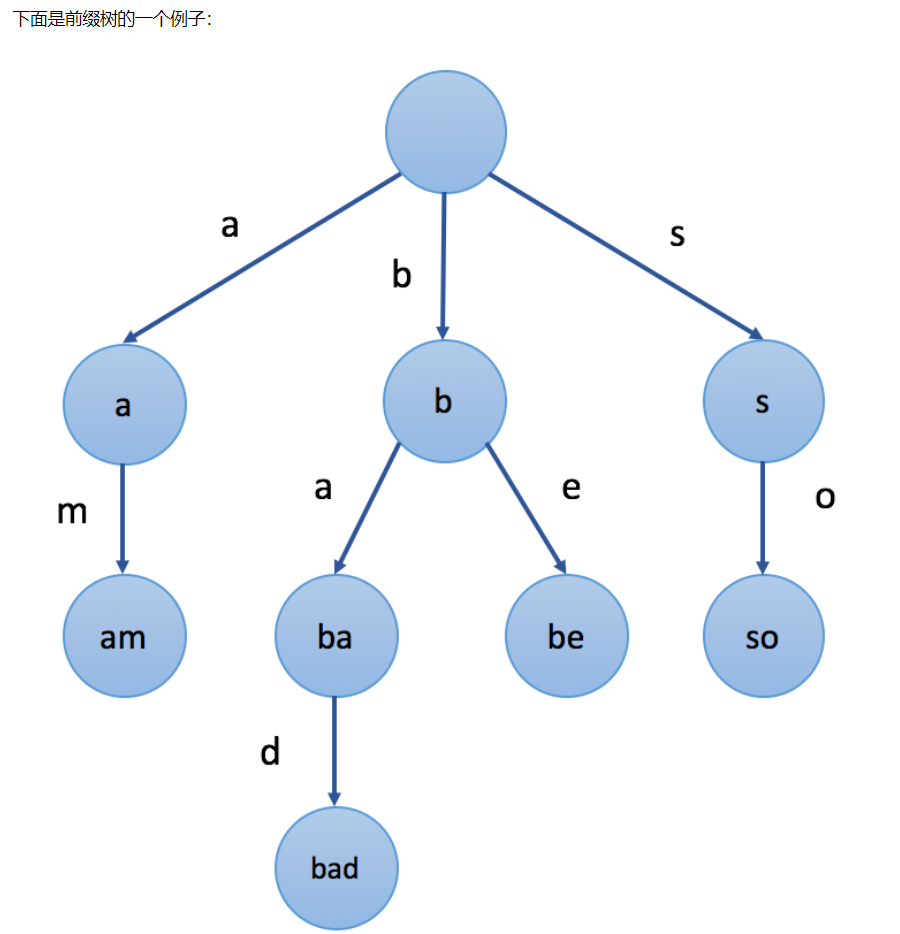
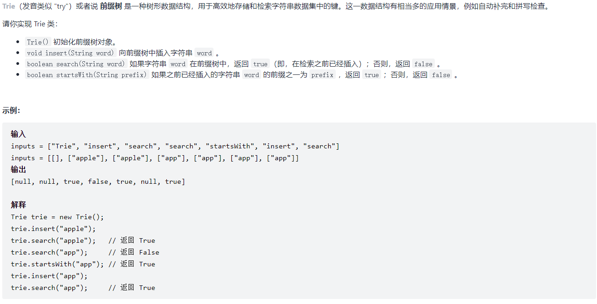
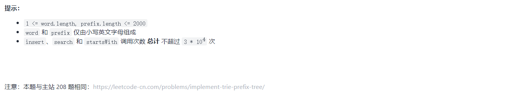
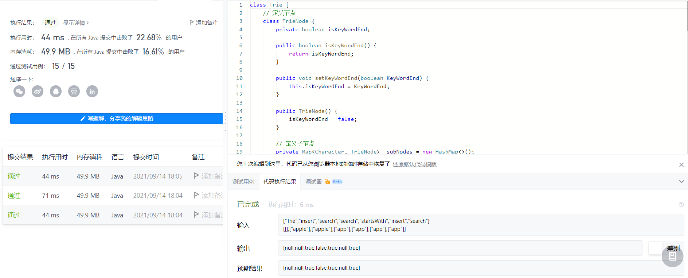

# 前缀树

> Trie树，即字典树，又称单词查找树或键树，是一种树形结构，是一种哈希树的变种。
>
> 典型应用是用于统计和排序大量的字符串（但不仅限于字符串），所以经常被搜索引擎系统用于文本词频统计。
>
> 它的优点是：最大限度地减少无谓的字符串比较。

## **定义:**

- 根节点不包含字符，除根节点外每一个节点都只包含一个字符。
- 从根节点到某一节点，路径上经过的字符连接起来，为该节点对应的字符串。
- 每个节点的所有子节点包含的字符都不相同。



## **实现:**

### 先定义节点

> 1. 关键词结束标志: `isKeywordEnd`
> 2. 子节点: `private Map<Character, TrieNode> subNodes = new HashMap<>();`
> 3. 添加及获取子节点 `addSubNode(Character c, TrieNode node)` 和 `getSubNode(Character c)`

```java
/**
 * 定义前缀树节点
 */
private class TrieNode {

    // 关键词结束标志
    private boolean isKeywordEnd = false;

    public boolean isKeywordEnd() {
        return isKeywordEnd;
    }

    public void setKeywordEnd(boolean keywordEnd) {
        isKeywordEnd = keywordEnd;
    }

    // 子节点 (key是下级字符, value是下级节点)
    private Map<Character, TrieNode> subNodes = new HashMap<>();

    /**
     * 添加子节点
     *
     * @param c    字符
     * @param node 前缀树节点
     */
    public void addSubNode(Character c, TrieNode node) {
        subNodes.put(c, node);
    }

    /**
     * 获取子节点
     *
     * @param c 字符
     * @return 子节点的引用
     */
    public TrieNode getSubNode(Character c) {
        return subNodes.get(c);
    }

}
```

### 根据敏感词, 初始化前缀树

> 敏感词文件: sensitive-words.txt
>
> 包含内容:
>
> ```xml
> 赌博
> 嫖娼
> 吸毒
> 开票
> ```

**初始化前缀树:**

```java
// 日志
private static final Logger logger = LoggerFactory.getLogger(SensitiveFilter.class);

/**
 * 替换符
 */
private static final String REPLACEMENT = "***";

/**
 * 根节点
 */
private TrieNode rootNode = new TrieNode();

/**
 * 这个 Bean即SensitiveFilter 在程序启动时就实例化,
 * 然后调用构造器,
 * 之后这个方法就会被调用.
 * this.getClass().getClassLoader() : 类加载器是从类路径下加载资源, 也就是 target/classes
 * 在 getResourceAsStream("sensitive-words.txt") 直接写文件名即可
 */
@PostConstruct
public void init() {
    try(
            // 初始化输入流并转换为缓冲流
            InputStream is = this.getClass().getClassLoader().getResourceAsStream("sensitive-words.txt");
            // 此处体现了装饰器模式
            BufferedReader reader = new BufferedReader(new InputStreamReader(is));
            ) {
        String keyword;
        while ((keyword = reader.readLine()) != null) {
            // 将一个敏感词添加到前缀树中
            this.addKeyword(keyword);
        }
    } catch (IOException e) {
        logger.error("加载敏感词文件失败: " + e.getMessage());
    }
}

/**
 * 将一个敏感词添加到前缀树中
 *
 * @param keyword 敏感词
 */
private void addKeyword(String keyword) {
    TrieNode tempNode = rootNode; // tempNode指向根节点, 相当于指针
    for (int i = 0; i < keyword.length(); i++) {
        char c = keyword.charAt(i);
        TrieNode subNode = tempNode.getSubNode(c);
        // 如果根节点没有子节点, 则初始化并添加
        if (subNode == null) {
            subNode = new TrieNode();
            tempNode.addSubNode(c, subNode);
        }

        // 指向子节点, 进入下一轮
        tempNode = subNode;

        // 设置结束标识
        if (i == keyword.length()-1) {
            tempNode.setKeywordEnd(true);
        }
    }

```

### 编写过滤敏感词的方法

```java
/**
 * 过滤敏感词
 * 对于敏感词中有符号的先去除符号
 * 需要三个指针
 * 还需要跳过特殊符号
 * @param text 待过滤的文本
 * @return 过滤后的文本
 */
public String filter(String text) {
    // 先判断是否为空
    if (StringUtils.isBlank(text)) {
        return null;
    }

    // 指针1
    TrieNode tempNode = rootNode;
    // 指针2
    int begin = 0;
    // 指针3
    int position = 0;
    // 结果
    StringBuilder sb = new StringBuilder();

    // 检测: 默认处于根节点, 所以检测它的下一级
    while (position < text.length()) {
        char c = text.charAt(position);

        // 跳过符号: 指针向下走一步
        if (isSymbol(c)) {
            // 若指针1处于根节点，将此符号计入结果，让指针2向下走一步
            if (tempNode == rootNode) {
                sb.append(c);
                begin++;
            }
            // 无论符号在开头或者中间，指针3都向下走一步
            position++;
            continue;
        }

        // 若不是符号: 检查下级节点:
        tempNode = tempNode.getSubNode(c); // 指针指向下级节点
        if (tempNode == null) { // 下级没有结点
            // 以begin开头的字符串不是敏感词
            sb.append(text.charAt(begin));
            // 进入下一个位置
            position = ++begin;
            // 归位: 重新指向根节点
            tempNode = rootNode;
        } else if (tempNode.isKeywordEnd()) { 
            // 发现敏感词，将begin~position字符串替换掉
            sb.append(REPLACEMENT);
            // 进入下一个位置
            begin = ++position;
            // 重新指向根节点
            tempNode = rootNode;
        } else {
            // 检查下一个字符
            position++;
        }
    } // while 结束

    // 将最后一批字符计入结果: 指针3 提前到终点, 但 指针2 并未到终点.
    sb.append(text.substring(begin));

    return sb.toString();
}
```

**是否是符号:**

```java
/**
 * 判断是否是符号
 * CharUtils.isAsciiAlphanumeric 方法可以判断是否是 合法字符,
 * 取反表示 它不是合法字符, 即它是特殊符号
 * 0x2E80 到 0x9FFF为东亚文字, 不认为是符号
 */
private boolean isSymbol(char c) {
    // 既不是字母数字也不是东亚文字 (0x2E80 到 0x9FFF为东亚文字), 可以认为是符号
    return !CharUtils.isAsciiAlphanumeric(c) && (c < 0x2E80 || c > 0x9FFF);
}
```


## 测试:

```java
package com.nowcoder.community;

import com.nowcoder.community.util.SensitiveFilter;
import org.junit.jupiter.api.Test;
import org.springframework.beans.factory.annotation.Autowired;
import org.springframework.boot.test.context.SpringBootTest;
import org.springframework.test.context.ContextConfiguration;

@SpringBootTest
@ContextConfiguration(classes = CommunityApplication.class)
public class SensitiveTests {
    @Autowired
    private SensitiveFilter sensitiveFilter;

    @Test
    public void testSensitiveFilter() {
        String text = "这里可以赌博，段义和可以嫖娼，可以吸毒，可以开票，哈哈哈！";
        text = sensitiveFilter.filter(text);
        System.out.println(text);


        text = "这里可以☺☺赌☺博☺，可以¶嫖☺娼♮，可以吸♂毒，可以㉿开☺☺票㉿，哈哈哈！";
        text = sensitiveFilter.filter(text);
        System.out.println(text);
    }
}
```

输出: 

```xml
这里可以***，段义和可以***，可以***，可以***，哈哈哈！
这里可以☺☺***☺，可以¶***♮，可以***，可以㉿***㉿，哈哈哈！
```


# 算法题:

>  [剑指 Offer II 062. 实现前缀树](https://leetcode-cn.com/problems/QC3q1f/)





> 测试用例:
>
> `["Trie","insert","search","search","startsWith","insert","search"]
> [[],["apple"],["apple"],["app"],["app"],["app"],["app"]]`

**代码实现如下:**

```java
package com.Test;

import java.util.HashMap;
import java.util.Map;

public class Trie {
    // 定义节点
    class TrieNode {
        private boolean isKeyWordEnd;

        public boolean isKeyWordEnd() {
            return isKeyWordEnd;
        }

        public void setKeyWordEnd(boolean KeyWordEnd) {
            this.isKeyWordEnd = KeyWordEnd;
        }

        public TrieNode() {
            isKeyWordEnd = false;
        }

        // 定义子节点
        private Map<Character, TrieNode> subNodes = new HashMap<>();

        public void addSubNode(Character c, TrieNode node) {
            subNodes.put(c, node);
        }

        public TrieNode getSubNode(Character c) {
            return subNodes.get(c);
        }

    }

    private TrieNode rootNode; // 前缀树根节点
    /** Initialize your data structure here. */
    public Trie() {
        rootNode = new TrieNode();
    }

    /** Inserts a word into the trie. */
    public void insert(String word) {
        TrieNode tmpNode = rootNode;
        for (int i = 0; i < word.length(); i++) {
            char c = word.charAt(i);
            TrieNode subNode = tmpNode.getSubNode(c);
            // 如果没有子节点, 则初始化并添加
            if (subNode == null) {
                subNode = new TrieNode();
                tmpNode.addSubNode(c, subNode);
            }
            // 执行子节点, 进入下一轮
            tmpNode = subNode;
            // 设置结束标志
            if (i == word.length()-1) tmpNode.setKeyWordEnd(true);
        }
    }

    /** Returns if the word is in the trie. */
    public boolean search(String word) {
        TrieNode tmpNode = rootNode;
        int position = 0;
        while(position < word.length()) {
            char c = word.charAt(position);
            if(tmpNode.getSubNode(c) == null) {
                return false;
            }
            tmpNode = tmpNode.getSubNode(c);
            position++;
        }

        return true == tmpNode.isKeyWordEnd;
    }

    /** Returns if there is any word in the trie that starts with the given prefix. */
    public boolean startsWith(String prefix) {
        TrieNode tmpNode = rootNode;
        int position = 0;
        while(position < prefix.length()) {
            char c = prefix.charAt(position);
            if(tmpNode.getSubNode(c) == null) {
                return false;
            }
            tmpNode = tmpNode.getSubNode(c);
            position++;
        }

        return true;
    }

}
```

> 运行效果:

