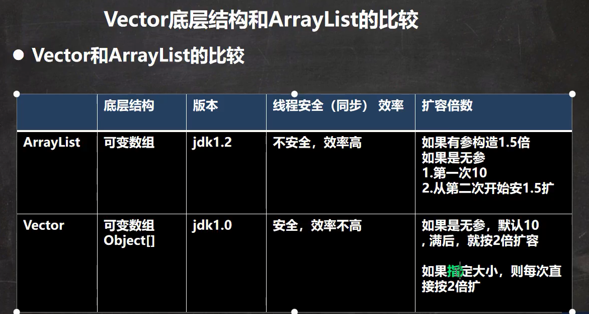

# `Vector`

## 说明

> Vector属于List接口下的,  是线程安全的类, 在开发中, 需要线程同步安全时, 可以使用Vector

```java
public class Vector<E>
    extends AbstractList<E>
    implements List<E>, RandomAccess, Cloneable, java.io.Serializable
```

> 底层也是一个对象数组

``` java
protected Object[] elementData;
```

> 线程安全, 带有synchronized关键字
>
> ```java
> public synchronized E get(int index) {
>     if (index >= elementCount)
>         throw new ArrayIndexOutOfBoundsException(index);
> 
>     return elementData(index);
> }
> ```
>
> ```java
> E elementData(int index) {
>     return (E) elementData[index];
> }
> ```

## 对比



## 扩容机制

### 无参构造

> 1. 无参构造, 默认初始化大小为10

``` java
public Vector() {
    this(10);
}

public Vector(int initialCapacity) {
    this(initialCapacity, 0);
}

protected Object[] elementData;

protected int capacityIncrement;

public Vector(int initialCapacity, int capacityIncrement) {
    super();
    if (initialCapacity < 0)
        throw new IllegalArgumentException("Illegal Capacity: "+
                                           initialCapacity);
    this.elementData = new Object[initialCapacity]; // initialCapacity = 10
    this.capacityIncrement = capacityIncrement; // capacityIncrement = 0 
}
```

> 2. 当添加元素的个数大于10时, 扩容

```java
protected int elementCount; //实际数目

public synchronized boolean add(E e) {
    modCount++;
    ensureCapacityHelper(elementCount + 1); // 1. minCapacity = elementCount + 1
    elementData[elementCount++] = e;
    return true;
}

private void ensureCapacityHelper(int minCapacity) {
    // 不够了就扩容
    if (minCapacity - elementData.length > 0) // 11 > 10
        grow(minCapacity); // 2. grow(11)
}

private static final int MAX_ARRAY_SIZE = Integer.MAX_VALUE - 8;

private void grow(int minCapacity) {
    // minCapacity = 11
    int oldCapacity = elementData.length; // 10
    int newCapacity = oldCapacity + ((capacityIncrement > 0) ?			// capacityIncrement == 0
                                     capacityIncrement : oldCapacity); // 10 + 10
    if (newCapacity - minCapacity < 0) // 20 - 11 不成立
        newCapacity = minCapacity;
    if (newCapacity - MAX_ARRAY_SIZE > 0) // 不成立
        newCapacity = hugeCapacity(minCapacity);
    elementData = Arrays.copyOf(elementData, newCapacity); // 复制扩容为两倍
}

private static int hugeCapacity(int minCapacity) {
    if (minCapacity < 0) // overflow
        throw new OutOfMemoryError();
    return (minCapacity > MAX_ARRAY_SIZE) ?
        Integer.MAX_VALUE :
        MAX_ARRAY_SIZE;
}
```


### 有参构造

> 1. 如果是指定大小

``` java
public Vector(int initialCapacity) {
    this(initialCapacity, 0); // 1.
}

public Vector(int initialCapacity, int capacityIncrement) {
    super();
    if (initialCapacity < 0)
        throw new IllegalArgumentException("Illegal Capacity: "+
                                           initialCapacity);
    this.elementData = new Object[initialCapacity]; // 2. 初始化为指定为initialCapacity大小的数组
    this.capacityIncrement = capacityIncrement; // capacityIncrement = 0
}
```

> 2. 扩容时, elementCount此时等于initialCapacity

```java
public synchronized boolean add(E e) {
    modCount++;
    ensureCapacityHelper(elementCount + 1); // 1. minCapacity = elementCount + 1 = initialCapacity + 1
    elementData[elementCount++] = e;
    return true;
}

private void ensureCapacityHelper(int minCapacity) {
    // 不够了就扩容 
    // minCapacity = elementCount + 1 = initialCapacity + 1
    // elementData.length = initialCapacity
    if (minCapacity - elementData.length > 0) // minCapacity > elementData.length
        grow(minCapacity); // 2. 进入扩容
}

private void grow(int minCapacity) {
    // 不够了就扩容 
    int oldCapacity = elementData.length; // initialCapacity
    int newCapacity = oldCapacity + ((capacityIncrement > 0) ? // capacityIncrement
                                     capacityIncrement : oldCapacity); // initialCapacity * 2
    // initialCapacity * 2 ?< initialCapacity + 1, 只有 initialCapacity == 0 才成立!
    if (newCapacity - minCapacity < 0) 
        newCapacity = minCapacity;
    if (newCapacity - MAX_ARRAY_SIZE > 0)
        newCapacity = hugeCapacity(minCapacity);
    elementData = Arrays.copyOf(elementData, newCapacity); // 复制扩容 为原来的两倍
}
```

**注:** 

- **initialCapacity == 0**

> 若在使用构造函数时, 指定了`new Vector(0)`, 那么 `this.elementData = new Object[initialCapacity]` , 即大小为0 的数组
>
> 在`add`的时候, 
>
> - `ensureCapacityHelper(0 + 1)`
> - `grow(minCapacity = 1)`
> - `oldCapacity =0`
> - `newCapacity = 0 + 0`
> - 此时 `newCapacity - minCapacity < 0`成立, newCapacity = minCapacity = 1.
> - `elementData = Arrays.copyOf(elementData, 1)`, 即扩容从0到1.

- **capacityIncrement != 0**

> 若在使用构造函数时, 指定了capacityIncrement, 则扩容机制为 `newCapacity = oldCapacity + capacityIncrement  `
>
> 可能就不是扩容为原来的两倍了, 除非 capacityIncrement  == initialCapacity

```java
public Vector(int initialCapacity, int capacityIncrement) {
    super();
    if (initialCapacity < 0)
        throw new IllegalArgumentException("Illegal Capacity: "+
                                           initialCapacity);
    this.elementData = new Object[initialCapacity]; 
    this.capacityIncrement = capacityIncrement; // capacityIncrement != 0
}
```

---


