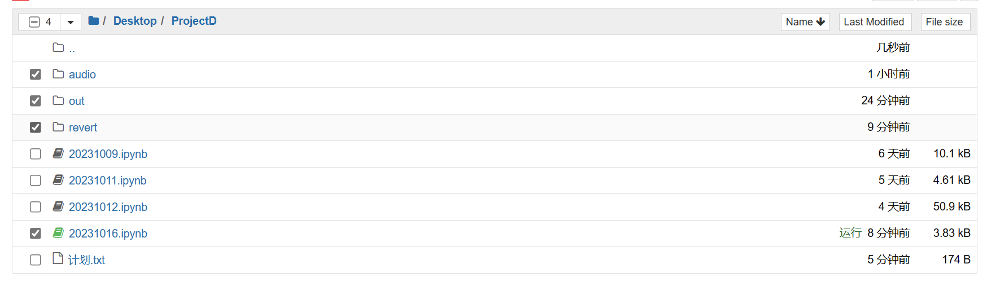
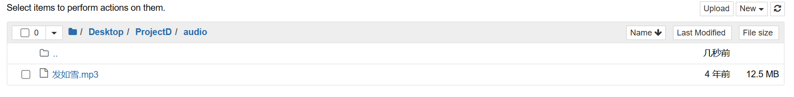
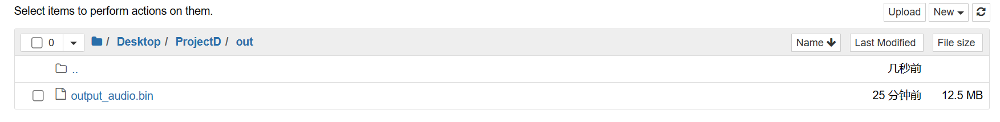
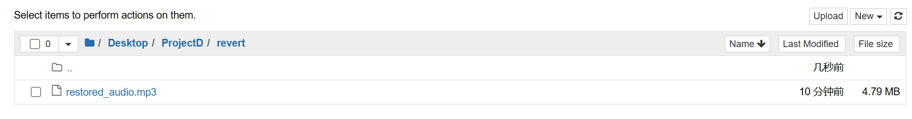
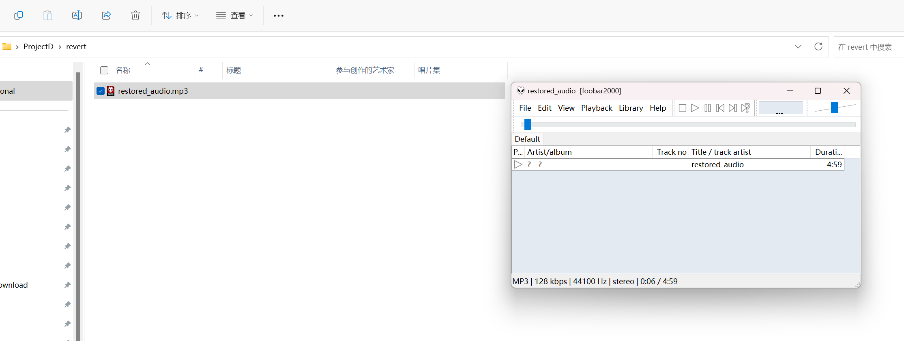

# 音频转换

## 音频信息

```python
from pydub import AudioSegment


AudioSegment.converter = 'D:\\ffmpeg\\bin\\ffmpeg.exe'
audio_path = "./audio/发如雪.mp3"  # 替换为你的音频文件路径
audio = AudioSegment.from_file(audio_path, format='MP3')

# 打印音频信息
print(audio)
print(f"声道数: {audio.channels}")
print(f"采样宽度 (位): {audio.sample_width * 8}")
print(f"采样率: {audio.frame_rate} Hz")
print(f"音频帧数: {len(audio)}")

# 打印音频的二进制文件
with open(audio_path, "rb") as audio_file:
    audio_binary_data = audio_file.read()
# print(audio_binary_data)

audio_out_directory = "./out/audio_binary"
# 保存音频的二进制文件
with open(audio_out_directory, "wb") as binary_file:
    binary_file.write(audio_binary_data)

```

输出：

```xml
<pydub.audio_segment.AudioSegment object at 0x0000022D0FD045D0>
声道数: 2
采样宽度 (位): 16
采样率: 44100 Hz
音频帧数: 299260
```

文件结构：





---

## 音频转二进制并保存

```python
# 使用pydub库打开音频文件
from pydub import AudioSegment


AudioSegment.converter = 'D:\\ffmpeg\\bin\\ffmpeg.exe'
audio_path = "./audio/发如雪.mp3"  # 替换为你的音频文件路径
audio = AudioSegment.from_file(audio_path, format='MP3')

# 将音频数据转换为二进制
audio_binary = audio.raw_data

# 保存二进制数据到文件
audio_out_file = "./out/output_audio.bin"
# 保存音频的二进制文件
with open(audio_out_file, "wb") as binary_file:
    binary_file.write(audio_binary_data)

```



---

## 二进制转音频并保存

```python
from pydub import AudioSegment
from io import BytesIO


AudioSegment.converter = 'D:\\ffmpeg\\bin\\ffmpeg.exe'

# 从二进制文件中读取数据
audio_out_file = "./out/output_audio.bin"
with open(audio_out_file, "rb") as binary_file:
    audio_binary = binary_file.read()

# 从二进制数据中创建音频对象
audio_buffer = BytesIO(audio_binary)
audio = AudioSegment.from_file(audio_buffer, format="mp3")

# 保存还原后的音频为文件
audio.export("./revert/restored_audio.mp3", format="mp3")

```



可播放：



