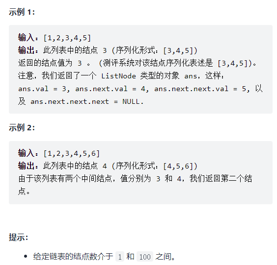
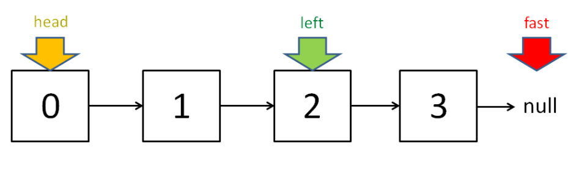
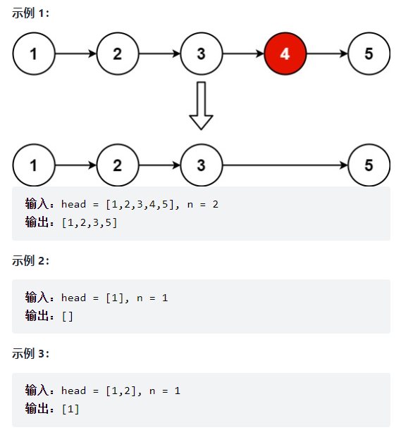
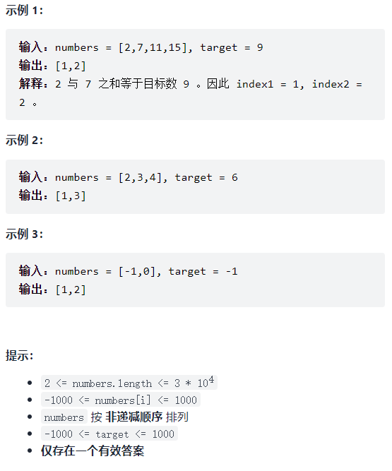
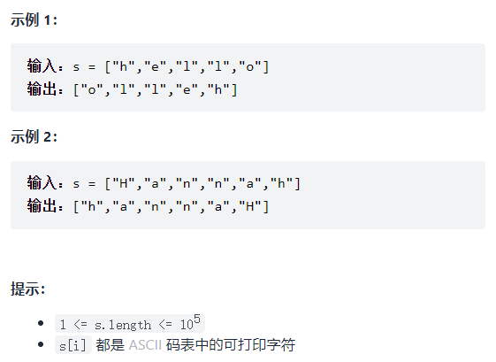

# [双指针](https://labuladong.github.io/algo/2/21/53/)

> 双指针技巧分为两类，一类是「快慢指针」，一类是「左右指针」。

前者解决主要解决链表中的问题，比如典型的判定链表中是否包含环；

**快慢指针一般都初始化指向链表的头结点 `head`，前进时快指针 `fast` 在前，慢指针 `slow` 在后，巧妙解决一些链表中的问题。**

**后者主要解决数组（或者字符串）中的问题，比如二分查找。**

---


## 快慢指针

### 141-判定链表中是否含有环

> 给你一个链表的头节点 `head` ，判断链表中是否有环。
>
> 如果链表中有某个节点，可以通过连续跟踪 `next` 指针再次到达，则链表中存在环。 为了表示给定链表中的环，评测系统内部使用整数 `pos` 来表示链表尾连接到链表中的位置（索引从 0 开始）。**注意：`pos` 不作为参数进行传递** 。仅仅是为了标识链表的实际情况。
>
> *如果链表中存在环* ，则返回 `true` 。 否则，返回 `false` 。
>
>  
>
> **示例 1：**
>
> 
>
> ```
> 输入：head = [3,2,0,-4], pos = 1
> 输出：true
> 解释：链表中有一个环，其尾部连接到第二个节点。
> ```
>
> **示例 2：**
>
> 
>
> ```
> 输入：head = [1,2], pos = 0
> 输出：true
> 解释：链表中有一个环，其尾部连接到第一个节点。
> ```
>
> **示例 3：**
>
> 
>
> ```
> 输入：head = [1], pos = -1
> 输出：false
> 解释：链表中没有环。
> ```
>
>  
>
> **提示：**
>
> - 链表中节点的数目范围是 `[0, 104]`
> - `-105 <= Node.val <= 105`
> - `pos` 为 `-1` 或者链表中的一个 **有效索引** 。
>
> 
>
> 经典题目了，要使用双指针技巧中的快慢指针，每当慢指针 `slow` 前进一步，快指针 `fast` 就前进两步。
>
> 如果 `fast` 最终遇到空指针，说明链表中没有环；如果 `fast` 最终和 `slow` 相遇，那肯定是 `fast` 超过了 `slow` 一圈，说明链表中含有环。

**判定链表中是否含有环**

单链表的特点是每个节点只知道下一个节点，所以一个指针的话无法判断链表中是否含有环的。

如果链表中不含环，那么这个指针最终会遇到空指针 `null` 表示链表到头了，这还好说，可以判断该链表不含环：

```java
boolean hasCycle(ListNode head) {
    while (head != null)
        head = head.next;
    return false;
}
```

**但是如果链表中含有环，那么这个指针就会陷入死循环，因为环形数组中没有 `null` 指针作为尾部节点。**

经典解法就是用两个指针，一个跑得快，一个跑得慢。

- 如果不含有环，跑得快的那个指针最终会遇到 `null`，说明链表不含环；
- 如果含有环，快指针最终会超慢指针一圈，和慢指针相遇，说明链表含有环。

```java
/**
 * Definition for singly-linked list.
 * class ListNode {
 *     int val;
 *     ListNode next;
 *     ListNode(int x) {
 *         val = x;
 *         next = null;
 *     }
 * }
 */
public class Solution {
    public boolean hasCycle(ListNode head) {
        ListNode fast, slow;
        fast = slow = head;
        while (fast != null && fast.next != null) {
            fast = fast.next.next;
            slow = slow.next;
            
            if (fast == slow) {
                return true;
            }
        }
        
        return false;
    }
}
```

---


### 142-已知链表中含有环，返回这个环的起始位置

> 给定一个链表的头节点  `head` ，返回链表开始入环的第一个节点。 *如果链表无环，则返回 `null`。*
>
> 如果链表中有某个节点，可以通过连续跟踪 `next` 指针再次到达，则链表中存在环。 为了表示给定链表中的环，评测系统内部使用整数 `pos` 来表示链表尾连接到链表中的位置（**索引从 0 开始**）。如果 `pos` 是 `-1`，则在该链表中没有环。**注意：`pos` 不作为参数进行传递**，仅仅是为了标识链表的实际情况。
>
> **不允许修改** 链表。
>
> 
>
>  
>
> **示例 1：**
>
> 
>
> ```
> 输入：head = [3,2,0,-4], pos = 1
> 输出：返回索引为 1 的链表节点
> 解释：链表中有一个环，其尾部连接到第二个节点。
> ```
>
> **示例 2：**
>
> 
>
> ```
> 输入：head = [1,2], pos = 0
> 输出：返回索引为 0 的链表节点
> 解释：链表中有一个环，其尾部连接到第一个节点。
> ```
>
> **示例 3：**
>
> 
>
> ```
> 输入：head = [1], pos = -1
> 输出：返回 null
> 解释：链表中没有环。
> ```
>
>  
>
> **提示：**
>
> - 链表中节点的数目范围在范围 `[0, 104]` 内
> - `-105 <= Node.val <= 105`
> - `pos` 的值为 `-1` 或者链表中的一个有效索引

直观地来说就是当快慢指针相遇时，让其中任一个指针指向头节点，然后让它俩以相同速度前进，再次相遇时所在的节点位置就是环开始的位置。

原理也简单说下吧，我们假设快慢指针相遇时，慢指针 `slow` 走了 `k` 步，那么快指针 `fast` 一定走了 `2k` 步：


`fast` 一定比 `slow` 多走了 `k` 步，这多走的 `k` 步其实就是 `fast` 指针在环里转圈圈，所以 `k` 的值就是环长度的「整数倍」。

假设相遇点距环的起点的距离为 `m`，那么结合上图的 `slow` 指针，环的起点距头结点 `head` 的距离为 `k - m`，也就是说如果从 `head` 前进 `k - m` 步就能到达环起点。

巧的是，如果从相遇点继续前进 `k - m` 步，也恰好到达环起点：


**所以，只要我们把快慢指针中的任一个重新指向 `head`，然后两个指针同速前进，`k - m` 步后一定会相遇，相遇之处就是环的起点了。**

```java
/**
 * Definition for singly-linked list.
 * class ListNode {
 *     int val;
 *     ListNode next;
 *     ListNode(int x) {
 *         val = x;
 *         next = null;
 *     }
 * }
 */
public class Solution {
    public ListNode detectCycle(ListNode head) {
        ListNode fast, slow;
        fast = slow = head;
        while (fast != null && fast.next != null) {
            fast = fast.next.next;
            slow = slow.next;
            
            if (fast == slow) {
                break;
            }
        }
        
        if (fast == null || fast.next == null) {
            return null;
        }
        
        slow = head;
        while (slow != fast) {
            slow = slow.next;
            fast = fast.next;
        }

        return slow;
    }
}
```

---


### 876-链表的中间结点

> https://leetcode-cn.com/problems/middle-of-the-linked-list/
>
> 给定一个头结点为 `head` 的非空单链表，返回链表的中间结点。
>
> 如果有两个中间结点，则返回第二个中间结点。
>
> 

**思路: 可以让快指针一次前进两步，慢指针一次前进一步，当快指针到达链表尽头时，慢指针就处于链表的中间位置。**

当链表的长度是奇数时，`slow` 恰巧停在中点位置；如果长度是偶数，`slow` 最终的位置是中间偏右：



> 看代码:

```java
/**
 * Definition for singly-linked list.
 * public class ListNode {
 *     int val;
 *     ListNode next;
 *     ListNode() {}
 *     ListNode(int val) { this.val = val; }
 *     ListNode(int val, ListNode next) { this.val = val; this.next = next; }
 * }
 */
class Solution {
    public ListNode middleNode(ListNode head) {
        ListNode slow, fast;
        slow = fast = head;
        while (fast != null && fast.next != null) {
            slow = slow.next;
            fast = fast.next.next;
        }
		
        // slow 就在中间位置
        return slow;
    }
}
```

---


### 19-删除链表的倒数第N个结点

> 给你一个链表，删除链表的倒数第 `n` 个结点，并且返回链表的头结点。
>
> 
>
> **提示：**
>
> - 链表中结点的数目为 `sz`
> - `1 <= sz <= 30`
> - `0 <= Node.val <= 100`
> - `1 <= n <= sz`

**思路: 还是使用快慢指针，让快指针先走 `n` 步，然后快慢指针开始同速前进。这样当快指针走到链表末尾 `null` 时，慢指针所在的位置就是倒数第 `n` 个链表节点（`n` 不会超过链表长度）。**

```java
/**
 * Definition for singly-linked list.
 * public class ListNode {
 *     int val;
 *     ListNode next;
 *     ListNode() {}
 *     ListNode(int val) { this.val = val; }
 *     ListNode(int val, ListNode next) { this.val = val; this.next = next; }
 * }
 */
class Solution {
    public ListNode removeNthFromEnd(ListNode head, int n) {
        ListNode fast, slow;
        fast = slow = head;
        // 快指针先前进 n 步
        while (n-- > 0) {
            fast = fast.next;
        }
        
        if (fast == null) {
            // 如果此时快指针走到头了，
        	// 说明倒数第 n 个节点就是第一个节点
            return head.next;
        }
        
        // 让慢指针和快指针同步向前
        while (fast != null && fast.next != null) {
            slow = slow.next;
            fast = fast.next;
        }
        
        // slow.next 就是倒数第 n 个节点，删除它
        slow.next = slow.next.next;
        return head;
    }
}
```

---


## 左右指针

左右指针在数组中实际是指两个索引值，一般初始化为 `left = 0, right = nums.length - 1` 。

---


### 二分查找

这里只写最简单的二分算法，旨在突出它的双指针特性：

```java
int binarySearch(int[] nums, int target) {
    int left = 0; 
    int right = nums.length - 1;
    while(left <= right) {
        int mid = (right + left) / 2;
        if(nums[mid] == target)
            return mid; 
        else if (nums[mid] < target)
            left = mid + 1; 
        else if (nums[mid] > target)
            right = mid - 1;
    }
    
    return -1;
}
```

---


### 167-两数之和-输入有序数组

> https://leetcode-cn.com/problems/two-sum-ii-input-array-is-sorted/
>
> 给定一个已按照 `非递减顺序排列`  的整数数组 numbers ，请你从数组中找出两个数满足相加之和等于目标数 target 。
>
> `函数应该以长度为 2 的整数数组的形式返回这两个数的下标值`。
>
> numbers 的下标 从 1 开始计数 ，所以答案数组应当满足 `1 <= answer[0] < answer[1] <= numbers.length` 。
>
> 你可以假设每个输入 只对应唯一的答案 ，而且你 不可以 重复使用相同的元素。
>
> 

只要数组有序，就应该想到双指针技巧。这道题的解法有点类似二分查找，通过调节 `left` 和 `right` 可以调整 `sum` 的大小：

```java
class Solution {
    public int[] twoSum(int[] nums, int target) {
        int left = 0, right = nums.length-1;
        while(left < right) {
            int sum = nums[left] + nums[right];
            if (sum == target) {
                return new int[]{ left+1, right+1 };
            } else if (sum < target) {
                left++;
            } else {
                right--;
            }
        }
        
        return new int[] { -1, -1 };
    }
}
```

---


### 344-反转字符串

> 编写一个函数，其作用是将输入的字符串反转过来。
>
> 输入字符串以字符数组 s 的形式给出。
>
> 不要给另外的数组分配额外的空间，你必须原地修改输入数组、使用 O(1) 的额外空间解决这一问题。
>
> 

一般编程语言都会提供 `reverse` 函数，其实非常简单，让你反转一个 `char[]` 类型的字符数组，我们直接看代码吧：

写法一:

```java
void reverseString(char[] arr) {
    int left = 0;
    int right = arr.length - 1;
    while (left < right) {
        // 交换 arr[left] 和 arr[right]
        char temp = arr[left];
        arr[left] = arr[right];
        arr[right] = temp;
        left++; right--;
    }
}
```

写法二:

```java
class Solution {
    public void reverseString(char[] s) {
        int left = 0, right = s.length-1;
        while (left < right) {
            s[left] ^= s[right];
            s[right] ^= s[left];
            s[left] ^= s[right];
            left++; right--;
        }
    }
}
```

---


