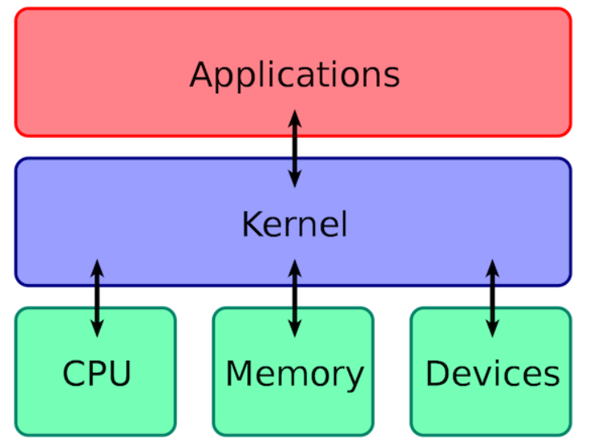

# Linux 

## 简介

**Linux 本质是指 Linux 内核** ： 严格来讲，Linux 这个词本身只表示 Linux 内核，单独的 Linux 内核并不能成为一个可以正常工作的操作系统。所以，就有了各种 Linux 发行版。


> 内核 : （英语：Kernel，又称核心）在计算机科学中是一个用来管理软件发出的数据 I/O（输入与输出）要求的电脑程序，将这些要求转译为数据处理的指令并交由中央处理器（CPU）及电脑中其他电子组件进行处理，是现代操作系统中最基本的部分。
>
> - 它是为众多应用程序提供对计算机硬件的安全访问的一部分软件，这种访问是有限的，并由内核决定一个程序在什么时候对某部分硬件操作多长时间。 
> - **直接对硬件操作是非常复杂的。所以内核通常提供一种硬件抽象的方法，来完成这些操作。有了这个，通过进程间通信机制及系统调用，应用进程可间接控制所需的硬件资源（特别是处理器及 IO 设备）。**

1. **操作系统的内核（Kernel）是操作系统的核心部分，它负责系统的内存管理，硬件设备的管理，文件系统的管理以及应用程序的管理。**
2. **操作系统的内核是连接应用程序和硬件的桥梁，决定着操作系统的性能和稳定性。**


> [内核与CPU的区别](https://snailclimb.gitee.io/javaguide/#/docs/cs-basics/operating-system/linux?id=_13-%e6%93%8d%e4%bd%9c%e7%b3%bb%e7%bb%9f%e7%9a%84%e5%86%85%e6%a0%b8%ef%bc%88kernel%ef%bc%89)

1. 操作系统的内核（Kernel）属于操作系统层面，而 CPU 属于硬件。
2. CPU 主要提供运算，处理各种指令的能力。内核（Kernel）主要负责系统管理比如内存管理，它屏蔽了对硬件的操作。



> **用户态和内核态**

根据进程访问资源的特点，我们可以把进程在系统上的运行分为两个级别：

1. **用户态(user mode)** : 用户态运行的进程或**可以直接读取用户数据**的程序。
2. **系统态(kernel mode)**: 可以简单的理解系统态运行的进程或程序**几乎可以访问计算机的任何资源，不受限制**。


> **系统调用**

我们运行的程序基本都是运行在用户态，如果我们调用操作系统提供的系统态级别的子功能咋办呢？那就需要系统调用了！

也就是说在我们运行的用户程序中，凡是**与系统态级别的资源有关的操作**（如文件管理、进程控制、内存管理等)，都**必须通过系统调用方式向操作系统提出服务请求，并由操作系统代为完成**。

这些系统调用按功能大致可分为如下几类：

- **设备管理** ：完成设备的请求或释放，以及**设备启动**等功能。
- **文件管理** ：完成**文件的读、写、创建及删除**等功能。
- **进程控制** ：完成**进程的创建、撤销、阻塞及唤醒**等功能。
- **进程通信** ：完成**进程之间的消息传递或信号传递**等功能。
- **内存管理** ：完成**内存的分配、回收**以及获取作业**占用内存区大小及地址**等功能。


## 发行版

> Linux的发行版说简单点就是将Linux内核与应用软件做一个打包。
>
> 一些组织或厂商将 Linux 内核与各种软件和文档包装起来，并提供系统安装界面和系统配置、设定与管理工具，就构成了 Linux 的发行版本。
>
> 内核主要负责系统的内存管理，硬件设备的管理，文件系统的管理以及应用程序的管理。

**Linux 的发行版本可以大体分为两类：**

- 商业公司维护的发行版本，以著名的 Red Hat 为代表，比较典型的有 CentOS 。
- 社区组织维护的发行版本，以 Debian 为代表，比较典型的有 Ubuntu、Debian。

对于初学者学习 Linux ,推荐选择 CentOS 。


[按包管理器来划分](https://zhuanlan.zhihu.com/p/139874681)

**首先，什么是包管理器呢？**

这么说吧，如果没有包管理器这个东西的存在，那估计仅仅是`Linux`系统上的软件安装，怕是就要劝退很多用户了，因为很多的**软件依赖处理**会让人抓狂。

因此简单起见，我们可以将包管理器理解为，用来为`Linux`系统上的软件`安装`、`卸载`、`升级`、`查询`提供支持的组件，所以对于用户使用来说，一般是一组工具命令集。


> 常用工具集: `apt, apt-get, yum, dpkg`


> 常用工具命令

**升级**

sudo apt-get upgrade

sudo yum update

**安装**

sudo apt-get install 包名

sudo yum install 包名

**本地安装**

sudo apt-get install 包名.deb

sudo yum install 包名.rpm

**移除**

sudo apt-get remove 包名

sudo yum remove 包名


---

## 文件系统

**在 Linux 操作系统中，所有被操作系统管理的资源，例如网络接口卡、磁盘驱动器、打印机、输入输出设备、普通文件或是目录都被看作是一个文件。** 也就是说在 Linux 系统中有一个重要的概念：**一切都是文件**。

- 硬盘的最小存储单位是扇区(Sector)，块(block)由多个扇区组成。
- 文件数据存储在块中。
- 块的最常见的大小是 4kb，约为 8 个连续的扇区组成（每个扇区存储 512 字节）。
- 一个文件可能会占用多个 block，但是一个块只能存放一个文件。


> **inode 是 linux/unix 文件系统的基础。那么，inode 是什么?有什么作用呢?**

- 虽然，我们将文件存储在了块(block)中，但是我们还需要一个空间来存储文件的 **元信息 metadata** ：
  - 如某个文件被分成几块、每一块在的地址、文件拥有者，创建时间，权限，大小等。
  - 这种 **存储文件元信息的区域就叫 inode**，译为索引节点：**i（index）+node**。 
- 每个文件都有一个 inode，存储文件的元信息。

简单来说：inode 就是用来维护某个文件被分成几块、每一块在的地址、文件拥有者，创建时间，权限，大小等信息。

- **inode** ：记录文件的属性信息，可以使用 stat 命令查看 inode 信息。
- **block** ：实际文件的内容，如果一个文件大于一个块时候，那么将占用多个 block，但是一个块只能存放一个文件。（因为数据是由 inode 指向的，如果有两个文件的数据存放在同一个块中，就会乱套了）


实际对比:

```bash
[root@VM-12-17-centos data]# ll
total 8
-rw-r--r-- 1 polkitd lighthouse   0 Apr 16  2021 appendonly.aof
-rw-r--r-- 1 polkitd lighthouse 175 Apr 16  2021 dump.rdb
-rw-r--r-- 1 polkitd lighthouse 772 Apr 16  2021 nodes.conf
[root@VM-12-17-centos data]# stat dump.rdb 
  File: ‘dump.rdb’
  Size: 175       	Blocks: 8          IO Block: 4096   regular file
Device: fd01h/64769d	Inode: 3407911     Links: 1
Access: (0644/-rw-r--r--)  Uid: (  999/ polkitd)   Gid: ( 1000/lighthouse)
Access: 2021-04-16 19:19:56.555265515 +0800
Modify: 2021-04-16 19:19:56.454265402 +0800
Change: 2021-04-16 19:19:56.457265405 +0800
Birth: -
```


> 文件类型

Linux 支持很多文件类型，其中非常重要的文件类型有: **普通文件**，**目录文件**，**链接文件**，**设备文件**，**管道文件**，**Socket 套接字文件**等。

- **普通文件（-）** ： 用于存储信息和数据， Linux 用户可以根据访问权限对普通文件进行查看、更改和删除。比如：图片、声音、PDF、text、视频、源代码等等。
- **目录文件（d，directory file）** ：目录也是文件的一种，用于表示和管理系统中的文件，目录文件中包含一些文件名和子目录名。打开目录事实上就是打开目录文件。
- **符号链接文件（l，symbolic link）** ：保留了指向文件的地址而不是文件本身。
- **字符设备（c，char）** ：用来访问字符设备比如键盘。
- **设备文件（b，block）** ： 用来访问块设备比如硬盘、软盘。
- **管道文件(p,pipe)** : 一种特殊类型的文件，用于进程之间的通信。
- **套接字(s,socket)** ：用于进程间的网络通信，也可以用于本机之间的非网络通信。


> 目录树

**Linux 的目录结构如下：**

Linux 文件系统的结构层次鲜明，就像一棵倒立的树，最顶层是其根目录：


**常见目录说明：**

- **/bin：** 存放二进制可执行文件(ls、cat、mkdir 等)，常用命令一般都在这里；
- **/etc：** 存放系统管理和配置文件；
- **/home：** 存放所有用户文件的根目录，是用户主目录的基点，比如用户 user 的主目录就是/home/user，可以用~user 表示；
- **/usr ：** 用于存放系统应用程序；
- **/opt：** 额外安装的可选应用程序包所放置的位置。一般情况下，我们可以把 tomcat 等都安装到这里；
- **/proc：** 虚拟文件系统目录，是系统内存的映射。可直接访问这个目录来获取系统信息；
- **/root：** 超级用户（系统管理员）的主目录（特权阶级^o^）；
- **/sbin:** 存放二进制可执行文件，只有 root 才能访问。这里存放的是系统管理员使用的系统级别的管理命令和程序。如 ifconfig 等；
- **/dev：** 用于存放设备文件；
- **/mnt：** 系统管理员安装临时文件系统的安装点，系统提供这个目录是让用户临时挂载其他的文件系统；
- **/boot：** 存放用于系统引导时使用的各种文件；
- **/lib ：** 存放着和系统运行相关的库文件 ；
- **/tmp：** 用于存放各种临时文件，是公用的临时文件存储点；
- **/var：** 用于存放运行时需要改变数据的文件，也是某些大文件的溢出区，比方说各种服务的日志文件（系统启动日志等。）等；
- **/lost+found：** 这个目录平时是空的，系统非正常关机而留下“无家可归”的文件（windows 下叫什么.chk）就在这里。


---

## 基本命令

**Linux 命令大全**：http://man.linuxde.net/

> cd  目录切换 (测试环境为 Centos)

cd /usr : 切换到usr目录

```bash
[root@VM-12-17-centos ~]# cd /usr
[root@VM-12-17-centos usr]# pwd
/usr
```

cd ..  : 上一级

```bash
[root@VM-12-17-centos usr]# cd ..
[root@VM-12-17-centos /]# pwd
/
```

cd / : 系统根目录

```bash
[root@VM-12-17-centos /]# cd /
[root@VM-12-17-centos /]# pwd
/
```

cd ~ : 用户主目录

```bash
[root@VM-12-17-centos /]# cd ~
[root@VM-12-17-centos ~]# pwd
/root
```

cd - : 上一个操作所在目录

```bash
[root@VM-12-17-centos ~]# cd -
/
[root@VM-12-17-centos /]# pwd
/
```


mkdir 新建目录

ls 查看目录信息

ll (ls-l) 查看该目录下所有目录和文件的详细信息

```bash
[root@VM-12-17-centos usr]# ls
bin  etc  games  include  lib  lib64  libexec  local  sbin  share  src  tmp
[root@VM-12-17-centos usr]# ll
total 128
dr-xr-xr-x.  2 root root 36864 Sep 16 16:45 bin
drwxr-xr-x.  2 root root  4096 Apr 11  2018 etc
drwxr-xr-x.  2 root root  4096 Apr 11  2018 games
drwxr-xr-x. 59 root root  4096 Sep  2  2020 include
dr-xr-xr-x. 30 root root  4096 Sep  2  2020 lib
dr-xr-xr-x. 52 root root 32768 Mar 17  2021 lib64
drwxr-xr-x. 26 root root  4096 Mar 17  2021 libexec
drwxr-xr-x. 13 root root  4096 May 28 11:22 local
dr-xr-xr-x.  2 root root 20480 Sep 28 15:24 sbin
drwxr-xr-x. 97 root root  4096 Mar 17  2021 share
drwxr-xr-x.  7 root root  4096 Sep  2  2020 src
lrwxrwxrwx.  1 root root    10 Mar  7  2019 tmp -> ../var/tmp
```

> touch 文件名称

新建文件


> find 目录 参数

find .  						列出当前目录及子目录下所有文件和文件夹

```bash
[root@VM-12-17-centos data]# find .
.
./1.jpg
./resnet50.mar
./test.txt
./resNet50.pth
./2.jpg
./3.jpg
```

find /home  -name *.txt  	在home目录下查找以.txt 结尾的文件名

```bash
[root@VM-12-17-centos ~]# find /home -name *.txt
/home/jungle/build/tomcat/tomcatlogs/localhost_access_log.2021-03-28.txt
/home/jungle/build/tomcat/tomcatlogs/localhost_access_log.2021-03-30.txt
/home/jungle/build/tomcat/tomcatlogs/localhost_access_log.2021-03-31.txt
/home/jungle/build/tomcat/tomcatlogs/localhost_access_log.2021-04-07.txt
/home/jungle/build/tomcat/tomcatlogs/localhost_access_log.2021-04-03.txt
/home/jungle/build/tomcat/tomcatlogs/localhost_access_log.2021-04-10.txt
/home/jungle/build/tomcat/tomcatlogs/localhost_access_log.2021-04-05.txt
/home/jungle/build/tomcat/tomcatlogs/localhost_access_log.2021-04-01.txt
/home/jungle/build/tomcat/tomcatlogs/localhost_access_log.2021-04-09.txt
/home/jungle/build/tomcat/tomcatlogs/localhost_access_log.2021-04-06.txt
/home/jungle/build/tomcat/tomcatlogs/localhost_access_log.2021-04-12.txt
/home/jungle/build/tomcat/tomcatlogs/localhost_access_log.2021-04-11.txt
/home/jungle/build/tomcat/tomcatlogs/localhost_access_log.2021-03-29.txt
/home/jungle/build/tomcat/tomcatlogs/localhost_access_log.2021-04-04.txt
/home/jungle/build/tomcat/tomcatlogs/localhost_access_log.2021-03-27.txt
/home/jungle/build/tomcat/tomcatlogs/localhost_access_log.2021-04-08.txt
/home/jungle/build/tomcat/tomcatlogs/localhost_access_log.2021-04-02.txt
```

忽略大小写: `find /home -iname "*.txt"`

```bash
[root@VM-12-17-centos ~]# find /home -iname "*.txt"
/home/jungle/build/tomcat/tomcatlogs/localhost_access_log.2021-03-28.txt
/home/jungle/build/tomcat/tomcatlogs/localhost_access_log.2021-03-30.txt
/home/jungle/build/tomcat/tomcatlogs/localhost_access_log.2021-03-31.txt
/home/jungle/build/tomcat/tomcatlogs/localhost_access_log.2021-04-07.txt
/home/jungle/build/tomcat/tomcatlogs/localhost_access_log.2021-04-03.txt
/home/jungle/build/tomcat/tomcatlogs/localhost_access_log.2021-04-10.txt
/home/jungle/build/tomcat/tomcatlogs/localhost_access_log.2021-04-05.txt
/home/jungle/build/tomcat/tomcatlogs/localhost_access_log.2021-04-01.txt
/home/jungle/build/tomcat/tomcatlogs/localhost_access_log.2021-04-09.txt
/home/jungle/build/tomcat/tomcatlogs/localhost_access_log.2021-04-06.txt
/home/jungle/build/tomcat/tomcatlogs/localhost_access_log.2021-04-12.txt
/home/jungle/build/tomcat/tomcatlogs/localhost_access_log.2021-04-11.txt
/home/jungle/build/tomcat/tomcatlogs/localhost_access_log.2021-03-29.txt
/home/jungle/build/tomcat/tomcatlogs/localhost_access_log.2021-04-04.txt
/home/jungle/build/tomcat/tomcatlogs/localhost_access_log.2021-03-27.txt
/home/jungle/build/tomcat/tomcatlogs/localhost_access_log.2021-04-08.txt
/home/jungle/build/tomcat/tomcatlogs/localhost_access_log.2021-04-02.txt
```

当前目录及子目录下查找所有以.txt 和.pdf 结尾的文件:`find . -name "*.txt" -o -name "*.pdf"`


> mv  目录名称 新目录名称
>
> mv  目录名称 目录的新位置

mv 命令用来对文件或目录重新命名，或者将文件从一个目录移到另一个目录中

```bash
# mv  目录名称 新目录名称
[root@VM-12-17-centos home]# ls
dockerfile  docker-test-volume  ftpuser  jungle  lighthouse  mysql  TestCommand
[root@VM-12-17-centos home]# mkdir TestCommand2
[root@VM-12-17-centos home]# ls
dockerfile  docker-test-volume  ftpuser  jungle  lighthouse  mysql  TestCommand  TestCommand2
[root@VM-12-17-centos home]# mv TestCommand TestCommand1	# 对目录重新命名
[root@VM-12-17-centos home]# ls
dockerfile          ftpuser  lighthouse  TestCommand1
docker-test-volume  jungle   mysql       TestCommand2

# mv  目录名称... 目录的新位置
[root@VM-12-17-centos home]# mkdir TestCommand
[root@VM-12-17-centos home]# ls
dockerfile          ftpuser  lighthouse  TestCommand   TestCommand2
docker-test-volume  jungle   mysql       TestCommand1
[root@VM-12-17-centos home]# mv TestCommand1 TestCommand2 TestCommand	# 将目录整体搬家
[root@VM-12-17-centos home]# ls
dockerfile  docker-test-volume  ftpuser  jungle  lighthouse  mysql  TestCommand
[root@VM-12-17-centos home]# cd TestCommand/
[root@VM-12-17-centos TestCommand]# ls
TestCommand1  TestCommand2
```


> cp -r 目录名称 目录拷贝的目标位置

拷贝目录（改），-r 代表递归拷贝 。

注意：cp 命令不仅可以拷贝目录还可以拷贝文件，压缩包等，拷贝文件和压缩包时不 用写-r 递归。

```bash
[root@VM-12-17-centos TestCommand]# cp TestCommand1/test1.txt TestCommand2	# 复制文件到另一个目录
[root@VM-12-17-centos TestCommand]# ls
TestCommand1  TestCommand2
[root@VM-12-17-centos TestCommand]# cd TestCommand2
[root@VM-12-17-centos TestCommand2]# ls
test1.txt
[root@VM-12-17-centos TestCommand2]# mv test1.txt test2.txt		# 给复制文件重命名
[root@VM-12-17-centos TestCommand2]# ls
test2.txt
# 递归拷贝目录及其文件
[root@VM-12-17-centos home]# cp -r TestCommand /usr
[root@VM-12-17-centos home]# cd /usr
[root@VM-12-17-centos usr]# cd TestCommand
[root@VM-12-17-centos TestCommand]# ll
total 8
drwxr-xr-x 2 root root 4096 Oct 24 18:43 TestCommand1
drwxr-xr-x 2 root root 4096 Oct 24 18:43 TestCommand2
```


> rm -rf 目录
>
> **`rm -rf 文件`：** 删除文件（删）。

删除目录 或 文件

注意：rm 不仅可以删除目录，也可以删除其他文件或压缩包，为了增强大家的记忆， 无论删除任何目录或文件，都直接使用`rm -rf` 目录/文件/压缩包。


> **`cat/more/less/tail 文件名称`** ：文件的查看（查） 

命令 `tail -f 文件` 可以对某个文件进行动态监控，例如 tomcat 的日志文件， 会随着程序的运行，日志会变化，可以使用 `tail -f catalina-2016-11-11.log` 监控 文 件的变化 。


> vim 文件

修改文件的内容（改）。

vim 编辑器是 Linux 中的强大组件，是 vi 编辑器的加强版，vim 编辑器的命令和快捷方式有很多，但此处不一一阐述，大家也无需研究的很透彻，使用 vim 编辑修改文件的方式基本会使用就可以了。

在实际开发中，使用 vim 编辑器主要作用就是修改配置文件，下面是一般步骤： `vim 文件------>进入文件----->命令模式------>按i进入编辑模式----->编辑文件 ------->按Esc进入底行模式----->输入：wq/q!` （输入 wq 代表写入内容并退出，即保存；输入 q!代表强制退出不保存）。


> 打包并压缩文件

Linux 中的打包文件一般是以.tar 结尾的，压缩的命令一般是以.gz 结尾的。

而一般情况下打包和压缩是一起进行的，打包并压缩后的文件的后缀名一般.tar.gz。 

命令：`tar -zcvf 打包压缩后的文件名 要打包压缩的文件` ，其中：

- z：调用 gzip 压缩命令进行压缩
- c：打包文件
- v：显示运行过程
- f：指定文件名

> 解压压缩包

命令：`tar [-xvf] 压缩文件`

其中：x：代表解压

```bash
[root@VM-12-17-centos usr]# ls
a.txt  b.txt  etc    hello.sh  lib    libexec  sbin   src                 tmp
bin    c.txt  games  include   lib64  local    share  TestCommand.tar.gz
[root@VM-12-17-centos usr]# tar -xvf TestCommand.tar.gz 
TestCommand/
TestCommand/TestCommand2/
TestCommand/TestCommand2/test2.txt
TestCommand/TestCommand1/
TestCommand/TestCommand1/test1.txt
[root@VM-12-17-centos usr]# ls
a.txt  b.txt  etc    hello.sh  lib    libexec  sbin   src          TestCommand.tar.gz
bin    c.txt  games  include   lib64  local    share  TestCommand  tmp
[root@VM-12-17-centos usr]# ll TestCommand
total 8
drwxr-xr-x 2 root root 4096 Oct 24 19:13 TestCommand1
drwxr-xr-x 2 root root 4096 Oct 24 18:39 TestCommand2
```

示例：

- 将 /test 下的 test.tar.gz 解压到当前目录下可以使用命令：**`tar -xvf test.tar.gz`**
- 将 /test 下的 test.tar.gz 解压到根目录/usr 下:**`tar -xvf test.tar.gz -C /usr`**（- C 代表指定解压的位置）


---

## 权限命令

操作系统中每个文件都拥有特定的权限、所属用户和所属组。

权限是操作系统用来限制资源访问的机制，在 Linux 中权限一般分为读(readable)、写(writable)和执行(excutable)，分为三组。

分别对应文件的属主(owner)，属组(group)和其他用户(other)，通过这样的机制来限制哪些用户、哪些组可以对特定的文件进行什么样的操作。

通过 **`ls -l`** 命令我们可以 查看某个目录下的文件或目录的权限

```bash
[root@VM-12-17-centos usr]# ls -l
total 128
-rw-r--r--   1 root root     0 Oct  2 19:41 a.txt
dr-xr-xr-x.  2 root root 36864 Sep 16 16:45 bin
-rw-r--r--   1 root root     0 Oct  2 19:41 b.txt
-rw-r--r--   1 root root     0 Oct  2 19:41 c.txt
drwxr-xr-x.  2 root root  4096 Apr 11  2018 etc
drwxr-xr-x.  2 root root  4096 Apr 11  2018 games
drwxr-xr-x. 59 root root  4096 Sep  2  2020 include
dr-xr-xr-x. 30 root root  4096 Sep  2  2020 lib
dr-xr-xr-x. 52 root root 32768 Mar 17  2021 lib64
drwxr-xr-x. 26 root root  4096 Mar 17  2021 libexec
drwxr-xr-x. 13 root root  4096 May 28 11:22 local
dr-xr-xr-x.  2 root root 20480 Sep 28 15:24 sbin
drwxr-xr-x. 97 root root  4096 Mar 17  2021 share
drwxr-xr-x.  7 root root  4096 Sep  2  2020 src
lrwxrwxrwx.  1 root root    10 Mar  7  2019 tmp -> ../var/tmp
```

> -rw-r--r--   1 root root     0 Oct  2 19:41 a.txt 

第一行 解释如下:

- `-`  :  代表文件

- rw- :  属主(owner) 可以读和写
- r--  :  属组(group)  只能读
- r--  :  其他用户(other) 只能读
- root  :  所有者是root
- root  : 所属root组
-  0      : 其他组


**文件的类型：**

- d： 代表目录
- -： 代表文件
- l： 代表软链接（可以认为是 window 中的快捷方式）

**Linux 中权限分为以下几种：**

- r：  代表权限是可读，r 也可以用数字 4 表示
- w：代表权限是可写，w 也可以用数字 2 表示
- x：代表权限是可执行，x 也可以用数字 1 表示

**在 linux 中的每个用户必须属于一个组，不能独立于组外。在 linux 中每个文件有所有者、所在组、其它组的概念。**

- **所有者(u)** ：一般为文件的创建者，谁创建了该文件，就天然的成为该文件的所有者，用 `ls ‐ahl` 命令可以看到文件的所有者 也可以使用 **chown 用户名 文件名**来修改文件的所有者 。
- **文件所在组(g)** ：当某个用户创建了一个文件后，这个文件的所在组就是该用户所在的组用 `ls ‐ahl`命令可以看到文件的所有组也可以使用 **chgrp 组名 文件名**来修改文件所在的组。
- **其它组(o)** ：除开文件的所有者和所在组的用户外，系统的其它用户都是文件的其它组。


> chmod 

**修改文件/目录的权限的命令：`chmod`**

示例：修改 目录 下的 a.txt 的权限为**文件所有者有全部权限**，**文件所有者所在的组有读写权限**，**其他用户只有读的权限**。

**`chmod u=rwx,g=rw,o=r a.txt`** 或者 **`chmod 764 a.txt`**

```bash
[root@VM-12-17-centos usr]# chmod 764 a.txt
[root@VM-12-17-centos usr]# ls -l
total 128
-rwxrw-r--   1 root root     0 Oct  2 19:41 a.txt
```


---

## 自动启动设置

**补充一个比较常用的东西:**

假如我们装了一个 zookeeper，我们每次开机到要求其自动启动该怎么办？

1. 新建一个脚本 zookeeper
2. 为新建的脚本 zookeeper 添加可执行权限，命令是:`chmod +x zookeeper`
3. 把 zookeeper 这个脚本添加到开机启动项里面，命令是：`chkconfig --add zookeeper`
4. 如果想看看是否添加成功，命令是：`chkconfig --list`


---

## 用户组

每个用户都有一个用户组，系统可以对一个用户组中的所有用户进行集中管理。不同 Linux 系统对用户组的规定有所不同，如 Linux 下的用户属于与它同名的用户组，这个用户组在创建用户时同时创建。

用户组的管理涉及用户组的添加、删除和修改。组的增加、删除和修改实际上就是对`/etc/group`文件的更新。

**Linux 系统用户组的管理相关命令:**

- `groupadd 选项 用户组` :增加一个新的用户组

  ```bash
  [root@VM-12-17-centos TestCommand]# groupadd --help
  Usage: groupadd [options] GROUP
  
  Options:
    -f, --force                   exit successfully if the group already exists,
                                  and cancel -g if the GID is already used
    -g, --gid GID                 use GID for the new group
    -h, --help                    display this help message and exit
    -K, --key KEY=VALUE           override /etc/login.defs defaults
    -o, --non-unique              allow to create groups with duplicate
                                  (non-unique) GID
    -p, --password PASSWORD       use this encrypted password for the new group
    -r, --system                  create a system account
    -R, --root CHROOT_DIR         directory to chroot into
    -P, --prefix PREFIX_DIR       directory prefix
  ```

- `groupdel 用户组`:要删除一个已有的用户组

  ```bash
  [root@VM-12-17-centos TestCommand]# groupdel --help
  Usage: groupdel [options] GROUP
  
  Options:
    -h, --help                    display this help message and exit
    -R, --root CHROOT_DIR         directory to chroot into
    -P, --prefix PREFIX_DIR       prefix directory where are located the /etc/* files
    -f, --force                   delete group even if it is the primary group of a user
  ```

- `groupmod 选项 用户组` : 修改用户组的属性

  ```bash
  [root@VM-12-17-centos TestCommand]# groupmod --help
  Usage: groupmod [options] GROUP
  
  Options:
    -g, --gid GID                 change the group ID to GID
    -h, --help                    display this help message and exit
    -n, --new-name NEW_GROUP      change the name to NEW_GROUP
    -o, --non-unique              allow to use a duplicate (non-unique) GID
    -p, --password PASSWORD       change the password to this (encrypted)
                                  PASSWORD
    -R, --root CHROOT_DIR         directory to chroot into
  ```

  

---

## 其他常用命令

- **`pwd`：** 显示当前所在位置

  ```bash
  [root@VM-12-17-centos TestCommand]# pwd
  /usr/TestCommand
  ```

  

- `sudo + 其他命令`：以系统管理者的身份执行指令，也就是说，经由 sudo 所执行的指令就好像是 root 亲自执行。

- **`grep 要搜索的字符串 要搜索的文件 --color`：** 搜索命令，--color 代表高亮显示

  ```bash
  [root@VM-12-17-centos TestCommand]# grep "hello" TestCommand1/test1.txt --color 
  hello world
  ```

> Linux中的`ps`命令是Process Status的缩写，`ps`命令用来列出系统中当前运行的那些进程。`ps`命令可以列出当前进程的运行情况（状态、时间等信息）。
>
> 在Linux系统中，进程有5中状态，在`ps`命令中分别用5个大写字母表示：
>
> - R (TASK_RUNNING)，可执行状态。  runnable (on run queue)，正在运行或在运行队列中等待的进程 
> - S (TASK_INTERRUPTIBLE)，可中断的睡眠状态。  sleeping，处于这个状态的进程因为等待某某事件的发生（比如等待socket连接、等待信号量），而被挂起。
> - D (TASK_UNINTERRUPTIBLE)，不可中断的睡眠状态。  uninterruptible sleep (usually IO)，进程处于睡眠状态，但是此刻进程是不可中断的。不可中断，指的并不是CPU不响应外部硬件的中断，而是指进程不响应异步信号。
> - T (TASK_STOPPED or TASK_TRACED)，暂停状态或跟踪状态。  traced or stopped，进程处于睡眠状态，但是此刻进程是不可中断的。不可中断，指的并不是CPU不响应外部硬件的中断，而是指进程不响应异步信号。(进程收到SIGSTOP, SIGSTP, SIGTIN, SIGTOU信号后停止运行)。 
> - Z (TASK_DEAD - EXIT_ZOMBIE)，退出状态，进程成为僵尸进程。  a defunct process，在这个退出过程中，进程占有的所有资源将被回收，除了task_struct结构（以及少数资源）。

- **`ps -ef`/`ps -aux`：** 这两个命令都是查看当前系统正在运行进程，两者的区别是展示格式不同

  - 如果想要查看特定的进程可以使用这样的格式：**`ps aux|grep redis`** （查看包括 redis 字符串的进程），
  - 也可使用 `pgrep redis -a`

  注意：如果直接用 ps（（Process Status））命令，会显示所有进程的状态，通常结合 grep 命令查看某进程的状态。

  ```bash
  # UID 启动进程的用户
  # PID 进程ID
  # PPID 进程的父进程ID
  # C 进程生命周期中的CPU利用率
  # STIME 进程启动时间
  # TTY 运行在哪个终端
  # TIME 进程已用CPU时间
  # CMD 进程的命令
  [root@VM-12-17-centos TestCommand]# ps -ef | grep redis
  UID        PID  PPID  C STIME TTY          TIME CMD
  root     29397   956  0 20:39 pts/0    00:00:00 grep --color=auto redis
  
  # USER      进程所属用户
  # PID          进程ID
  # %CPU     进程占用CPU百分比
  # %MEM    进程占用内存百分比
  # VSZ         虚拟内存占用大小      单位：kb（killobytes）
  # RSS        实际内存占用大小       单位：kb（killobytes）
  # TTY         终端类型
  # STAT      进程状态
  # START   进程启动时刻
  # TIME      进程运行时长
  # COMMAND 启动进程的命令
  [root@VM-12-17-centos TestCommand]# ps -aux | grep redis
  USER       PID %CPU %MEM    VSZ   RSS TTY      STAT START   TIME COMMAND
  root     29537  0.0  0.0 112812   968 pts/0    R+   20:40   0:00 grep --color=auto redis
  ```
  > STAT 进程的状态，（O表示正在运行，S表示休眠，R表示运行，Z代表僵化，T代表停止）

  

- **`kill -9 进程的pid`：** 杀死进程（-9 表示强制终止。）

  先用 ps 查找进程，然后用 kill 杀掉

- **网络通信命令：**
  - 查看当前系统的网卡信息：ifconfig
  - 查看与某台机器的连接情况：ping
  - 查看当前系统的端口使用：netstat -an

- **`shutdown`：** `shutdown -h now`： 指定现在立即关机；`shutdown +5 "System will shutdown after 5 minutes"`：指定 5 分钟后关机，同时送出警告信息给登入用户。

- **`reboot`：** **`reboot`：** 重开机。**`reboot -w`：** 做个重开机的模拟（只有纪录并不会真的重开机）。


## 网络

> netstat -ntlp
>
> 以数字形式显示地址和端口号, 进程号和名字, 列出所有监听端口, 列出所有tcp
>
> - -t 列出所有tcp
> - -u 列出所有udp
> - -l 列出所有监听端口 （listen）
> - -n 以数字形式显示地址和端口号 （number）
> - -p 显示进程的pid 和 名字 （process）

```bash
[root@VM-12-17-centos ~]# netstat -ntlp
Active Internet connections (only servers)
Proto Recv-Q Send-Q Local Address           Foreign Address         State       PID/Program name    
tcp        0      0 0.0.0.0:21              0.0.0.0:*               LISTEN      1044/vsftpd         
tcp        0      0 0.0.0.0:22              0.0.0.0:*               LISTEN      1147/sshd           
tcp        0      0 127.0.0.1:25            0.0.0.0:*               LISTEN      1295/master         
tcp6       0      0 ::1:25                  :::*                    LISTEN      1295/master         
```

top 持续监视系统性能


---


# 三剑客与管道的使用

## 正则

> 就是记录文本规则的代码
>
> 学习网址：http://tool.chinaz.com/tools/regexgenerate
>
> 

**单词: \b...\b**

`. `任意字符 (除了换行符)

`\w` 字母, 数字, 下划线, 汉字

`\s` 任意空白符

`\d ` 数字

`\b` 匹配单词的开始或结束

`^` 开始

`$` 结束

`*` : {0, } 即 >= 0 次

`+` : {1, } 即 >= 1 次

`?` : 0 次 或 1次

`{n, m}` : >= n 且 m <= 即 n 到 m次

`{n}` : n 次

`{n, }` : >= n次

> 小例子：

```bash
# 中文字符
[\u4e00-\u9fa5]

# Email
\w[-\w.+]*@([A-Za-z0-9][-A-Za-z0-9]+\.)+[A-Za-z]{2,14}

# 网址
^((https|http|ftp|rtsp|mms)?:\/\/)[^\s]+

# QQ号
[1-9]([0-9]{5,11})

# 邮编
\d{6}
```


## 管道

> Linux提供管道符"|"将两个命令隔开, 管道符左边命令的输出就会作为管道符右边命令的输入


```bash
[root@VM-12-17-centos ~]# echo "hello1234"|grep "hello"
hello1234
```


## grep

> grep [OPTIONS] PATTERN [FILE]

-v 显示不配 pattern 匹配到的行 (反转 re-v-erse)

-i 忽略字符大小写

-n 显示匹配到的行号

-c 统计匹配的行数

-o 仅显示匹配到的字符串

-E 使用ERE, 相当于 egrep

> 实战1

```bash
[root@VM-12-17-centos TestCommand]# vim test.txt
rootboot
roots
hello
1023
1024
james
jungle
root1234
root666

# 显示匹配到的行号
[root@VM-12-17-centos TestCommand]# grep -n root test.txt
1:rootboot
2:roots
8:root1234
9:root666

# 显示不配 pattern 匹配到的行
[root@VM-12-17-centos TestCommand]# grep -nv root test.txt
3:hello
4:1023
5:1024
6:james
7:jungle
```

> 实战2

```bash
[root@VM-12-17-centos TestCommand]# vim test.txt 
rootboot
roots
hello
1023
1024
james
jungle
root1234
root666
slam
stupid
ssr
s1234n
sacrfice
dsadn
csdn

# 查找以s开头的行
[root@VM-12-17-centos TestCommand]# grep ^s test.txt
slam
stupid
ssr
s1234n
sacrfice

# 查找以n结尾的行
[root@VM-12-17-centos TestCommand]# grep n$ test.txt 
s1234n
dsadn
csdn
```


## sed

**sed 是流编辑器, 一次处理一行内容**

> sed - stream editor for filtering and transforming text


> `sed [-hn] [-e <script>] [-f <script FILE>] [FILE]`

`-h`  : 显示帮助

`-n ` : 仅显示script处理后的结果

`-e <script>`  :  以选项中的指定的script来处理输入的文本文件

`-f <script FILE>` : 以选项中指定的script文件来处理输入的文本文件

**常用动作:**

`<script>`

- a 新增 : `sed -e '2 a newline' [FILE]` **在第2行后面新增一行** `newline`

  ```bash
  [root@VM-12-17-centos TestCommand]# cat test.txt 
  rootboot
  roots
  hello
  1023
  1024
  james
  jungle
  root1234
  root666
  slam
  stupid
  ssr
  s1234n
  sacrfice
  dsadn
  csdn
  [root@VM-12-17-centos TestCommand]# sed -e '2 a newline' test.txt 
  rootboot
  roots
  newline
  hello
  1023
  1024
  james
  jungle
  root1234
  root666
  slam
  stupid
  ssr
  s1234n
  sacrfice
  dsadn
  csdn
  
  # sed 是将内容存储在模式空间进行处理并送入屏幕, 并没有对源文件进行了修改
  [root@VM-12-17-centos TestCommand]# cat test.txt 
  rootboot
  roots
  hello
  1023
  1024
  james
  jungle
  root1234
  root666
  slam
  stupid
  ssr
  s1234n
  sacrfice
  dsadn
  csdn
  ```

  

- c 取代 : `sed -e '2,5 c No2-5 number' [FILE]` 用 c 后的内容 (No2-5 number) 取代 2到5行的内容

  ```bash
  [root@VM-12-17-centos TestCommand]# cat test.txt 
  helloboot hello hello hello hello
  hellos
  hello
  1023
  1024
  james
  jungle
  hello1234
  hello666
  slam
  stupid
  ssr
  s1234n
  sacrfice
  dsadn
  csdn
  
  [root@VM-12-17-centos TestCommand]# sed -e '2,5 c No2-5 number' test.txt 
  helloboot hello hello hello hello
  No2-5 number
  james
  jungle
  hello1234
  hello666
  slam
  stupid
  ssr
  s1234n
  sacrfice
  dsadn
  csdn
  ```

  

- d 删除 : `sed -e '2,5d' [FILE]`  删除2到5行

  ```bash
  [root@VM-12-17-centos TestCommand]# cat test.txt 
  helloboot hello hello hello hello
  hellos
  hello
  1023
  1024
  james
  jungle
  hello1234
  hello666
  slam
  stupid
  ssr
  s1234n
  sacrfice
  dsadn
  csdn
  
  [root@VM-12-17-centos TestCommand]# sed -e '2,5d' test.txt 
  helloboot hello hello hello hello
  james
  jungle
  hello1234
  hello666
  slam
  stupid
  ssr
  s1234n
  sacrfice
  dsadn
  csdn
  ```

  

- i 插入 : `sed -e '2 i newline' [FILE]` **在第2行前面插入一行** `newline`

  ```bash
  [root@VM-12-17-centos TestCommand]# sed -e '2 i newline' test.txt 
  rootboot
  newline
  roots
  hello
  1023
  1024
  james
  jungle
  root1234
  root666
  slam
  stupid
  ssr
  s1234n
  sacrfice
  dsadn
  csdn
  ```

  

- p 打印 : `sed -n '/hello/p' [FILE]`  打印sed处理后, 满足正则`/root/`匹配到的内容 (`/.../` 表示正则)

  ```bash
  [root@VM-12-17-centos TestCommand]# cat test.txt 
  helloboot hello hello hello hello
  hellos
  hello
  1023
  1024
  james
  jungle
  hello1234
  hello666
  slam
  stupid
  ssr
  s1234n
  sacrfice
  dsadn
  csdn
  
  [root@VM-12-17-centos TestCommand]# sed -n '/hello/p' test.txt 
  helloboot hello hello hello hello
  hellos
  hello
  hello1234
  hello666
  ```

  

- s 取代: `sed -e 's/root/hello/g' ` 用hello取代root   (`/.../.../` 表示正则, g表示全局)

  ```bash
  # 只修改第一个匹配到的
  [root@VM-12-17-centos TestCommand]# sed 's/root/hello/' test.txt 
  helloboot root root hello root
  hellos
  hello
  1023
  1024
  james
  jungle
  hello1234
  hello666
  slam
  stupid
  ssr
  s1234n
  sacrfice
  dsadn
  csdn
  
  # 匹配到所有的内容
  [root@VM-12-17-centos TestCommand]# sed 's/root/hello/g' test.txt 
  helloboot hello hello hello hello
  hellos
  hello
  1023
  1024
  james
  jungle
  hello1234
  hello666
  slam
  stupid
  ssr
  s1234n
  sacrfice
  dsadn
  csdn
  ```

> 慎重选用!

**直接修改文件内容: `-i`**

```bash
# 并未修改文件内容
[root@VM-12-17-centos TestCommand]# cat test.txt 
rootboot root root hello root
roots
hello
1023
1024
james
jungle
root1234
root666
slam
stupid
ssr
s1234n
sacrfice
dsadn
csdn

# 如果要直接修改文件内容, 需要加 -i 参数
[root@VM-12-17-centos TestCommand]# sed -i 's/root/hello/g' test.txt 
[root@VM-12-17-centos TestCommand]# cat test.txt 
helloboot hello hello hello hello
hellos
hello
1023
1024
james
jungle
hello1234
hello666
slam
stupid
ssr
s1234n
sacrfice
dsadn
csdn
```


> 扩展

```bash
# j 向下翻页, k向上翻页 /输入查找内容,如: /-e
[root@VM-12-17-centos ~]# man sed


SED(1)                                 User Commands                                 SED(1)

NAME
       sed - stream editor for filtering and transforming text

SYNOPSIS # 概要
       sed [OPTION]... {script-only-if-no-other-script} [input-file]...

DESCRIPTION
       Sed  is  a stream editor.  A stream editor is used to perform basic text transforma‐
       tions on an input stream (a file or input from a pipeline).  While in some ways sim‐
       ilar  to  an  editor  which permits scripted edits (such as ed), sed works by making
       only one pass over the input(s), and is consequently  more  efficient.   But  it  is
       sed's  ability to filter text in a pipeline which particularly distinguishes it from
       other types of editors.

 Manual page sed(1) line 1 (press h for help or q to quit)...skipping...
SED(1)                                 User Commands                                 SED(1)

NAME
       sed - stream editor for filtering and transforming text

SYNOPSIS
       sed [OPTION]... {script-only-if-no-other-script} [input-file]...

DESCRIPTION
       Sed  is  a stream editor.  A stream editor is used to perform basic text transforma‐
       tions on an input stream (a file or input from a pipeline).  While in some ways sim‐
       ilar  to  an  editor  which permits scripted edits (such as ed), sed works by making
       only one pass over the input(s), and is consequently  more  efficient.   But  it  is
       sed's  ability to filter text in a pipeline which particularly distinguishes it from
       other types of editors.

       -n, --quiet, --silent

              suppress automatic printing of pattern space

       -e script, --expression=script

              add the script to the commands to be executed

       -f script-file, --file=script-file

              add the contents of script-file to the commands to be executed

       --follow-symlinks

              follow symlinks when processing in place

       -i[SUFFIX], --in-place[=SUFFIX]

              edit files in place (makes backup if SUFFIX supplied)

       -c, --copy

              use copy instead of rename when shuffling files in -i mode

       -b, --binary
 
 
[root@VM-12-17-centos ~]# sed -h
sed: invalid option -- 'h'
Usage: sed [OPTION]... {script-only-if-no-other-script} [input-file]...

  -n, --quiet, --silent
                 suppress automatic printing of pattern space
  -e script, --expression=script
                 add the script to the commands to be executed
  -f script-file, --file=script-file
                 add the contents of script-file to the commands to be executed
  --follow-symlinks
                 follow symlinks when processing in place
  -i[SUFFIX], --in-place[=SUFFIX]
                 edit files in place (makes backup if SUFFIX supplied)
  -c, --copy
                 use copy instead of rename when shuffling files in -i mode
  -b, --binary
                 does nothing; for compatibility with WIN32/CYGWIN/MSDOS/EMX (
                 open files in binary mode (CR+LFs are not treated specially))
  -l N, --line-length=N
                 specify the desired line-wrap length for the `l' command
  --posix
                 disable all GNU extensions.
  -r, --regexp-extended
                 use extended regular expressions in the script.
  -s, --separate
                 consider files as separate rather than as a single continuous
                 long stream.
  -u, --unbuffered
                 load minimal amounts of data from the input files and flush
                 the output buffers more often
  -z, --null-data
                 separate lines by NUL characters
  --help
                 display this help and exit
  --version
                 output version information and exit

If no -e, --expression, -f, or --file option is given, then the first
non-option argument is taken as the sed script to interpret.  All
remaining arguments are names of input files; if no input files are
specified, then the standard input is read.
```


---

## awk

> 把文件逐行的读入, 以空格为默认分隔符将每行切片, 切开的部分再进行后续操作

$0 内置变量, 表示整条记录

$1 从行切段, 从$1开始, 即当前行的第一个域, ... , 以此类推 


> awk '/pattern/{action}' [FILE]

FILENAME : 文件名

BEGIN : 处理文本之前要执行的操作

END: 处理文本之后要执行的操作

**FS**: 设置**输入域**分隔符, 等价于 **-F 选项** (F: Field-领域)

RS: **控制记录**分割符

NF: 浏览记录的域的个数 (**列数**)

NR: **已读的记录数** (**行数**) (R: Read)

OFS: **输出域**分隔符 (O: output)

ORS: 输出记录分隔符

```bash
[root@VM-12-17-centos usr]# cat /etc/passwd
root:x:0:0:root:/root:/bin/bash
bin:x:1:1:bin:/bin:/sbin/nologin
daemon:x:2:2:daemon:/sbin:/sbin/nologin
adm:x:3:4:adm:/var/adm:/sbin/nologin
lp:x:4:7:lp:/var/spool/lpd:/sbin/nologin
sync:x:5:0:sync:/sbin:/bin/sync
shutdown:x:6:0:shutdown:/sbin:/sbin/shutdown
halt:x:7:0:halt:/sbin:/sbin/halt
mail:x:8:12:mail:/var/spool/mail:/sbin/nologin
operator:x:11:0:operator:/root:/sbin/nologin
games:x:12:100:games:/usr/games:/sbin/nologin
ftp:x:14:50:FTP User:/var/ftp:/sbin/nologin
nobody:x:99:99:Nobody:/:/sbin/nologin
systemd-network:x:192:192:systemd Network Management:/:/sbin/nologin
dbus:x:81:81:System message bus:/:/sbin/nologin
polkitd:x:999:998:User for polkitd:/:/sbin/nologin
libstoragemgmt:x:998:997:daemon account for libstoragemgmt:/var/run/lsm:/sbin/nologin
rpc:x:32:32:Rpcbind Daemon:/var/lib/rpcbind:/sbin/nologin
ntp:x:38:38::/etc/ntp:/sbin/nologin
abrt:x:173:173::/etc/abrt:/sbin/nologin
sshd:x:74:74:Privilege-separated SSH:/var/empty/sshd:/sbin/nologin
postfix:x:89:89::/var/spool/postfix:/sbin/nologin
chrony:x:997:995::/var/lib/chrony:/sbin/nologin
tcpdump:x:72:72::/:/sbin/nologin
syslog:x:996:994::/home/syslog:/bin/false
lighthouse:x:1000:1000::/home/lighthouse:/bin/bash
ftpuser:x:1001:1001::/home/ftpuser:/bin/bash

# 搜索/etc/passwd有root关键字的所有行, 并显示对应的shell
[root@VM-12-17-centos usr]# awk -F : '/root/{print $0}' /etc/passwd
root:x:0:0:root:/root:/bin/bash
operator:x:11:0:operator:/root:/sbin/nologin
[root@VM-12-17-centos usr]# awk -F : '/root/{print $7}' /etc/passwd
/bin/bash
/sbin/nologin

# 打印/etc/passwd的第二行信息
[root@VM-12-17-centos usr]# awk -F : 'NR==2{print $0}' /etc/passwd
bin:x:1:1:bin:/bin:/sbin/nologin

# 使用begin加入标题
[root@VM-12-17-centos usr]# awk 'BEGIN {print "BEGIN BEGIN"}{print $1,$2}' /etc/passwd
BEGIN BEGIN
root:x:0:0:root:/root:/bin/bash 
bin:x:1:1:bin:/bin:/sbin/nologin 
daemon:x:2:2:daemon:/sbin:/sbin/nologin 
adm:x:3:4:adm:/var/adm:/sbin/nologin 
lp:x:4:7:lp:/var/spool/lpd:/sbin/nologin 
sync:x:5:0:sync:/sbin:/bin/sync 
shutdown:x:6:0:shutdown:/sbin:/sbin/shutdown 
halt:x:7:0:halt:/sbin:/sbin/halt 
mail:x:8:12:mail:/var/spool/mail:/sbin/nologin 
operator:x:11:0:operator:/root:/sbin/nologin 
games:x:12:100:games:/usr/games:/sbin/nologin 
ftp:x:14:50:FTP User:/var/ftp:/sbin/nologin
nobody:x:99:99:Nobody:/:/sbin/nologin 
systemd-network:x:192:192:systemd Network
dbus:x:81:81:System message
polkitd:x:999:998:User for
libstoragemgmt:x:998:997:daemon account
rpc:x:32:32:Rpcbind Daemon:/var/lib/rpcbind:/sbin/nologin
ntp:x:38:38::/etc/ntp:/sbin/nologin 
abrt:x:173:173::/etc/abrt:/sbin/nologin 
sshd:x:74:74:Privilege-separated SSH:/var/empty/sshd:/sbin/nologin
postfix:x:89:89::/var/spool/postfix:/sbin/nologin 
chrony:x:997:995::/var/lib/chrony:/sbin/nologin 
tcpdump:x:72:72::/:/sbin/nologin 
syslog:x:996:994::/home/syslog:/bin/false 
lighthouse:x:1000:1000::/home/lighthouse:/bin/bash 
ftpuser:x:1001:1001::/home/ftpuser:/bin/bash

# 自定义分割符
[root@VM-12-17-centos usr]# echo "111 222|333 444|555 666" | awk 'BEGIN{RS="|"}{print $0}'
111 222
333 444
555 666
```

---


# Bash


## 变量


> **设置只读变量**

**readonly** variable_name


> **删除变量**
>

**unset** variable_name


> 变量类型


**示例1:**

> 

```bash
[root@VM-12-17-centos ~]# my_array=(A B "C" D)
[root@VM-12-17-centos ~]# echo ${my_array[0]}
A
```


**示例2:**

> 

```bash
[root@VM-12-17-centos ~]# my_array[0]=A
[root@VM-12-17-centos ~]# my_array[3]=D
[root@VM-12-17-centos ~]# echo ${my_array[*]}
A D
[root@VM-12-17-centos ~]# echo ${my_array[@]}
A D
```

---


## 控制语句


**if定义**

> 
>
> - `==` : `-eq`
> - `<` : `-lt`
> - `>` : `-gt` 


**例子:**

> `>` 和 `<` 要两个 `[[]]`
>
> 为了统一使用一个 `[]`, 使用 `-gt` 和 `-lt` 替换!

```bash
[root@VM-12-17-centos ~]# if [ 2==2 ]; then echo "true"; else echo "false"; fi
true

[root@VM-12-17-centos ~]# if [[ 2 > 1 ]]; then echo "true"; else echo "false"; fi
true

[root@VM-12-17-centos ~]# if [ $a -eq $b ]; then echo "equal"; elif [ $a -lt $b ]; then echo "small"; elif [ $a -gt $b ]; then echo "big"; fi
small
```

**注意: 空格要求很严格!**

---


**for 定义**

> 

```bash
[root@VM-12-17-centos ~]# for loop in 1 2 3 4 5
> do
> echo "hello"
> done
hello
hello
hello
hello
hello

# 循环读取文件内容并输出
[root@VM-12-17-centos TestCommand]# for line in $(cat test.txt); do echo $line; done
helloboot
hello
hello
hello
hello
hellos
hello
1023
1024
james
jungle
hello1234
hello666
slam
stupid
ssr
s1234n
sacrfice
dsadn
csdn
```

---


**while定义**

> 

```bash
[root@VM-12-17-centos TestCommand]# int=1
[root@VM-12-17-centos TestCommand]# while(($int<=5))
> do
> echo $int
> let "int++"
> done
1
2
3
4
5

# 循环读取文件内容并输出
[root@VM-12-17-centos TestCommand]# while read line; do echo $line; done<test.txt
helloboot hello hello hello hello
hellos
hello
1023
1024
james
jungle
hello1234
hello666
slam
stupid
ssr
s1234n
sacrfice
dsadn
csdn
```

---


## read命令

**用途**


**使用**


---


## 参数传递


---


## 基本运算


**算数运算1**

> 

**注意:**

- 符号 是 ``
- expr 和 变量 和 运算符之间都有 空格
- `*` 乘法有 `\` 转义字符


**算数运算2**

> 


**算数运算3**

> 

---


# Bash 与 linux 命令结合


## read

```bash
[root@VM-12-17-centos test]# read a
123
[root@VM-12-17-centos test]# echo $a
123

[root@VM-12-17-centos test]# read a b c 
123 456 789
[root@VM-12-17-centos test]# echo $a
123
[root@VM-12-17-centos test]# echo $b
456
[root@VM-12-17-centos test]# echo $c
789

[root@VM-12-17-centos test]# read 
456
[root@VM-12-17-centos test]# echo $REPLY
456

```

---


## 参数

```bash
[root@VM-12-17-centos test]# vim test.sh
#!/bin/bash
echo $1,$2,$3
echo "文件名 "$0
echo "参数数量 "$#
echo "all "$*
echo "return "$? 

[root@VM-12-17-centos test]# bash test.sh 1 2 3
1,2,3
文件名 test.sh
参数数量 3
all 1 2 3
return 0
```


## 运算


**实例1:**

```bash
[root@VM-12-17-centos test]# vim test.sh
#!/bin/bash
a=10
b=20
echo `expr $a + $b`
[root@VM-12-17-centos test]# bash test.sh
30

[root@VM-12-17-centos test]# vim test.sh
#!/bin/bash
a=10
b=20
echo `expr $a + $b`
echo `expr $a - $b`
echo `expr $a \* $b`
echo `expr $a / $b`
echo `expr $a % $b`
[root@VM-12-17-centos test]# bash test.sh
30
-10
200
0
10
```


**实例2:**

```bash
[root@VM-12-17-centos test]# vim test.sh
#!/bin/bash
a=10
b=20
if [ $a -lt $b  ]
then
     echo "equal"
fi

[root@VM-12-17-centos test]# bash test.sh
equal
```


**实例3:**

```bash
[root@VM-12-17-centos test]# vim test.sh
#!/bin/bash
mkdir test
cd test
echo "hello" > test.txt
cat test.txt

[root@VM-12-17-centos test]# bash test.sh
hello
```


---


