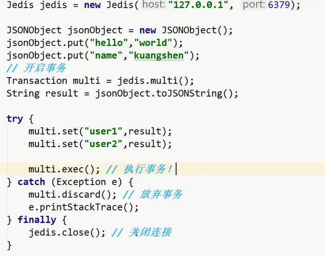
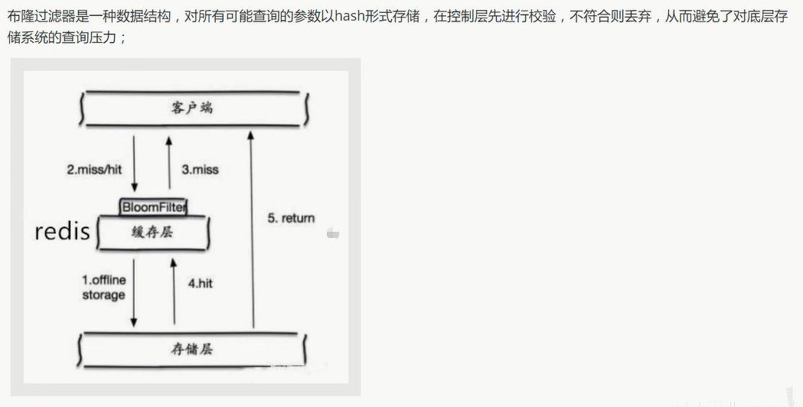

> NoSQL: 

# 发展史


​	开始进行分库分表解决写的压力!

​	如: 订单, 用户, 支付... 单独一个数据库


# 进入正文

> 为什么要用NoSQL


> 什么是NoSQL:

NoSQL = Not Only SQL (不仅仅是SQL)

泛指非关系型数据库

> NoSQL特点

1. 方便扩展 (数据之间没有关系, 很好扩展!)
2. 大数据量高性能 (Redis 一秒写8万次, 读取11万次)
3. 数据类型是多样型的! (不需要事先设计数据库!)

> 和传统的RDBMS的区别

1. 传统的RDBMS:
   - 结构化组织
   - SQL
   - 数据和关系都存在单独的表中
   - 严格一致性
2. NoSQL:
   - 不仅仅是数据
   - 没有固定的查询语言
   - 键值对存储, 列存储, 文档存储, 图像数据库(社交关系)
   - 最终一致性
   - 高性能, 高可用, 高可扩

> 真正的实践: NoSQL + RDBMS 一起使用


# [Redis](https://redis.io/)

## 概述:

> Redis是什么?

Redis 是一个开源（BSD许可）的，内存中的数据结构存储系统，它可以用作数据库、缓存和消息中间件。 

它支持多种类型的数据结构，如 [字符串（strings）](http://www.redis.cn/topics/data-types-intro.html#strings)， [散列（hashes）](http://www.redis.cn/topics/data-types-intro.html#hashes)， [列表（lists）](http://www.redis.cn/topics/data-types-intro.html#lists)， [集合（sets）](http://www.redis.cn/topics/data-types-intro.html#sets)， [有序集合（sorted sets）](http://www.redis.cn/topics/data-types-intro.html#sorted-sets) 与范围查询， [bitmaps](http://www.redis.cn/topics/data-types-intro.html#bitmaps)， [hyperloglogs](http://www.redis.cn/topics/data-types-intro.html#hyperloglogs) 和 [地理空间（geospatial）](http://www.redis.cn/commands/geoadd.html) 索引半径查询。 

Redis 内置了 [复制（replication）](http://www.redis.cn/topics/replication.html)，[LUA脚本（Lua scripting）](http://www.redis.cn/commands/eval.html)， [LRU驱动事件（LRU eviction）](http://www.redis.cn/topics/lru-cache.html)，[事务（transactions）](http://www.redis.cn/topics/transactions.html) 和不同级别的 [磁盘持久化（persistence）](http://www.redis.cn/topics/persistence.html)， 并通过 [Redis哨兵（Sentinel）](http://www.redis.cn/topics/sentinel.html)和自动 [分区（Cluster）](http://www.redis.cn/topics/cluster-tutorial.html)提供高可用性（high availability）。


> [redis-benchmark 性能测试](https://www.runoob.com/redis/redis-benchmarks.html) : [官方教程](https://www.redis.com.cn/tutorial.html)

Redis 包含了工具程序 redis-benchmark，它可以模拟运行命令，相当于模拟N个客户端同时发送总数M个查询。

启动benchmark之前你得有个正在运行的Redis实例。

运行benchmark典型示例如下：

> redis-benchmark -q -n 100000

使用这个工具比较简单，你也可以实现你自己的benchmark，但是有些坑不要踩。

```shell
C:\Users\LeBro>redis-benchmark -q -n 100000
PING_INLINE: 27979.86 requests per second
PING_BULK: 582.22 requests per second
SET: 19735.54 requests per second
GET: 21226.92 requests per second
INCR: 23062.73 requests per second
LPUSH: 22227.16 requests per second
RPUSH: 22301.52 requests per second
LPOP: 21901.01 requests per second
RPOP: 22527.60 requests per second
SADD: 23310.02 requests per second
SPOP: 23546.03 requests per second
LPUSH (needed to benchmark LRANGE): 22568.27 requests per second
LRANGE_100 (first 100 elements): 11139.58 requests per second
LRANGE_300 (first 300 elements): 6033.18 requests per second
LRANGE_500 (first 450 elements): 4969.19 requests per second
LRANGE_600 (first 600 elements): 4417.74 requests per second
MSET (10 keys): 23820.87 requests per second
```


## 基本知识:

redis-cli: 连接

select index :  切换数据库 (0~15 , 一共16个数据库)

dbsize: 当前数据库大小

set key value

get key

keys *:  显示所有的key

flushall: 清空全部数据库

flushdb: 清空当前数据库

> Redis是单线程的!

Redis是基于内存操作的, CPU不是Redis的性能瓶颈, Redis的瓶颈是根据机器的内存和网络带宽, 既然可以单线程实现, 所以就使用了单线程了!


## 五大数据类型

> Key 操作

keys *:  显示所有的key

set key value

get key

exists key: key是否存在(返回 0 or 1)

move key db: 将key 移动到其他数据库

expire key seconds: 设置key的过期时间

ttl key: 查看当前key的剩余时间(也就是还有几秒就过期了)

type key: 查看当前key的类型


---

### String: 字符串

set key value

get key

strlen key: 查看当前key对应的字符串的长度

append key value: 在某个key对应的字符串后面追加字符串

incr key: 自增key对应的value

decr key: 自减key对应的value

incrby key increment:  将key对应的value增加increment

decrby key decrement: 将key对应的value减少decrement

getrange key start end: 截取字符串

- [start, end] 包括end!
- [0, -1] 代表全部

setrange key offset value: 替换指定位置开始的字符串(替换长度由value决定)

setex: set with expire 

- setex key seconds value
- 即 设置过期时间

setnx : set if not exist 

- setnx key value

- 即 不存在再设置

mset key value [key value  ...] : 批量设置值

mget key [key ...]: 批量获取值

msetnx key value [key value  ...] : 

- 不存在再批量设置值
-  原子性操作: 即只有有其中一个key已经存在了,  就会导致整体设置失败!


**进阶使用:**

> 设置一个user:1 对象(id为1),  值为  json 字符串 来保存一个对象!

`set user:1 {name:zhangsan, age:3}`

> 更好的使用方法: [推荐!]

`mset user:1:name zhangsan user:1:age 3`

> 组合命令

`getset  key value`: **用于更新操作**

- 先get上一次设置的值
- 然后再set本次的值

**理解: 如果key不存在, 则返回nil; 如果key存在, 获取原来的值, 并设置新的值**

> 使用场景: value除了作为字符串还可以作为数字使用

- 计数器
- 统计数量
- 粉丝数
- 对象缓存存储


---

### List: 列表

> 其实就是双端队列
>
> 如果不存在,  lpush/rpush 会创建新的内容; 如果存在则新增内容.

lpush key value[value ...]

lpop key 

rpush key value[value ...]

rpop key

lrange key start stop # 区间取值 [start, stop]

lrange key 0 -1 # 取出所有的值

lindex key index # 通过下标获得list中的值 (索引从0开始)

llen key # 返回列表的长度

lrem  key count value # 移除list集合中指定个数的value, 精确匹配

**修剪**

> ltrim key start stop # 通过下标截取指定的长度, 保留截取的元素

```shell
127.0.0.1:6379> rpush mylist 1 2 3 4
(integer) 4
127.0.0.1:6379> ltrim mylist 1 2
OK
127.0.0.1:6379> lrange mylist 0 -1
1) "2"
2) "3"
```

**组合**

> rpoplpush source destination # 移除列表的最后一个元素并将它移动到新的列表中!

```shell
127.0.0.1:6379> rpush mylist 1 2 3 4
(integer) 4
127.0.0.1:6379> rpoplpush mylist myotherlist
"4"
127.0.0.1:6379> lrange mylist 0 -1
1) "1"
2) "2"
3) "3"
127.0.0.1:6379> lrange myotherlist 0 -1
1) "4"
```


**更新**

> lset  key index value # 将列表中指定下标的值替换为另一个值, **更新操作**

- 如果list不存在就更新会报错!

- exist key # 检查list是否存在

- lpush key value[value ...] # 新建一个list


**前插或者后插**

> linsert key before|after  pivot value # 将某个值插入到列表中某个元素的前面或者后面

```shell
127.0.0.1:6379> rpush mylist 1 2 3 4
(integer) 4
127.0.0.1:6379> linsert mylist before 1 0
(integer) 5
127.0.0.1:6379> lrange mylist 0 -1
1) "0"
2) "1"
3) "2"
4) "3"
5) "4"
```


---

### Set : 无序集合

sadd  key value[value ...] # 往set集合添加元素

smembers key # 查看所有成员

sismember key member # 判断元素是否在集合中 (0代表不再, 1代表在!)

```shell
127.0.0.1:6379> sadd myset 1 2 3 4
(integer) 4
127.0.0.1:6379> smembers myset
1) "1"
2) "2"
3) "3"
4) "4"
127.0.0.1:6379> sismember myset 0
(integer) 0
127.0.0.1:6379> sismember myset 2
(integer) 1
127.0.0.1:6379> sismember myset 4
(integer) 1
```

scard key # 返回set集合元素个数

srem key member [member ...] # 移除set集合中指定的元素

```shell
127.0.0.1:6379> scard myset
(integer) 4
127.0.0.1:6379> srem myset 3
(integer) 1
127.0.0.1:6379> smembers myset
1) "1"
2) "2"
3) "4"
```

**抽奖**

> srandmember key [count]

不写 表示 count 默认为1, 0 代表不抽奖

```shell
127.0.0.1:6379> srandmember myset
"2"
127.0.0.1:6379> srandmember myset 0
(empty list or set)
127.0.0.1:6379> srandmember myset 1
1) "2"
127.0.0.1:6379> srandmember myset 2
1) "2"
2) "4"
```

spop key [count] # 随机移除set集合元素

smove source  destination member # 移动set集合中的元素到另一个set集合中


**共同关注(交集)**

- 差集 : `sdiff key [key ...]`
- 交集: `sinter key [key ...]`
- 并集: `sunion key [key ...]`

```shell
127.0.0.1:6379> sadd a 1 2 3 4 
(integer) 4
127.0.0.1:6379> sadd b 3 4 5 6
(integer) 4
127.0.0.1:6379> sdiff a b # 在 a 集合中, 排除 b 集合中的元素 (对应数学上的符号: a-b) - 差集
1) "1"
2) "2"
127.0.0.1:6379> sinter a b # a 和 b 的公共元素 - 交集(微博共同关注)
1) "3"
2) "4"
127.0.0.1:6379> sunion a b # a 和 b 的所有元素 - 并集
1) "1"
2) "2"
3) "3"
4) "4"
5) "5"
6) "6"
```


---

### Hash: 哈希

> key-filed-value 对应 Java 中的 Map 集合
>
> key 是 Map集合名
>
> field 是 k
>
> value 是 v
>
> 简单点来说就是将 key-value 中的 value 又分为了 k-v 

hset key field value

hget  key field

hmset key field value [field value ...] # 设置多个 k-v

hmget key field [field ...] # 获取多个v

hgetall key #  获取全部的数据 k-v

hlen key # 返回 k-v 的数目, 即当前hash表的长度

hexists key field # 判断hash中指定的 k 是否存在

hkeys key # 获得所有k

hvals key # 获得所有v

hincrby key field increment  # v + increment (increment为负数则是做减法)

**hsetnx key field value # 如果不存在就添加, 否则添加失败**

> 场景应用: 
>
> 例子: 
>
> - hset user:1 name jungle age 26 
> - hexist user:1 jungle # 是否有这个用户
> - hincrby user:1 age 1 # 给该用户年龄加1
>
> 可以存用户信息等, 就是经常变更的信息.

**hash 适合存储对象, string 适合字符串存储!**


---

### Sorted Set : 有序集合

> zset : 在set的基础上添加了一个权重
>
> key 是有序集合名
>
> score 是权重
>
> member 是成员

zadd key  score member [score member ...] # 添加 权重-成员

zrange key  start stop

**zrangebyscore key min max** [withscores] [limit offset count]  # 从最小值到最大值排序

- min # 可以设置为 **-inf 无限小**
- max # 可以设置为 **+inf 无限大**
- 这么设置就是**全部都排序**

```shell
127.0.0.1:6379> zadd salary 1000 java 2000 c 3000 c++
(integer) 3
127.0.0.1:6379> zrangebyscore salary -inf +inf withscores # 从小到大升序显示所有元素
1) "java"
2) "1000"
3) "c"
4) "2000"
5) "c++"
6) "3000"
127.0.0.1:6379> zrangebyscore salary -inf 3000 withscores limit 0 1 # 取出薪水最低的元素
1) "java"
2) "1000"
```

zrem key member # 移除有序集合中的指定元素

zcard key # 获取有序集合的元素个数

zcount key start stop # 获取指定区间的成员数量

**zrevrange key start stop  [withscores] # 翻转指定区间的元素**

> 场景应用:  排行榜应用!
>
> 127.0.0.1:6379> zrevrange salary 0 1 withscores # 取出 top2 的元素
> 1) "c++"
> 2) "3000"
> 3) "c"
> 4) "2000"


## 三种特殊数据类型

### Gospatial : 地理位置

可以推算地理位置的信息, 两地之间的距离, 方圆几里的人!

> [geoadd](https://redis.io/commands/geoadd) key longitude latitude member [longitude latitude member ...] 

**添加 地理位置集合 的经纬度及地点名称**

- key : 地理位置集合

- longitude 经度 

- latitude 纬度

  

- member 地点名称

>  [geopos](https://redis.io/commands/geopos) key member [member ...] 

**获取 地理位置集合中 指定地点的经度和纬度**

- key : 地理位置集合
- member : 指定地点名称

> [geodist](https://redis.io/commands/geodist) key member1 member2 [unit]

**计算地理集合中两个地点之间的直线距离**

- key : 地理位置集合
- member1 :  地点1的名称
- member2 :  地点2的名称

**unit 表示距离的单位:**

The unit must be one of the following, and defaults to meters:

- **m** for meters.
- **km** for kilometers.
- **mi** for miles.
- **ft** for feet.

> [georadius](https://redis.io/commands/georadius) key longitude latitude radius m|km|ft|mi  [WITHCOORD] [WITHDIST] [WITHHASH] [COUNT count] [ASC|DES]

**在地理位置集合中, 计算以某个 坐标点 longitude latitude 为中心, 方圆半径为radius 的地点子集**

- key : 地理位置集合
- longitude latitude : 坐标点
- radius m|km|ft|mi  : 半径和单位

- [WITHCOORD] : 显示计算出的子集的坐标
- [WITHDIST] : 显示到中心位置的距离
- [WITHHASH] : 显示计算出的子集的坐标 对应的hash字符串
- [COUNT count] : 限定子集数量
- [ASC|DES] : 升序 或 逆序

**个人理解: 以地图上某个点为中心找出周围的地点集合**

> [georadiusbymember](https://redis.io/commands/georadiusbymember)  key member radius m|km|ft|mi [WITHCOORD] [WITHDIST] [WITHHASH] [COUNT count] [ASC|DES]

**找出位于指定元素周围的其他元素**

- key : 地理位置集合
- member  : 地理位置集合中的某个元素
- radius m|km|ft|mi  : 半径和单位
- 其他参数同上

>  geohash key member [member ...]

**返回地理位置集合中一个或多个位置元素的hash字符串表示(通常11位)**


**注: geospatial 是基于 sorted sets 的, 所以可以 使用 zset zrange zrem ... 命令来操作 geo !**

---

### Hyperloglog : 基础统计

**找不重复的数**


**可以用来计算网站的访问量**

- pfadd key element [element ...]  # 创建一组元素

- pfcount key [key ...] # 统计元素数量

- pfmerge destkey sourcekey [sourcekey ...] # 组间合并

```shell
127.0.0.1:6379> pfadd mykey1 6 7 8 9 10 11 12
(integer) 1
127.0.0.1:6379> pfadd mykey2 1 2 3 4 5 6 7 8 9
(integer) 1
127.0.0.1:6379> pfmerge mykey3 mykey1 mykey2
OK
127.0.0.1:6379> pfcount mykey3
(integer) 12
```

**注: 会有 0.81% 的错误率!**

---

### Bitmaps : 位图

> 位存储

统计用户信息: 登录, 未登录, 只有两个状态的这种!

某用户一年的登录信息: 365 bit 即 365/8 约等于 46 byte .

> 统计 用户-jungle 一周内的打卡情况

- setbit key offset value
- getbit key offset
- bitcount key [start end]

```bash
127.0.0.1:6379> setbit jungle 0 1
(integer) 0
127.0.0.1:6379> setbit jungle 1 0
(integer) 0
127.0.0.1:6379> setbit jungle 2 1
(integer) 0
127.0.0.1:6379> setbit jungle 3 1
(integer) 0
127.0.0.1:6379> setbit jungle 4 1
(integer) 0
127.0.0.1:6379> setbit jungle 5 1
(integer) 0
127.0.0.1:6379> setbit jungle 6 0
(integer) 0
127.0.0.1:6379> getbit jungle 0 # 第一天是否打卡
(integer) 1
127.0.0.1:6379> bitcount jungle 0 6 # 一周打卡情况
(integer) 5
```


## 事务

**Redis 事务的本质: 一组命令的集合!**

> 一次性,  顺序性,  排他性.
>
> --------- 队列 set set set 执行 -------------

所有的命令都在事务中, 并没有直接被执行 ! 只有发起执行命令的时候才会执行


> 使用 [`MULTI`](https://redis.io/commands/multi)输入多个命令。Redis 不会立即执行这些命令，而是将它们放到队列，当调用了 [`EXEC`](https://redis.io/commands/exec)将执行所有命令。

这个过程是这样的：

1. 开始事务（`MULTI`）。
2. 命令入队(批量操作 Redis 的命令，先进先出（FIFO）的顺序执行)。
3. 执行事务(`EXEC`)。

也可以通过 [`DISCARD`](https://redis.io/commands/discard)，它会清空事务队列中保存的所有命令


Redis 的事务和我们平时理解的关系型数据库的事务不同。我们知道事务具有四大特性： **1. 原子性**，**2. 隔离性**，**3. 持久性**，**4. 一致性**。

1. **原子性（Atomicity）：** 事务是最小的执行单位，不允许分割。事务的原子性确保动作要么全部完成，要么完全不起作用；
2. **隔离性（Isolation）：** 并发访问数据库时，一个用户的事务不被其他事务所干扰，各并发事务之间数据库是独立的；
3. **持久性（Durability）：** 一个事务被提交之后。它对数据库中数据的改变是持久的，即使数据库发生故障也不应该对其有任何影响。
4. **一致性（Consistency）：** 执行事务前后，数据保持一致，多个事务对同一个数据读取的结果是相同的；

**Redis 是不支持 roll back 的，因而不满足原子性的（而且不满足持久性）。**

- **编译型异常(代码有问题, 错误的命令), 事务中所有的命令都不会被执行!**

- **运行时异常 (incr 一个字符串),  如果事务队列中存在语法性, 那么执行命令的时候, 其他命令是可以正常执行的, 错误命令抛出异常!**


> [`WATCH`](https://redis.io/commands/watch)用于监听指定的键，当调用 `EXEC` 命令执行事务时，如果一个被 `WATCH` 命令监视的键被修改的话，整个事务都不会执行，直接返回失败。

悲观锁: 任何时候都会出问题, 无论做什么都会加锁!

乐观锁: 任何时候都不会出问题, 所以不会上锁!  更新时比较version判断是否数据被修改过.


> 使用watch可以实现redis的乐观锁操作!

正常执行：

```bash
127.0.0.1:6379> set money 100 # 余额
OK
127.0.0.1:6379> set out 0 # 花出去的钱
OK
127.0.0.1:6379> watch money # 监视 money 对象
OK
127.0.0.1:6379> multi # 事务正常结束, 数据期间没有发生变动, 此时正常执行成功!
OK
127.0.0.1:6379> decrby money 20
QUEUED
127.0.0.1:6379> incrby out 20
QUEUED
127.0.0.1:6379> exec # 执行成功后, watch自动释放锁
1) (integer) 80
2) (integer) 20
```


多线程操作:

1. client1:

```bash
127.0.0.1:6379> watch money
OK
127.0.0.1:6379> multi
OK
127.0.0.1:6379> decryby money 10
(error) ERR unknown command 'decryby'
127.0.0.1:6379> decrby money 10
QUEUED
127.0.0.1:6379> incrby out 10
# 先不执行 事务
```

2. 此时, client2 进行存钱操作:

```bash
127.0.0.1:6379> get money
"80"
127.0.0.1:6379> set money 1000
OK
127.0.0.1:6379> get money
"1000"
```

3. 这个时候, client1 执行事务时, 由于监视的键发生修改, 所以事务执行失败!

```bash
127.0.0.1:6379> watch money
OK
127.0.0.1:6379> multi
OK
127.0.0.1:6379> decryby money 10
(error) ERR unknown command 'decryby'
127.0.0.1:6379> decrby money 10
QUEUED
127.0.0.1:6379> incrby out 10
QUEUED
127.0.0.1:6379> exec # 执行时, 发现不是之前的100, 所以执行事务失败!
(error) EXECABORT Transaction discarded because of previous errors.
```

**注: 要再次监视, 可以使用 unwach 先解除监视 (即解锁), 再添加新的监视.**

---

## Jedis

> Redis 官方推荐的java连接开发工具, 使用java操作Redis的中间件.

```xml
<!-- https://mvnrepository.com/artifact/redis.clients/jedis -->
<dependency>
    <groupId>redis.clients</groupId>
    <artifactId>jedis</artifactId>
    <version>3.7.0</version>
</dependency>
```

导包之后看源码: `package redis.clients.jedis;`

所有的api命令基本上都是对应上面学过的方法! 

> 操作事务:

了解一下:  也可以通过 `jedis.watch(result)` 实现乐观锁.



---

## Spring Boot 整合

> 

源码分析: `RedisAutoConfiguration`


源代码:

`class RedisAutoConfiguration`

```java
/*
 * Copyright 2012-2020 the original author or authors.
 *
 * Licensed under the Apache License, Version 2.0 (the "License");
 * you may not use this file except in compliance with the License.
 * You may obtain a copy of the License at
 *
 *      https://www.apache.org/licenses/LICENSE-2.0
 *
 * Unless required by applicable law or agreed to in writing, software
 * distributed under the License is distributed on an "AS IS" BASIS,
 * WITHOUT WARRANTIES OR CONDITIONS OF ANY KIND, either express or implied.
 * See the License for the specific language governing permissions and
 * limitations under the License.
 */

package org.springframework.boot.autoconfigure.data.redis;

import org.springframework.boot.autoconfigure.EnableAutoConfiguration;
import org.springframework.boot.autoconfigure.condition.ConditionalOnClass;
import org.springframework.boot.autoconfigure.condition.ConditionalOnMissingBean;
import org.springframework.boot.autoconfigure.condition.ConditionalOnSingleCandidate;
import org.springframework.boot.context.properties.EnableConfigurationProperties;
import org.springframework.context.annotation.Bean;
import org.springframework.context.annotation.Configuration;
import org.springframework.context.annotation.Import;
import org.springframework.data.redis.connection.RedisConnectionFactory;
import org.springframework.data.redis.core.RedisOperations;
import org.springframework.data.redis.core.RedisTemplate;
import org.springframework.data.redis.core.StringRedisTemplate;

/**
 * {@link EnableAutoConfiguration Auto-configuration} for Spring Data's Redis support.
 *
 * @author Dave Syer
 * @author Andy Wilkinson
 * @author Christian Dupuis
 * @author Christoph Strobl
 * @author Phillip Webb
 * @author Eddú Meléndez
 * @author Stephane Nicoll
 * @author Marco Aust
 * @author Mark Paluch
 * @since 1.0.0
 */
@Configuration(proxyBeanMethods = false)
@ConditionalOnClass(RedisOperations.class)
@EnableConfigurationProperties(RedisProperties.class)
@Import({ LettuceConnectionConfiguration.class, JedisConnectionConfiguration.class })
public class RedisAutoConfiguration {

	@Bean
	@ConditionalOnMissingBean(name = "redisTemplate")
	@ConditionalOnSingleCandidate(RedisConnectionFactory.class)
	public RedisTemplate<Object, Object> redisTemplate(RedisConnectionFactory redisConnectionFactory) {
		RedisTemplate<Object, Object> template = new RedisTemplate<>();
		template.setConnectionFactory(redisConnectionFactory);
		return template;
	}

	@Bean
	@ConditionalOnMissingBean
	@ConditionalOnSingleCandidate(RedisConnectionFactory.class)
	public StringRedisTemplate stringRedisTemplate(RedisConnectionFactory redisConnectionFactory) {
		StringRedisTemplate template = new StringRedisTemplate();
		template.setConnectionFactory(redisConnectionFactory);
		return template;
	}

}
```

使用过程:

1. 导包

   ```xml
   <!-- https://mvnrepository.com/artifact/org.springframework.boot/spring-boot-starter-data-redis -->
   <dependency>
       <groupId>org.springframework.boot</groupId>
       <artifactId>spring-boot-starter-data-redis</artifactId>
   <!-- <version>2.5.3</version> -->
   </dependency>
   ```

2. 配置

   ```xml
   # RedisProperties
   # 选择哪个库
   spring.redis.database=11
   # 设置这个库的IP
   spring.redis.host=localhost
   # 配置端口
   spring.redis.port=6379
   ```

3. 自定义

    ```java
    package com.nowcoder.community.config;
    
    import org.springframework.context.annotation.Bean;
    import org.springframework.context.annotation.Configuration;
    import org.springframework.data.redis.connection.RedisConnectionFactory;
    import org.springframework.data.redis.core.RedisTemplate;
    import org.springframework.data.redis.serializer.RedisSerializer;
    
    /**
     * @author Jungle
     */
    @Configuration
    public class RedisConfig {
    
        @Bean
        public RedisTemplate<String, Object> redisTemplate(RedisConnectionFactory factory) {
            RedisTemplate<String, Object> template = new RedisTemplate<>();
            template.setConnectionFactory(factory);
    
            /* 设置key的序列化方式
            * String
            * RedisSerializer.string()返回 能够序列化为String的序列化器 */
            template.setKeySerializer(RedisSerializer.string());
    
            /* 设置value的序列化
            * Object*/
            template.setValueSerializer(RedisSerializer.json());
    
            /* 设置hash的key的序列化方式
            * String */
            template.setHashKeySerializer(RedisSerializer.string());
    
            /* 设置hash的value的序列化方式 */
            template.setHashValueSerializer(RedisSerializer.json());
    
            /* 设置生效 */
            template.afterPropertiesSet();
    
            return template;
        }
    
    }
    ```

4. 操作

   - `opsForValue` : 操作 String / Bitmaps
   - `opsForList` : 操作 List
   - `opsForSet` : 操作 Set
   - `opsForHash `: 操作 Hash
   - `opsForZSet` : 操作 Sorted Set
   - `opsForGeo` : 操作 GeoSpatial
   - `opsForHyperLogLog` : 操作 Hyperloglog

要去理解Redis的思想和数据结构的用处和作用场景.


---

## Redis.conf 详解

> 单位

```xml
# Redis configuration file example

# Note on units: when memory size is needed, it is possible to specify
# it in the usual form of 1k 5GB 4M and so forth:
#
# 1k => 1000 bytes
# 1kb => 1024 bytes
# 1m => 1000000 bytes
# 1mb => 1024*1024 bytes
# 1g => 1000000000 bytes
# 1gb => 1024*1024*1024 bytes
#
# units are case insensitive so 1GB 1Gb 1gB are all the same.
```

units are case insensitive so 1GB 1Gb 1gB are all the same.

**单位对大小写不敏感.**


> 包含 : 可以把其他的配置文件包含进来.

```xml
################################## INCLUDES ###################################

# Include one or more other config files here.  This is useful if you
# have a standard template that goes to all Redis servers but also need
# to customize a few per-server settings.  Include files can include
# other files, so use this wisely.
#
# Notice option "include" won't be rewritten by command "CONFIG REWRITE"
# from admin or Redis Sentinel. Since Redis always uses the last processed
# line as value of a configuration directive, you'd better put includes
# at the beginning of this file to avoid overwriting config change at runtime.
#
# If instead you are interested in using includes to override configuration
# options, it is better to use include as the last line.
#
# include .\path\to\local.conf
# include c:\path\to\other.conf
```


> 网络

**绑定的ip**

```xml
################################## NETWORK #####################################

# By default, if no "bind" configuration directive is specified, Redis listens
# for connections from all the network interfaces available on the server.
# It is possible to listen to just one or multiple selected interfaces using
# the "bind" configuration directive, followed by one or more IP addresses.
#
# Examples:
#
# bind 192.168.1.100 10.0.0.1
# bind 127.0.0.1 ::1
#
# ~~~ WARNING ~~~ If the computer running Redis is directly exposed to the
# internet, binding to all the interfaces is dangerous and will expose the
# instance to everybody on the internet. So by default we uncomment the
# following bind directive, that will force Redis to listen only into
# the IPv4 lookback interface address (this means Redis will be able to
# accept connections only from clients running into the same computer it
# is running).
#
# IF YOU ARE SURE YOU WANT YOUR INSTANCE TO LISTEN TO ALL THE INTERFACES
# JUST COMMENT THE FOLLOWING LINE.
# ~~~~~~~~~~~~~~~~~~~~~~~~~~~~~~~~~~~~~~~~~~~~~~~~~~~~~~~~~~~~~~~~~~~~~~~~
bind 127.0.0.1
```

**保护模式**

```xml
# Protected mode is a layer of security protection, in order to avoid that
# Redis instances left open on the internet are accessed and exploited.
#
# When protected mode is on and if:
#
# 1) The server is not binding explicitly to a set of addresses using the
#    "bind" directive.
# 2) No password is configured.
#
# The server only accepts connections from clients connecting from the
# IPv4 and IPv6 loopback addresses 127.0.0.1 and ::1, and from Unix domain
# sockets.
#
# By default protected mode is enabled. You should disable it only if
# you are sure you want clients from other hosts to connect to Redis
# even if no authentication is configured, nor a specific set of interfaces
# are explicitly listed using the "bind" directive.
protected-mode yes
```

**绑定的端口**

```xml
# Accept connections on the specified port, default is 6379 (IANA #815344).
# If port 0 is specified Redis will not listen on a TCP socket.
port 6379
```


> 通用配置

**守护进程和pid**

```xml
# By default Redis does not run as a daemon. Use 'yes' if you need it.
# Note that Redis will write a pid file in /var/run/redis.pid when daemonized.
# NOT SUPPORTED ON WINDOWS daemonize no
daemonize yes # 以守护进程的方式运行, 默认是 no, 需要自己开启!

# If a pid file is specified, Redis writes it where specified at startup
# and removes it at exit.
#
# When the server runs non daemonized, no pid file is created if none is
# specified in the configuration. When the server is daemonized, the pid file
# is used even if not specified, defaulting to "/var/run/redis.pid".
#
# Creating a pid file is best effort: if Redis is not able to create it
# nothing bad happens, the server will start and run normally.
# NOT SUPPORTED ON WINDOWS pidfile /var/run/redis.pid
pidfile /var/run/redis.pid # 如果以后台的方式运行, 就需要指定一个pid文件!
```

**日志和日志文件**

```xml
# Specify the server verbosity level.
# This can be one of:
# debug (a lot of information, useful for development/testing)
# verbose (many rarely useful info, but not a mess like the debug level)
# notice (moderately verbose, what you want in production probably)
# warning (only very important / critical messages are logged)
loglevel notice

# Specify the log file name. Also 'stdout' can be used to force
# Redis to log on the standard output.
logfile "server_log.txt" 
```

**默认数据库的数量**

```xml
# Set the number of databases. The default database is DB 0, you can select
# a different one on a per-connection basis using SELECT <dbid> where
# dbid is a number between 0 and 'databases'-1
databases 16
```


> 快照
>
> 在规定的时间内, 执行了多少次操作,  则会持久化到文件 .rdb .aof

**save <seconds> <changes>**

```xml
################################ SNAPSHOTTING  ################################
#
# Save the DB on disk:
#
#   save <seconds> <changes>
#
#   Will save the DB if both the given number of seconds and the given
#   number of write operations against the DB occurred.
#
#   In the example below the behaviour will be to save:
#   after 900 sec (15 min) if at least 1 key changed
#   after 300 sec (5 min) if at least 10 keys changed
#   after 60 sec if at least 10000 keys changed
#
#   Note: you can disable saving completely by commenting out all "save" lines.
#
#   It is also possible to remove all the previously configured save
#   points by adding a save directive with a single empty string argument
#   like in the following example:
#
#   save ""

save 900 1      # 如果900秒-15分钟, 至少有一个key进行了修改, 就进行持久化操作
save 300 10     # 如果300秒-5分钟, 至少有10个key进行了修改, 就进行持久化操作
save 60 10000	# 如果60秒-1分钟, 至少有10000个key进行了修改, 就进行持久化操作
```

**stop-writes-on-bgsave-error**

```xml
# By default Redis will stop accepting writes if RDB snapshots are enabled
# (at least one save point) and the latest background save failed.
# This will make the user aware (in a hard way) that data is not persisting
# on disk properly, otherwise chances are that no one will notice and some
# disaster will happen.
#
# If the background saving process will start working again Redis will
# automatically allow writes again.
#
# However if you have setup your proper monitoring of the Redis server
# and persistence, you may want to disable this feature so that Redis will
# continue to work as usual even if there are problems with disk,
# permissions, and so forth.
stop-writes-on-bgsave-error yes # 如果持久化出错, 是否还需要继续工作!
```

**rdbcompression**

```xml
# Compress string objects using LZF when dump .rdb databases?
# For default that's set to 'yes' as it's almost always a win.
# If you want to save some CPU in the saving child set it to 'no' but
# the dataset will likely be bigger if you have compressible values or keys.
rdbcompression yes # 是否压缩 rdb文件, 需要消耗一些cpu资源!
```

**rdbchecksum**

```xml
# Since version 5 of RDB a CRC64 checksum is placed at the end of the file.
# This makes the format more resistant to corruption but there is a performance
# hit to pay (around 10%) when saving and loading RDB files, so you can disable it
# for maximum performances.
#
# RDB files created with checksum disabled have a checksum of zero that will
# tell the loading code to skip the check.
rdbchecksum yes # 保存rdb文件是否进行校验检查
```

**rdb文件保存的文件名和目录**

```xml
# The filename where to dump the DB
dbfilename dump.rdb # 文件名

# The working directory.
#
# The DB will be written inside this directory, with the filename specified
# above using the 'dbfilename' configuration directive.
#
# The Append Only File will also be created inside this directory.
#
# Note that you must specify a directory here, not a file name.
dir ./ # 目录
```


> 安全
>
> **默认为空, 没有密码**
>
> 可以在配置文件里设置: `requirepass 密码`
>
> 也可以通过命令:
>
> - `config set requirepass 123456` # 设置密码
> - `config get requirepass` # 查看密码
>
> 之后需要登录: `auth 123456` # 登录

```xml
################################## SECURITY ###################################

# Require clients to issue AUTH <PASSWORD> before processing any other
# commands.  This might be useful in environments in which you do not trust
# others with access to the host running redis-server.
#
# This should stay commented out for backward compatibility and because most
# people do not need auth (e.g. they run their own servers).
#
# Warning: since Redis is pretty fast an outside user can try up to
# 150k passwords per second against a good box. This means that you should
# use a very strong password otherwise it will be very easy to break.
#
# requirepass foobared

# Command renaming.
#
# It is possible to change the name of dangerous commands in a shared
# environment. For instance the CONFIG command may be renamed into something
# hard to guess so that it will still be available for internal-use tools
# but not available for general clients.
#
# Example:
#
# rename-command CONFIG b840fc02d524045429941cc15f59e41cb7be6c52
#
# It is also possible to completely kill a command by renaming it into
# an empty string:
#
# rename-command CONFIG ""
#
# Please note that changing the name of commands that are logged into the
# AOF file or transmitted to slaves may cause problems.
```


> 客户端限制

```xml
################################### LIMITS ####################################
maxclients 10000	 # 最多能连上 redis 的客户端数量
maxmemory <bytes>    # redis 配置最大的内存容量
```

**内存达到上限的处理策略**

```xml
maxmemory-policy noeviction # 默认处理策略

# volatile-lru -> remove the key with an expire set using an LRU algorithm
1. 只对设置了过期时间的key进行LRU(默认值)

# allkeys-lru -> remove any key according to the LRU algorithm
2. 删除lru算法的key

# volatile-random -> remove a random key with an expire set
3. 随机删除即将过期的key

# allkeys-random -> remove a random key, any key
4. 随机删除

# volatile-ttl -> remove the key with the nearest expire time (minor TTL)
5. 删除即将过期的

# noeviction -> don't expire at all, just return an error on write operations
6. 永不过期, 返回错误
```


> APPEND ONLY 模式 : aof配置

```xml
appendonly no # 默认不开启aof模式, 默认使用rdb方式持久化, 大部分情况下, rdb完全够用!
appendfilename "appendonly.aof" # 持久化的文件的名字

# appendfsync always	# 每次修改都会写入
appendfsync everysec	# 默认每秒都执行一次 sync, 可能会丢失这1s的数据!(假如宕机)
# appendfsync no		# 不执行 sync, 这个时候操作系统自己同步数据, 速度最快!
```


---

## Redis 持久化

Redis是内存数据库, 如果不将内存中的数据库状态保存在磁盘, 那么一旦服务器进程退出, 服务器中的数据库状态也会消失. 

所以, Redis提供了持久化功能!


### RDB (Redis DataBase)

> RDB是Redis用来进行持久化的一种方式，是把当前内存中的数据集快照写入磁盘，也就是 Snapshot 快照（数据库中所有键值对数据）。恢复时是将快照文件直接读到内存里。


**Snapshot 快照**


rdb保存的文件是 dump.rdb , 有时在生产环境需要将这个文件进行备份!


> 触发机制

1 save 的规则满足的情况下, 会自动触发rdb规则

2 执行flushall 命令, 也会触发rdb规则

3 shutdown redis, 也会产生rdb文件


> 如何恢复rdb文件

1 只需要将rdb文件放在redis启动目录, redis启动时会自动检查dump.rdb恢复其中的数据!

2 查看需要存放的位置 `config get dir`


> 默认配置

优点:

1. 适合大规模的数据恢复
2. 对数据的完整性不高

缺点:

1. 需要一定的时间间隔进行操作(如果redis意外宕机, 这个最后一次的修改数据就没有了)
2. fork 进程的时候, 会占用一定的内存空间


### AOF (Append-only file)

> 将所有的命令都记录下来, 恢复的时候就把这个文件全部再执行一遍!


```xml
############################## APPEND ONLY MODE ###############################

# By default Redis asynchronously dumps the dataset on disk. This mode is
# good enough in many applications, but an issue with the Redis process or
# a power outage may result into a few minutes of writes lost (depending on
# the configured save points).
#
# The Append Only File is an alternative persistence mode that provides
# much better durability. For instance using the default data fsync policy
# (see later in the config file) Redis can lose just one second of writes in a
# dramatic event like a server power outage, or a single write if something
# wrong with the Redis process itself happens, but the operating system is
# still running correctly.
#
# AOF and RDB persistence can be enabled at the same time without problems.
# If the AOF is enabled on startup Redis will load the AOF, that is the file
# with the better durability guarantees.
#
# Please check http://redis.io/topics/persistence for more information.

appendonly no

# The name of the append only file (default: "appendonly.aof")
appendfilename "appendonly.aof"
```

默认不开启aof, 需要手动设置, 只需要设置为 `appendonly yes` 即可!

重启 redis 就可以生效了! `redis-server 配置文件`

**如果这个aof文件有错位, 这时候redis就启动不起来, 需要通过 `redis-check-aof --fix` 进行修复**


> 优点和缺点

优点: 

1 每一次修改都同步, 文件的完整性会更好!

2 每秒同步一次, 可能会丢失1s的数据

3 从不同步, 效率最高!

缺点:

1 相对于数据文件来说, aof远远大于rdb, 修复的速度也比rdb慢!

2 aof运行效率也比rdb慢, 所以redis默认配置就是rdb持久化!


> 重写规则
>
> 如果aof文件大于64m, fork一个新的进程来将文件进行重写!

aof 默认就是文件的无限追加, 文件会越来越大!

```bash
no-appendfsync-on-rewrite no
auto-aof-rewrite-percentage 100
auto-aof-rewrite-min-size 64mb
```


## Redis 发布订阅


> 命令


使用场景:

1 实时消息系统

2 实时聊天  (频道当做聊天室, 将信息回显给所有人即可!)

3 订阅, 关注系统

复杂的场景可以使用消息中间件!


## Redis主从复制

> 主从复制 是 将一台Redis服务器的数据, 复制到其他的Redis服务器.
>
> 前者称为 主节点 (Master/Leader), 后者称为 从节点(Slave/Follower)
>
> `数据是单向复制的, 只能由主节点到从节点!`


> 最基本的主从复制: **一主二从**


> **环境配置**

**只配置从库, 不配置主库!**

查看配置信息:

```bash
C:\Users\LeBro>redis-cli
127.0.0.1:6379> info replication	# 查看当前库的信息
# Replication
role:master			# 角色
connected_slaves:0	# 从机
master_repl_offset:0
repl_backlog_active:0
repl_backlog_size:1048576
repl_backlog_first_byte_offset:0
repl_backlog_histlen:0
```

配置: 复制3个配置文件, 然后修改对应的信息

1 端口

2 pid 文件名字

3 long文件名字

4 dump.rdb 文件名字

```xml
cp redis.conf redis79.conf
cp redis.conf redis80.conf
cp redis.conf redis81.conf

port 6379
pidfile /var/run/redis6379.pid"
logfile "6379.log"
dbfilename dump6379.rdb

port 6380
pidfile /var/run/redis6380.pid"
logfile "6380.log"
dbfilename dump6380.rdb

port 6381
pidfile /var/run/redis6381.pid"
logfile "6381.log"
dbfilename dump6381.rdb
```

一主: 6379

二从: 6380, 6381

> 只配置从机: `slaveof host port`

```bash
127.0.0.1:6380> slaveof 127.0.0.1 6379
OK
127.0.0.1:6381> slaveof 127.0.0.1 6379
OK
```

在主机中查看从机的配置信息: `info replication`

```bash
127.0.0.1:6379> info replication
# Replication
role:master
connected_slaves:2
slave0:ip=127.0.0.1,port=6380,state=online,offset=57,lag=1
slave1:ip=127.0.0.1,port=6381,state=online,offset=57,lag=1
master_repl_offset:57
repl_backlog_active:1
repl_backlog_size:1048576
repl_backlog_first_byte_offset:2
repl_backlog_histlen:56
```

**注: 这里使用的命令进行的配置只是暂时的, 永久的主从配置应该是在配置文件中配置!**


> **主机负责写, 从机负责读!**

```bash
# 主机
127.0.0.1:6379> set k1 v1
OK

# 从机1
127.0.0.1:6380> get k1
"v1"
127.0.0.1:6380> set k2 v2
(error) READONLY You can't write against a read only slave.

# 从机2
127.0.0.1:6381> get k1
"v1"
127.0.0.1:6381> set k3 v3
(error) READONLY You can't write against a read only slave.
```

**复制原理:** 


**主从传递:**


> 若主机断了, 可以使用 `slaveof no one` 使自己成为主节点 (手动操作)

```bash
127.0.0.1:6380> slaveof no one
OK
127.0.0.1:6380> info replication
# Replication
role:master
connected_slaves:0
master_repl_offset:0
repl_backlog_active:0
repl_backlog_size:1048576
repl_backlog_first_byte_offset:0
repl_backlog_histlen:0
```


## 哨兵模式

> 概述


**可以后台监控主机是否故障, 如果故障, 根据投票数 `自动将从库转换为主库`**


实际上:


**根据投票数 `自动将从库转换为主库`**


> 测试 (单哨兵)

1 配置哨兵配置文件 sentinel.conf (最基本的配置)

```bash
# myredis 被监控的名称
# 127.0.0.1 host
# 6379 		port
# 1		表示 主机挂了, salve投票让谁接替成为主机, 票数最多的, 就会成为主机!
sentinel monitor myredis 127.0.0.1 6379 1
```

2 启动哨兵

```bash
redis-sentinel sentinel.conf
```

3 断开主机再查看信息


**关键点信息 :**  最新主机 `6381`


**若主机回来了, 会变成`6381`的从机**, 这就是哨兵模式的规则!


> 优缺点


## 缓存穿透和雪崩


### 缓存穿透 (查不到)

> 概念 


> 解决方案

**布隆过滤器**



**缓存空对象**


### 缓存击穿 (量太大)

> 概念


> 解决方案


### 缓存雪崩 (集中过期/宕机)

> 概念


> 原因


> 解决方案


---


# 答疑:

常见问题: https://www.redis.com.cn/redis-interview-questions.html

