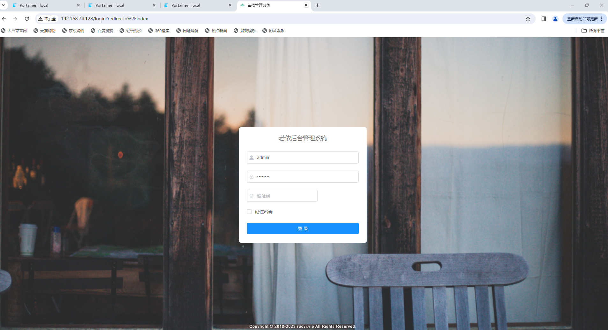
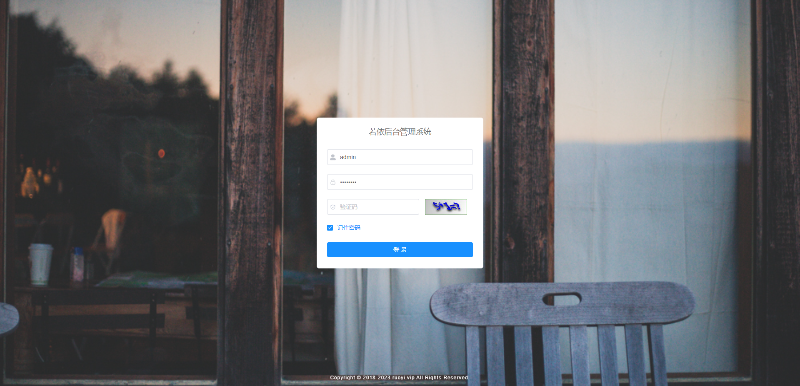
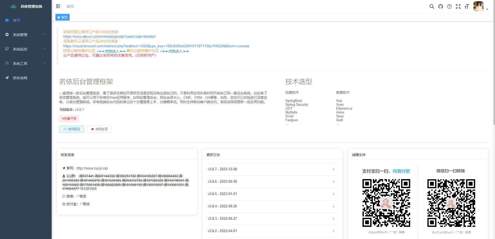
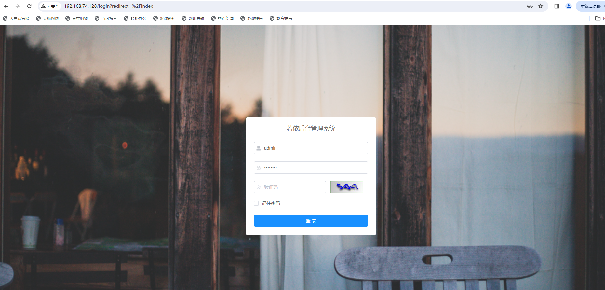
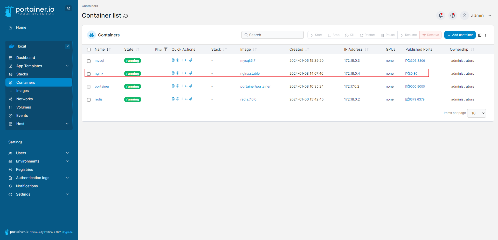
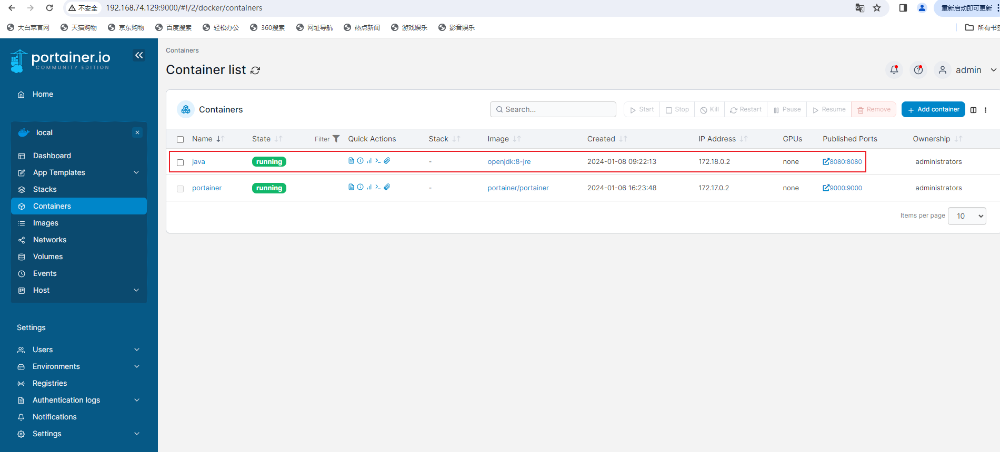
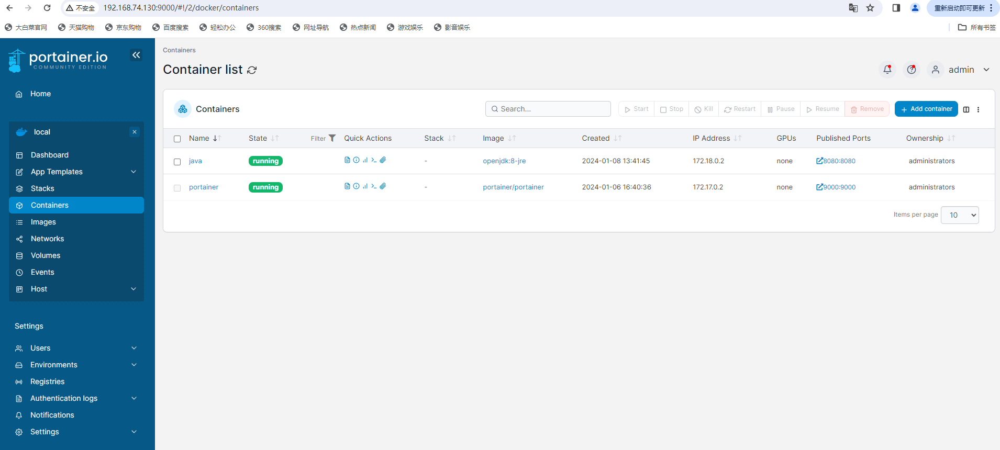

# 部署若依系统

## 前置准备

首先，先在本地部署，准备好虚拟机，建立三台centos服务器，分别为100、101、102。

- 100：前端部署 【http://192.168.74.128/】
  - mysql
  - redis
- 101：后端部署【实例1-http://192.168.74.129/】
- 102：后端部署【实例2-http://192.168.74.130/】

## 安装Docker

采用docker安装mysql、redis等服务，简化部署。

```sh
# 切换root用户，就不要加sudo了
su root

yum install -y yum-utils device-mapper-persistent-data lvm2

yum-config-manager --add-repo http://mirrors.aliyun.com/docker-ce/linux/centos/docker-ce.repo

yum makecache fast

yum list docker-ce --showduplicates | sort -r

yum install -y docker-ce

sudo systemctl start docker
sudo systemctl enable docker
docker version
```

## 安装网桥

```sh
docker network create -d bridge ruoyi-bridge
```


## Docker可视化

```sh
sudo docker run -d -p 9000:9000 --restart=always -v /var/run/docker.sock:/var/run/docker.sock --privileged=true --name portainer portainer/portainer
```


## 100 前端部署准备

### MySQL

```sh
docker run \
--name mysql \
--publish 3306:3306 \
--env TZ=Asia/Shanghai \
--env MYSQL_DATABASE="ruoyi" \
--env MYSQL_ROOT_PASSWORD=ruoyi123456 \
--volume /var/data/mysql/mysql:/var/lib/mysql \
--network ruoyi-bridge \
--restart unless-stopped \
--detach \
mysql:5.7 \
--character-set-server=utf8 \
--collation-server=utf8_unicode_ci \
--lower-case-table-names=1

```

### redis

```sh
docker run \
--name redis \
--publish 6379:6379 \
--volume /var/data/redis:/usr/local/etc/redis  \
--volume /var/data/redis/data:/data  \
--network ruoyi-bridge \
--restart unless-stopped \
--detach \
redis:7.0.0 \
--requirepass "ruoyi123456" \
--appendonly yes

```

### nginx

```sh
docker run \
--name nginx \
--volume /var/data/nginx/html:/usr/share/nginx/html \
--publish 80:80 \
--network ruoyi-bridge \
--restart unless-stopped \
--detach \
nginx:stable

```

> 若遇到镜像源下载失败，则替换之：
>
> `docker: error pulling image configuration: download failed after attempts=6: dial tcp 104.16.100.207:443: i/o timeout.`

```sh
sudo mkdir -p /etc/docker
sudo tee /etc/docker/daemon.json <<-'EOF'
{
  "registry-mirrors": ["https://yxzrazem.mirror.aliyuncs.com"]
}
EOF
sudo systemctl daemon-reload
sudo systemctl restart docker
```


## 101&102多实例后端部署准备

### jdk1.8

```sh
docker run \
--name java \
--publish 8080:8080 \
--volume /var/data/java/server.jar:/server.jar \
--volume /var/data/java/uploadPath:/uploadPath \
--volume /var/data/java/logs:/logs \
--volume /etc/localtime:/etc/localtime \
--env "TZ=Asia/Shanghai" \
--network ruoyi-bridge \
--restart unless-stopped \
--detach \
openjdk:8-jre \
java -jar /server.jar

```

### 参数设置

> `RuoYi-Vue\ruoyi-admin\src\main\resources\application-druid.yml`
>
> 涉及 `MySQL` 数据库
>
> -  url: jdbc:mysql://192.168.74.128:3306/ruoyi?
> - password: ruoyi123456

```yaml
# 数据源配置
spring:
    datasource:
        type: com.alibaba.druid.pool.DruidDataSource
        driverClassName: com.mysql.cj.jdbc.Driver
        druid:
            # 主库数据源
            master:
                url: jdbc:mysql://192.168.74.128:3306/ruoyi?useUnicode=true&characterEncoding=utf8&zeroDateTimeBehavior=convertToNull&useSSL=true&serverTimezone=GMT%2B8
                username: root
                password: ruoyi123456
            # 从库数据源
            slave:
                # 从数据源开关/默认关闭
                enabled: false
                url: 
                username: 
                password: 
            # 初始连接数
            initialSize: 5
            # 最小连接池数量
            minIdle: 10
            # 最大连接池数量
            maxActive: 20
            # 配置获取连接等待超时的时间
            maxWait: 60000
            # 配置连接超时时间
            connectTimeout: 30000
            # 配置网络超时时间
            socketTimeout: 60000
            # 配置间隔多久才进行一次检测，检测需要关闭的空闲连接，单位是毫秒
            timeBetweenEvictionRunsMillis: 60000
            # 配置一个连接在池中最小生存的时间，单位是毫秒
            minEvictableIdleTimeMillis: 300000
            # 配置一个连接在池中最大生存的时间，单位是毫秒
            maxEvictableIdleTimeMillis: 900000
            # 配置检测连接是否有效
            validationQuery: SELECT 1 FROM DUAL
            testWhileIdle: true
            testOnBorrow: false
            testOnReturn: false
            webStatFilter: 
                enabled: true
            statViewServlet:
                enabled: true
                # 设置白名单，不填则允许所有访问
                allow:
                url-pattern: /druid/*
                # 控制台管理用户名和密码
                login-username: ruoyi
                login-password: 123456
            filter:
                stat:
                    enabled: true
                    # 慢SQL记录
                    log-slow-sql: true
                    slow-sql-millis: 1000
                    merge-sql: true
                wall:
                    config:
                        multi-statement-allow: true
```

> `RuoYi-Vue\ruoyi-admin\src\main\resources\application.yml`
>
> 项目配置
>
> - profile: /uploadPath
>
> 涉及到redis
>
> - host: 192.168.74.128
> - password: ruoyi123456

```yaml
# 项目相关配置
ruoyi:
  # 名称
  name: RuoYi
  # 版本
  version: 3.8.7
  # 版权年份
  copyrightYear: 2023
  # 文件路径 示例（ Windows配置D:/ruoyi/uploadPath，Linux配置 /uploadPath）
  profile: /uploadPath
  # 获取ip地址开关
  addressEnabled: false
  # 验证码类型 math 数字计算 char 字符验证
  captchaType: math

# 开发环境配置
server:
  # 服务器的HTTP端口，默认为8080
  port: 8080
  servlet:
    # 应用的访问路径
    context-path: /
  tomcat:
    # tomcat的URI编码
    uri-encoding: UTF-8
    # 连接数满后的排队数，默认为100
    accept-count: 1000
    threads:
      # tomcat最大线程数，默认为200
      max: 800
      # Tomcat启动初始化的线程数，默认值10
      min-spare: 100

# 日志配置
logging:
  level:
    com.ruoyi: debug
    org.springframework: warn

# 用户配置
user:
  password:
    # 密码最大错误次数
    maxRetryCount: 5
    # 密码锁定时间（默认10分钟）
    lockTime: 10

# Spring配置
spring:
  # 资源信息
  messages:
    # 国际化资源文件路径
    basename: i18n/messages
  profiles:
    active: druid
  # 文件上传
  servlet:
    multipart:
      # 单个文件大小
      max-file-size: 10MB
      # 设置总上传的文件大小
      max-request-size: 20MB
  # 服务模块
  devtools:
    restart:
      # 热部署开关
      enabled: true
  # redis 配置
  redis:
    # 地址
    host: 192.168.74.128
    # 端口，默认为6379
    port: 6379
    # 数据库索引
    database: 0
    # 密码
    password: ruoyi123456
    # 连接超时时间
    timeout: 10s
    lettuce:
      pool:
        # 连接池中的最小空闲连接
        min-idle: 0
        # 连接池中的最大空闲连接
        max-idle: 8
        # 连接池的最大数据库连接数
        max-active: 8
        # #连接池最大阻塞等待时间（使用负值表示没有限制）
        max-wait: -1ms

# token配置
token:
  # 令牌自定义标识
  header: Authorization
  # 令牌密钥
  secret: abcdefghijklmnopqrstuvwxyz
  # 令牌有效期（默认30分钟）
  expireTime: 30

# MyBatis配置
mybatis:
  # 搜索指定包别名
  typeAliasesPackage: com.ruoyi.**.domain
  # 配置mapper的扫描，找到所有的mapper.xml映射文件
  mapperLocations: classpath*:mapper/**/*Mapper.xml
  # 加载全局的配置文件
  configLocation: classpath:mybatis/mybatis-config.xml

# PageHelper分页插件
pagehelper:
  helperDialect: mysql
  supportMethodsArguments: true
  params: count=countSql

# Swagger配置
swagger:
  # 是否开启swagger
  enabled: true
  # 请求前缀
  pathMapping: /dev-api

# 防止XSS攻击
xss:
  # 过滤开关
  enabled: true
  # 排除链接（多个用逗号分隔）
  excludes: /system/notice
  # 匹配链接
  urlPatterns: /system/*,/monitor/*,/tool/*

```

## 前端打包

**说明：**一般可以先本地打包，再上传文件到服务器进行部署。

若要在服务器上打包，则需要安装 `node.js` 才可以使用`npm`命令打包`vue`前端项目。


关键命令如下：

````sh
```bash

# 进入项目目录
cd ruoyi-ui

# 建议不要直接使用 cnpm 安装依赖，会有各种诡异的 bug。可以通过如下操作解决 npm 下载速度慢的问题
npm install --registry=https://registry.npmmirror.com

# 启动服务
npm run dev
```
````


## 后端打包

**说明：**一般可以先本地打包，再上传文件到服务器进行部署。

若要在服务器上打包，则需要安装 `maven`才可以使用`mvn`命令打包`SpringBoot`项目。


关键命令如下：

```sh
# 进入项目目录
cd RuoYi-Vue

# 打包
mvn clean
mvn clean package -Dmaven.test.skip=true

# 运行
java -jar ruoyi-admin.jar
```


## 前端部署

> **注：根据实际情况改变！**
>
> 参考文章：[阿昌手摸手教你如何在服务器部署若依前后端分离版项目_若依前后端分离部署idea,vscode-CSDN博客](https://blog.csdn.net/qq_43284469/article/details/115800331)
>
> 参考视频：[项目下载、运行、配置、构建、打包、部署：全步骤实战演示。前后端分离式项目实战部署（含nginx、tomcat部署配置）视频教程_哔哩哔哩_bilibili](https://www.bilibili.com/video/BV1uK411p7Bp/?vd_source=89c2ecd16d049f7e389852ac699e1d72)

在 `/var/data`目录下新建nginx目录，然后再建立html目录，将打包的dist目录下的内容上传到html目录下，重启nginx即可。

注：前端项目dist最好打包上传，否则容易遗漏文件！


过程如下：按照上面的**前端部署准备**部署，然后再进行下面的操作。

```sh
cd /var/data
mkdir /nginx/html
rz #上传dist.zip压缩包
pwd #/var/data/nginx/html
unzip dist.zip
mv html/dist/* html/
rm -rf dist/
rm -f dist.zip

sudo systemctl restart docker
```


访问前端页面：



## 后端部署

### 单实例部署

> 按照上面的后端部署准备进行部署后，进入100服务器设置nginx配置。

1, 进入容器内

```sh
docker exec -it nginx /bin/bash
```

2， 修改配置

文件所在位置：/etc/nginx/nginx.conf

> vim /etc/nginx/nginx.conf
>
> ESC   #进入命令模式
>
> :%d  #清空，然后将下面的文件内容复制进去。
>
> 【若没有vim则看下一步如何安装vim】
>
> exit #最后再退出容器

**nginx.conf：**

```xml
user  nginx;
worker_processes  1;

error_log  /var/log/nginx/error.log notice;
pid        /var/run/nginx.pid;


events {
    worker_connections  1024;
}


http {
    include       mime.types;
    default_type  application/octet-stream;
    sendfile        on;
    keepalive_timeout  65;

    gzip on;
    gzip_min_length  1k;
    gzip_buffers     16 64K;
    gzip_http_version 1.1;
    gzip_comp_level 5;
    gzip_types     text/plain application/javascript application/x-javascript text/javascript text/css application/xml;
    gzip_vary on;
    gzip_proxied   expired no-cache no-store private auth;
    gzip_disable   "MSIE [1-6]\.";

    server {
        listen       80;
        server_name  localhost;
        charset utf-8;

        location / {
            root   /usr/share/nginx/html;
            try_files $uri $uri/ /index.html;
            index  index.html index.htm;
        }
		
        location /prod-api/ {
            proxy_set_header Host $http_host;
            proxy_set_header X-Real-IP $remote_addr;
            proxy_set_header REMOTE-HOST $remote_addr;
            proxy_set_header X-Forwarded-For $proxy_add_x_forwarded_for;
			proxy_pass http://192.168.74.129:8080/;
        }

        error_page   500 502 503 504  /50x.html;
        location = /50x.html {
            root   html;
        }
    }
}
```

3, 如何安装Vim

```sh
apt-get update
apt-get install -y vim
```

4, 重启nginx

```sh
docker stop nginx 
docker start nginx
```

实现效果：【能访问到后端服务，显示验证码了】





---

### 双实例部署

> 101 & 102 先网桥，再按照上面的部署准备进行部署。

```sh
docker network create -d bridge ruoyi-bridge
```

>  进入100服务器设置nginx配置【操作同上】

```xml
user  nginx;
worker_processes  1;

error_log  /var/log/nginx/error.log notice;
pid        /var/run/nginx.pid;

events {
    worker_connections  1024;
}


http {
    include       mime.types;
    default_type  application/octet-stream;
    sendfile        on;
    keepalive_timeout  65;

    gzip on;
    gzip_min_length  1k;
    gzip_buffers     16 64K;
    gzip_http_version 1.1;
    gzip_comp_level 5;
    gzip_types     text/plain application/javascript application/x-javascript text/javascript text/css application/xml;
    gzip_vary on;
    gzip_proxied   expired no-cache no-store private auth;
    gzip_disable   "MSIE [1-6]\.";

	upstream ruoyi{
        server 192.168.74.129:8080 weight=5;
        server 192.168.74.130:8080 weight=3;
    }

    server {
        listen       80;
        server_name  localhost;
        charset utf-8;

        location / {
            root   /usr/share/nginx/html;
            try_files $uri $uri/ /index.html;
            index  index.html index.htm;
        }
		
        location /prod-api/ {
            proxy_set_header Host $http_host;
            proxy_set_header X-Real-IP $remote_addr;
            proxy_set_header REMOTE-HOST $remote_addr;
            proxy_set_header X-Forwarded-For $proxy_add_x_forwarded_for;
			proxy_pass http://ruoyi/; 
        }

        error_page   500 502 503 504  /50x.html;
        location = /50x.html {
            root   html;
        }
    }
}
```

>  最终实现效果

**前端页面**





**后端实例1**



**后端实例2**



**结论：只要有一台后端实例还在运行，那么就可以访问到。**


