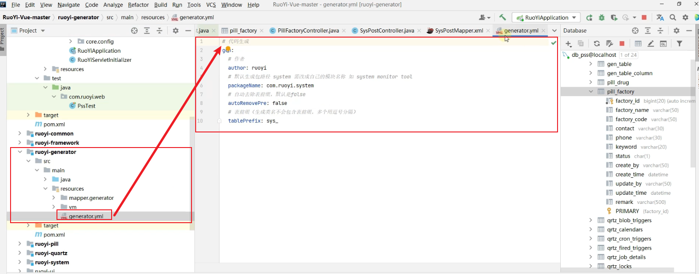

# 若依系统二次开发


## 部署系统

服务端部署可以参考本地虚拟机模拟单实例部署方式：[blog of Jungle (jungle8884.github.io)](https://jungle8884.github.io/2024/01/06/ruoyi/)

---


## 配置说明

> nginx 配置后端访问地址

```xml
user  nginx;
worker_processes  1;

error_log  /var/log/nginx/error.log notice;
pid        /var/run/nginx.pid;


events {
    worker_connections  1024;
}


http {
    include       mime.types;
    default_type  application/octet-stream;
    sendfile        on;
    keepalive_timeout  65;

    gzip on;
    gzip_min_length  1k;
    gzip_buffers     16 64K;
    gzip_http_version 1.1;
    gzip_comp_level 5;
    gzip_types     text/plain application/javascript application/x-javascript text/javascript text/css application/xml;
    gzip_vary on;
    gzip_proxied   expired no-cache no-store private auth;
    gzip_disable   "MSIE [1-6]\.";

    server {
        listen       80;
        server_name  localhost;
        charset utf-8;

        location / { #访问根目录
            root   /usr/share/nginx/html; #1：首先访问当前目录
            try_files $uri $uri/ /index.html; # 2：如果第一步的访问不到，那么就尝试访问你输入的url下的index页面
            index  index.html index.htm;
        }
		
        location /prod-api/ { #若果路径带有 `/prod-api/` ，那么就推到 `http://39.108.69.176:8080/;` 后端项目
            proxy_set_header Host $http_host;
            proxy_set_header X-Real-IP $remote_addr;
            proxy_set_header REMOTE-HOST $remote_addr;
            proxy_set_header X-Forwarded-For $proxy_add_x_forwarded_for;
			proxy_pass http://39.108.69.176:8080/;
        }

        error_page   500 502 503 504  /50x.html; # 上面都没找到，返回错误页
        location = /50x.html {
            root   html;
        }
    }
}
```

10.1.10.3

---

## 若依系统结构了解

所有的js脚本都在api目录下：


---

## 二次开发

### 开发流程

#### 设计数据表

参考如下：

```mysql
create table if not exists sys_post
(
    post_id     bigint auto_increment comment '岗位ID'
        primary key,
    post_code   varchar(64)            not null comment '岗位编码',
    post_name   varchar(50)            not null comment '岗位名称',
    post_sort   int(4)                 not null comment '显示顺序',
    status      char                   not null comment '状态（0正常 1停用）',
    create_by   varchar(64) default '' null comment '创建者',
    create_time datetime               null comment '创建时间',
    update_by   varchar(64) default '' null comment '更新者',
    update_time datetime               null comment '更新时间',
    remark      varchar(500)           null comment '备注'
)
    comment '岗位信息表' row_format = DYNAMIC;

insert into sys_post (id, first_name, last_name, birth) values (10001, 'Georgi', 'Facello', 'M');
insert into sys_post (id, first_name, last_name, birth) values (10002, 'Bezalel', 'Simmel', 'F');
insert into sys_post (id, first_name, last_name, birth) values (10003, 'Parto', 'Bamford', 'M');
insert into sys_post (id, first_name, last_name, birth) values (10004, 'Chirstian', 'Koblick', 'M');
insert into sys_post (id, first_name, last_name, birth) values (10005, 'Kyoichi', 'Maliniak', 'M');
insert into sys_post (id, first_name, last_name, birth) values (10006, 'Anneke', 'Preusig', 'F');
insert into sys_post (id, first_name, last_name, birth) values (10007, 'Tzvetan', 'Zielinski', 'F');
insert into sys_post (id, first_name, last_name, birth) values (10008, 'Saniya', 'Kalloufi', 'M');
insert into sys_post (id, first_name, last_name, birth) values (10009, 'Sumant', 'Peac', 'F');
insert into sys_post (id, first_name, last_name, birth) values (10010, 'Duangkaew', 'Piveteau', 'F');
```

> 注意：下面这5个字段是通用的，每个表都得有，如果使用的是若依框架的话。

```sql
 	create_by   varchar(64) default '' null comment '创建者',
    create_time datetime               null comment '创建时间',
    update_by   varchar(64) default '' null comment '更新者',
    update_time datetime               null comment '更新时间',
    remark      varchar(500)           null comment '备注'
```

#### 案例

##### 设计表


##### 后端模块


建立开发架构


Mapper的配置文件在启动项：ruoyi-admin模块


##### 常规开发

1，引入依赖

每个类都依赖于类：com.ruoyi.common.core.domain.BaseEntity

该类位于：ruoyi-common包下


2, 生成实体类

注意： 数据导出功能需要添加@Excel！


参考实体代码如下：

###### 实体类

```java
package com.ruoyi.system.domain;

import javax.validation.constraints.NotBlank;
import javax.validation.constraints.Size;
import org.apache.commons.lang3.builder.ToStringBuilder;
import org.apache.commons.lang3.builder.ToStringStyle;
import com.ruoyi.common.annotation.Excel;
import com.ruoyi.common.annotation.Excel.ColumnType;
import com.ruoyi.common.core.domain.BaseEntity;

/**
 * 岗位表 sys_post
 * 
 * @author ruoyi
 */
public class SysPost extends BaseEntity
{
    private static final long serialVersionUID = 1L;

    /** 岗位序号 */
    @Excel(name = "岗位序号", cellType = ColumnType.NUMERIC)
    private Long postId;

    /** 岗位编码 */
    @Excel(name = "岗位编码")
    private String postCode;

    /** 岗位名称 */
    @Excel(name = "岗位名称")
    private String postName;

    /** 岗位排序 */
    @Excel(name = "岗位排序")
    private String postSort;

    /** 状态（0正常 1停用） */
    @Excel(name = "状态", readConverterExp = "0=正常,1=停用")
    private String status;

    /** 用户是否存在此岗位标识 默认不存在 */
    private boolean flag = false;

    public Long getPostId()
    {
        return postId;
    }

    public void setPostId(Long postId)
    {
        this.postId = postId;
    }

    @NotBlank(message = "岗位编码不能为空")
    @Size(min = 0, max = 64, message = "岗位编码长度不能超过64个字符")
    public String getPostCode()
    {
        return postCode;
    }

    public void setPostCode(String postCode)
    {
        this.postCode = postCode;
    }

    @NotBlank(message = "岗位名称不能为空")
    @Size(min = 0, max = 50, message = "岗位名称长度不能超过50个字符")
    public String getPostName()
    {
        return postName;
    }

    public void setPostName(String postName)
    {
        this.postName = postName;
    }

    @NotBlank(message = "显示顺序不能为空")
    public String getPostSort()
    {
        return postSort;
    }

    public void setPostSort(String postSort)
    {
        this.postSort = postSort;
    }

    public String getStatus()
    {
        return status;
    }

    public void setStatus(String status)
    {
        this.status = status;
    }

    public boolean isFlag()
    {
        return flag;
    }

    public void setFlag(boolean flag)
    {
        this.flag = flag;
    }
    
    @Override
    public String toString() {
        return new ToStringBuilder(this,ToStringStyle.MULTI_LINE_STYLE)
            .append("postId", getPostId())
            .append("postCode", getPostCode())
            .append("postName", getPostName())
            .append("postSort", getPostSort())
            .append("status", getStatus())
            .append("createBy", getCreateBy())
            .append("createTime", getCreateTime())
            .append("updateBy", getUpdateBy())
            .append("updateTime", getUpdateTime())
            .append("remark", getRemark())
            .toString();
    }
}
```

###### 数据层

mapper

```java
package com.ruoyi.system.mapper;

import java.util.List;
import com.ruoyi.system.domain.SysPost;

/**
 * 岗位信息 数据层
 * 
 * @author ruoyi
 */
public interface SysPostMapper
{
    /**
     * 查询岗位数据集合
     * 
     * @param post 岗位信息
     * @return 岗位数据集合
     */
    public List<SysPost> selectPostList(SysPost post);

    /**
     * 查询所有岗位
     * 
     * @return 岗位列表
     */
    public List<SysPost> selectPostAll();

    /**
     * 通过岗位ID查询岗位信息
     * 
     * @param postId 岗位ID
     * @return 角色对象信息
     */
    public SysPost selectPostById(Long postId);

    /**
     * 根据用户ID获取岗位选择框列表
     * 
     * @param userId 用户ID
     * @return 选中岗位ID列表
     */
    public List<Integer> selectPostListByUserId(Long userId);

    /**
     * 查询用户所属岗位组
     * 
     * @param userName 用户名
     * @return 结果
     */
    public List<SysPost> selectPostsByUserName(String userName);

    /**
     * 删除岗位信息
     * 
     * @param postId 岗位ID
     * @return 结果
     */
    public int deletePostById(Long postId);

    /**
     * 批量删除岗位信息
     * 
     * @param postIds 需要删除的岗位ID
     * @return 结果
     */
    public int deletePostByIds(Long[] postIds);

    /**
     * 修改岗位信息
     * 
     * @param post 岗位信息
     * @return 结果
     */
    public int updatePost(SysPost post);

    /**
     * 新增岗位信息
     * 
     * @param post 岗位信息
     * @return 结果
     */
    public int insertPost(SysPost post);

    /**
     * 校验岗位名称
     * 
     * @param postName 岗位名称
     * @return 结果
     */
    public SysPost checkPostNameUnique(String postName);

    /**
     * 校验岗位编码
     * 
     * @param postCode 岗位编码
     * @return 结果
     */
    public SysPost checkPostCodeUnique(String postCode);
}

```

###### SQL

```xml
<?xml version="1.0" encoding="UTF-8" ?>
<!DOCTYPE mapper
PUBLIC "-//mybatis.org//DTD Mapper 3.0//EN"
"http://mybatis.org/dtd/mybatis-3-mapper.dtd">
<mapper namespace="com.ruoyi.system.mapper.SysPostMapper">

	<resultMap type="SysPost" id="SysPostResult">
		<id     property="postId"        column="post_id"       />
		<result property="postCode"      column="post_code"     />
		<result property="postName"      column="post_name"     />
		<result property="postSort"      column="post_sort"     />
		<result property="status"        column="status"        />
		<result property="createBy"      column="create_by"     />
		<result property="createTime"    column="create_time"   />
		<result property="updateBy"      column="update_by"     />
		<result property="updateTime"    column="update_time"   />
		<result property="remark"        column="remark"        />
	</resultMap>
	
	<sql id="selectPostVo">
        select post_id, post_code, post_name, post_sort, status, create_by, create_time, remark 
		from sys_post
    </sql>
	
	<select id="selectPostList" parameterType="SysPost" resultMap="SysPostResult">
	    <include refid="selectPostVo"/>
		<where>
			<if test="postCode != null and postCode != ''">
				AND post_code like concat('%', #{postCode}, '%')
			</if>
			<if test="status != null and status != ''">
				AND status = #{status}
			</if>
			<if test="postName != null and postName != ''">
				AND post_name like concat('%', #{postName}, '%')
			</if>
		</where>
	</select>
	
	<select id="selectPostAll" resultMap="SysPostResult">
		<include refid="selectPostVo"/>
	</select>
	
	<select id="selectPostById" parameterType="Long" resultMap="SysPostResult">
		<include refid="selectPostVo"/>
		where post_id = #{postId}
	</select>
	
	<select id="selectPostListByUserId" parameterType="Long" resultType="Integer">
		select p.post_id
        from sys_post p
	        left join sys_user_post up on up.post_id = p.post_id
	        left join sys_user u on u.user_id = up.user_id
	    where u.user_id = #{userId}
	</select>
	
	<select id="selectPostsByUserName" parameterType="String" resultMap="SysPostResult">
		select p.post_id, p.post_name, p.post_code
		from sys_post p
			 left join sys_user_post up on up.post_id = p.post_id
			 left join sys_user u on u.user_id = up.user_id
		where u.user_name = #{userName}
	</select>
	
	<select id="checkPostNameUnique" parameterType="String" resultMap="SysPostResult">
		<include refid="selectPostVo"/>
		 where post_name=#{postName} limit 1
	</select>
	
	<select id="checkPostCodeUnique" parameterType="String" resultMap="SysPostResult">
		<include refid="selectPostVo"/>
		 where post_code=#{postCode} limit 1
	</select>
	
	<update id="updatePost" parameterType="SysPost">
 		update sys_post
 		<set>
 			<if test="postCode != null and postCode != ''">post_code = #{postCode},</if>
 			<if test="postName != null and postName != ''">post_name = #{postName},</if>
 			<if test="postSort != null and postSort != ''">post_sort = #{postSort},</if>
 			<if test="status != null and status != ''">status = #{status},</if>
 			<if test="remark != null">remark = #{remark},</if>
 			<if test="updateBy != null and updateBy != ''">update_by = #{updateBy},</if>
 			update_time = sysdate()
 		</set>
 		where post_id = #{postId}
	</update>
 	
 	<insert id="insertPost" parameterType="SysPost" useGeneratedKeys="true" keyProperty="postId">
 		insert into sys_post(
 			<if test="postId != null and postId != 0">post_id,</if>
 			<if test="postCode != null and postCode != ''">post_code,</if>
 			<if test="postName != null and postName != ''">post_name,</if>
 			<if test="postSort != null and postSort != ''">post_sort,</if>
 			<if test="status != null and status != ''">status,</if>
 			<if test="remark != null and remark != ''">remark,</if>
 			<if test="createBy != null and createBy != ''">create_by,</if>
 			create_time
 		)values(
 			<if test="postId != null and postId != 0">#{postId},</if>
 			<if test="postCode != null and postCode != ''">#{postCode},</if>
 			<if test="postName != null and postName != ''">#{postName},</if>
 			<if test="postSort != null and postSort != ''">#{postSort},</if>
 			<if test="status != null and status != ''">#{status},</if>
 			<if test="remark != null and remark != ''">#{remark},</if>
 			<if test="createBy != null and createBy != ''">#{createBy},</if>
 			sysdate()
 		)
	</insert>
	
	<delete id="deletePostById" parameterType="Long">
		delete from sys_post where post_id = #{postId}
	</delete>
	
	<delete id="deletePostByIds" parameterType="Long">
 		delete from sys_post where post_id in
 		<foreach collection="array" item="postId" open="(" separator="," close=")">
 			#{postId}
        </foreach> 
 	</delete>

</mapper> 
```

###### 服务层

interface

```java
package com.ruoyi.system.service;

import java.util.List;
import com.ruoyi.system.domain.SysPost;

/**
 * 岗位信息 服务层
 * 
 * @author ruoyi
 */
public interface ISysPostService
{
    /**
     * 查询岗位信息集合
     * 
     * @param post 岗位信息
     * @return 岗位列表
     */
    public List<SysPost> selectPostList(SysPost post);

    /**
     * 查询所有岗位
     * 
     * @return 岗位列表
     */
    public List<SysPost> selectPostAll();

    /**
     * 通过岗位ID查询岗位信息
     * 
     * @param postId 岗位ID
     * @return 角色对象信息
     */
    public SysPost selectPostById(Long postId);

    /**
     * 根据用户ID获取岗位选择框列表
     * 
     * @param userId 用户ID
     * @return 选中岗位ID列表
     */
    public List<Integer> selectPostListByUserId(Long userId);

    /**
     * 校验岗位名称
     * 
     * @param post 岗位信息
     * @return 结果
     */
    public String checkPostNameUnique(SysPost post);

    /**
     * 校验岗位编码
     * 
     * @param post 岗位信息
     * @return 结果
     */
    public String checkPostCodeUnique(SysPost post);

    /**
     * 通过岗位ID查询岗位使用数量
     * 
     * @param postId 岗位ID
     * @return 结果
     */
    public int countUserPostById(Long postId);

    /**
     * 删除岗位信息
     * 
     * @param postId 岗位ID
     * @return 结果
     */
    public int deletePostById(Long postId);

    /**
     * 批量删除岗位信息
     * 
     * @param postIds 需要删除的岗位ID
     * @return 结果
     * @throws Exception 异常
     */
    public int deletePostByIds(Long[] postIds);

    /**
     * 新增保存岗位信息
     * 
     * @param post 岗位信息
     * @return 结果
     */
    public int insertPost(SysPost post);

    /**
     * 修改保存岗位信息
     * 
     * @param post 岗位信息
     * @return 结果
     */
    public int updatePost(SysPost post);
}
```

impl

```java
package com.ruoyi.system.service.impl;

import java.util.List;
import org.springframework.beans.factory.annotation.Autowired;
import org.springframework.stereotype.Service;
import com.ruoyi.common.constant.UserConstants;
import com.ruoyi.common.exception.ServiceException;
import com.ruoyi.common.utils.StringUtils;
import com.ruoyi.system.domain.SysPost;
import com.ruoyi.system.mapper.SysPostMapper;
import com.ruoyi.system.mapper.SysUserPostMapper;
import com.ruoyi.system.service.ISysPostService;

/**
 * 岗位信息 服务层处理
 * 
 * @author ruoyi
 */
@Service
public class SysPostServiceImpl implements ISysPostService
{
    @Autowired
    private SysPostMapper postMapper;

    @Autowired
    private SysUserPostMapper userPostMapper;

    /**
     * 查询岗位信息集合
     * 
     * @param post 岗位信息
     * @return 岗位信息集合
     */
    @Override
    public List<SysPost> selectPostList(SysPost post)
    {
        return postMapper.selectPostList(post);
    }

    /**
     * 查询所有岗位
     * 
     * @return 岗位列表
     */
    @Override
    public List<SysPost> selectPostAll()
    {
        return postMapper.selectPostAll();
    }

    /**
     * 通过岗位ID查询岗位信息
     * 
     * @param postId 岗位ID
     * @return 角色对象信息
     */
    @Override
    public SysPost selectPostById(Long postId)
    {
        return postMapper.selectPostById(postId);
    }

    /**
     * 根据用户ID获取岗位选择框列表
     * 
     * @param userId 用户ID
     * @return 选中岗位ID列表
     */
    @Override
    public List<Integer> selectPostListByUserId(Long userId)
    {
        return postMapper.selectPostListByUserId(userId);
    }

    /**
     * 校验岗位名称是否唯一
     * 
     * @param post 岗位信息
     * @return 结果
     */
    @Override
    public String checkPostNameUnique(SysPost post)
    {
        Long postId = StringUtils.isNull(post.getPostId()) ? -1L : post.getPostId();
        SysPost info = postMapper.checkPostNameUnique(post.getPostName());
        if (StringUtils.isNotNull(info) && info.getPostId().longValue() != postId.longValue())
        {
            return UserConstants.NOT_UNIQUE;
        }
        return UserConstants.UNIQUE;
    }

    /**
     * 校验岗位编码是否唯一
     * 
     * @param post 岗位信息
     * @return 结果
     */
    @Override
    public String checkPostCodeUnique(SysPost post)
    {
        Long postId = StringUtils.isNull(post.getPostId()) ? -1L : post.getPostId();
        SysPost info = postMapper.checkPostCodeUnique(post.getPostCode());
        if (StringUtils.isNotNull(info) && info.getPostId().longValue() != postId.longValue())
        {
            return UserConstants.NOT_UNIQUE;
        }
        return UserConstants.UNIQUE;
    }

    /**
     * 通过岗位ID查询岗位使用数量
     * 
     * @param postId 岗位ID
     * @return 结果
     */
    @Override
    public int countUserPostById(Long postId)
    {
        return userPostMapper.countUserPostById(postId);
    }

    /**
     * 删除岗位信息
     * 
     * @param postId 岗位ID
     * @return 结果
     */
    @Override
    public int deletePostById(Long postId)
    {
        return postMapper.deletePostById(postId);
    }

    /**
     * 批量删除岗位信息
     * 
     * @param postIds 需要删除的岗位ID
     * @return 结果
     * @throws Exception 异常
     */
    @Override
    public int deletePostByIds(Long[] postIds)
    {
        for (Long postId : postIds)
        {
            SysPost post = selectPostById(postId);
            if (countUserPostById(postId) > 0)
            {
                throw new ServiceException(String.format("%1$s已分配,不能删除", post.getPostName()));
            }
        }
        return postMapper.deletePostByIds(postIds);
    }

    /**
     * 新增保存岗位信息
     * 
     * @param post 岗位信息
     * @return 结果
     */
    @Override
    public int insertPost(SysPost post)
    {
        return postMapper.insertPost(post);
    }

    /**
     * 修改保存岗位信息
     * 
     * @param post 岗位信息
     * @return 结果
     */
    @Override
    public int updatePost(SysPost post)
    {
        return postMapper.updatePost(post);
    }
}
```

###### 访问器

```java
package com.ruoyi.web.controller.system;

import java.util.List;
import javax.servlet.http.HttpServletResponse;
import org.springframework.beans.factory.annotation.Autowired;
import org.springframework.security.access.prepost.PreAuthorize;
import org.springframework.validation.annotation.Validated;
import org.springframework.web.bind.annotation.DeleteMapping;
import org.springframework.web.bind.annotation.GetMapping;
import org.springframework.web.bind.annotation.PathVariable;
import org.springframework.web.bind.annotation.PostMapping;
import org.springframework.web.bind.annotation.PutMapping;
import org.springframework.web.bind.annotation.RequestBody;
import org.springframework.web.bind.annotation.RequestMapping;
import org.springframework.web.bind.annotation.RestController;
import com.ruoyi.common.annotation.Log;
import com.ruoyi.common.constant.UserConstants;
import com.ruoyi.common.core.controller.BaseController;
import com.ruoyi.common.core.domain.AjaxResult;
import com.ruoyi.common.core.page.TableDataInfo;
import com.ruoyi.common.enums.BusinessType;
import com.ruoyi.common.utils.poi.ExcelUtil;
import com.ruoyi.system.domain.SysPost;
import com.ruoyi.system.service.ISysPostService;

/**
 * 岗位信息操作处理
 * 
 * @author ruoyi
 */
@RestController
@RequestMapping("/system/post")
public class SysPostController extends BaseController
{
    @Autowired
    private ISysPostService postService;

    /**
     * 获取岗位列表
     */
    @PreAuthorize("@ss.hasPermi('system:post:list')")
    @GetMapping("/list")
    public TableDataInfo list(SysPost post)
    {
        startPage();
        List<SysPost> list = postService.selectPostList(post);
        return getDataTable(list);
    }
    
    @Log(title = "岗位管理", businessType = BusinessType.EXPORT)
    @PreAuthorize("@ss.hasPermi('system:post:export')")
    @PostMapping("/export")
    public void export(HttpServletResponse response, SysPost post)
    {
        List<SysPost> list = postService.selectPostList(post);
        ExcelUtil<SysPost> util = new ExcelUtil<SysPost>(SysPost.class);
        util.exportExcel(response, list, "岗位数据");
    }

    /**
     * 根据岗位编号获取详细信息
     */
    @PreAuthorize("@ss.hasPermi('system:post:query')")
    @GetMapping(value = "/{postId}")
    public AjaxResult getInfo(@PathVariable Long postId)
    {
        return AjaxResult.success(postService.selectPostById(postId));
    }

    /**
     * 新增岗位
     */
    @PreAuthorize("@ss.hasPermi('system:post:add')")
    @Log(title = "岗位管理", businessType = BusinessType.INSERT)
    @PostMapping
    public AjaxResult add(@Validated @RequestBody SysPost post)
    {
        if (UserConstants.NOT_UNIQUE.equals(postService.checkPostNameUnique(post)))
        {
            return AjaxResult.error("新增岗位'" + post.getPostName() + "'失败，岗位名称已存在");
        }
        else if (UserConstants.NOT_UNIQUE.equals(postService.checkPostCodeUnique(post)))
        {
            return AjaxResult.error("新增岗位'" + post.getPostName() + "'失败，岗位编码已存在");
        }
        post.setCreateBy(getUsername());
        return toAjax(postService.insertPost(post));
    }

    /**
     * 修改岗位
     */
    @PreAuthorize("@ss.hasPermi('system:post:edit')")
    @Log(title = "岗位管理", businessType = BusinessType.UPDATE)
    @PutMapping
    public AjaxResult edit(@Validated @RequestBody SysPost post)
    {
        if (UserConstants.NOT_UNIQUE.equals(postService.checkPostNameUnique(post)))
        {
            return AjaxResult.error("修改岗位'" + post.getPostName() + "'失败，岗位名称已存在");
        }
        else if (UserConstants.NOT_UNIQUE.equals(postService.checkPostCodeUnique(post)))
        {
            return AjaxResult.error("修改岗位'" + post.getPostName() + "'失败，岗位编码已存在");
        }
        post.setUpdateBy(getUsername());
        return toAjax(postService.updatePost(post));
    }

    /**
     * 删除岗位
     */
    @PreAuthorize("@ss.hasPermi('system:post:remove')")
    @Log(title = "岗位管理", businessType = BusinessType.DELETE)
    @DeleteMapping("/{postIds}")
    public AjaxResult remove(@PathVariable Long[] postIds)
    {
        return toAjax(postService.deletePostByIds(postIds));
    }

    /**
     * 获取岗位选择框列表
     */
    @GetMapping("/optionselect")
    public AjaxResult optionselect()
    {
        List<SysPost> posts = postService.selectPostAll();
        return AjaxResult.success(posts);
    }
}

```

##### 后端-自动生成代码

1，选择导入功能


2，将自己添加的表导入进来


3，自动生成代码配置



修改后


4，先删除再重新导入表


5，生成代码并覆盖main文件夹


6，复制controller到正确的位置：ruoyi-admin包下。


生成的代码：


---

##### 前端模块

1，前端代码说明


2，设置自定义图标

> [iconfont-阿里巴巴矢量图标库](https://www.iconfont.cn/)


3, 模仿已有的菜单建立自己的菜单

目录


菜单


4，在代码下载页面复制前端页面代码到对应页面覆盖，详情见【设备数据导出】。


---

### 设备数据导出

1，生成前端代码：


2， 建立模块，并将前端代码复制到index.vue里


3，模仿现有的菜单，建立现有的栏目


4，效果展示


---


