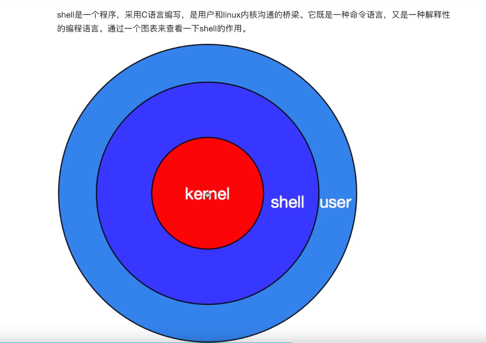
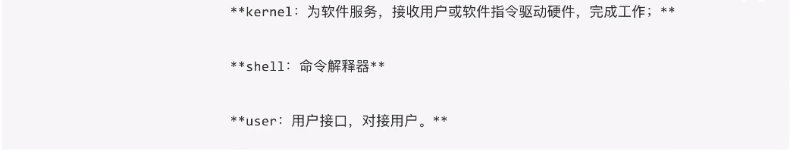
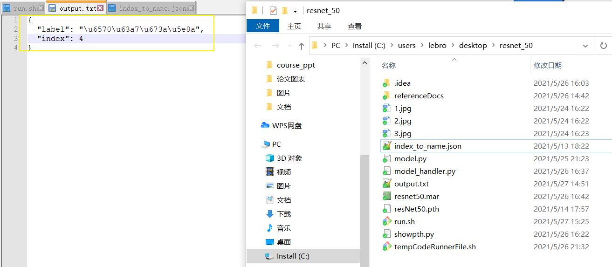

# 引言

**只记录对个人比较重要的命令！**

[参考链接](https://www.zutuanxue.com/home/4/6_20)





# curl 命令

[参考链接](http://www.ruanyifeng.com/blog/2011/09/curl.html)

1. 将docker容器提供的resnet50图像分类服务保存到输出文件

```shell
curl -X POST http://192.168.94.112:8080/predictions/resnet50 -T $1 -o output.txt
```

2. 输出文件内容：




# shell 脚本编程


