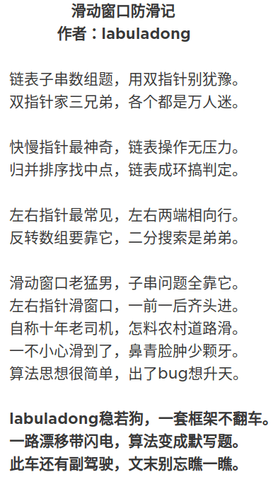
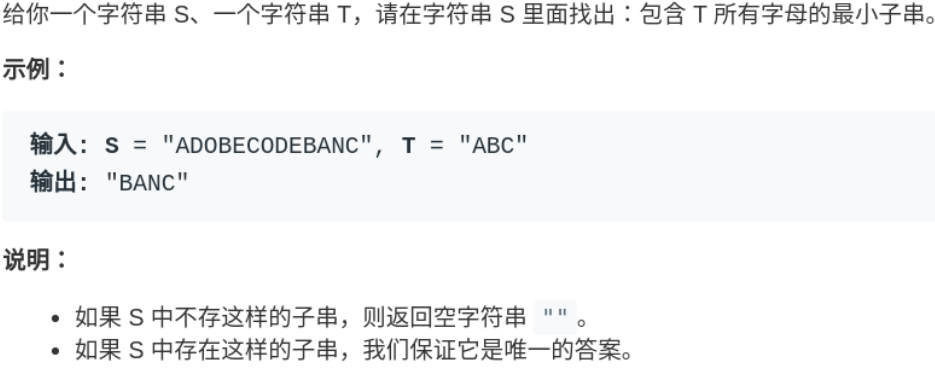
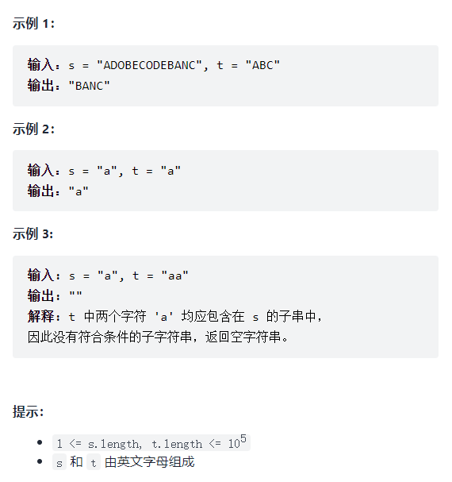
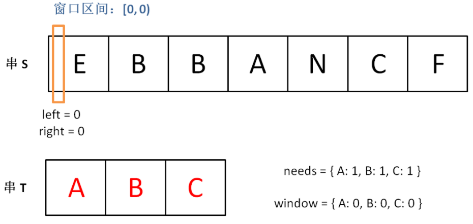
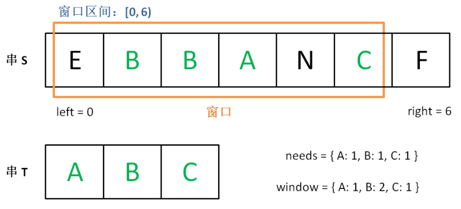
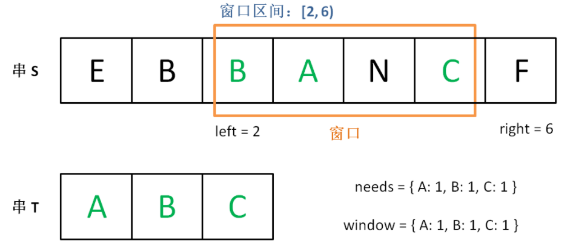
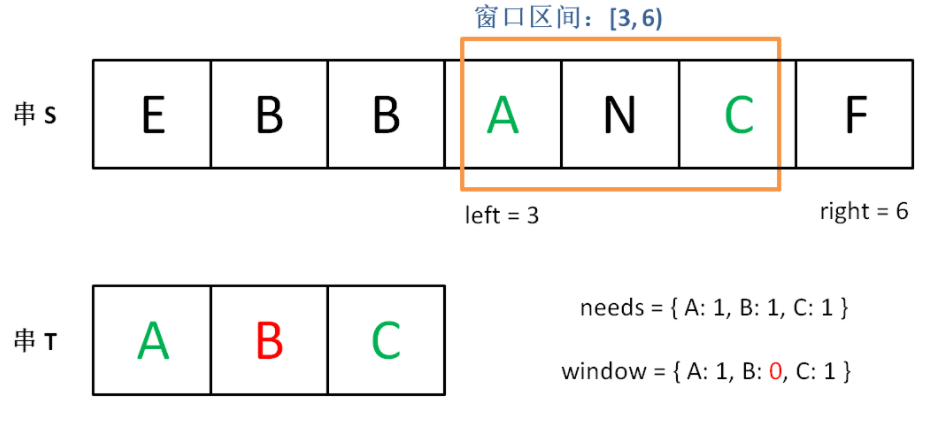

# [滑动窗口](https://labuladong.github.io/algo/2/21/53/)

**一首小诗来歌颂滑动窗口算法的伟大：(作者-东哥)**




说起滑动窗口算法，很多读者都会头疼。这个算法技巧的思路非常简单，就是维护一个窗口，不断滑动，然后更新答案么。

该算法的大致逻辑如下：

```java
int left = 0, right = 0;

while (right < s.size()) {
    // 增大窗口
    window.add(s[right]);
    right++;
    
    while (window needs shrink) {
        // 缩小窗口
        window.remove(s[left]);
        left++;
    }
}
```

这个算法技巧的时间复杂度是 O(N)，比字符串暴力算法要高效得多。

其实困扰大家的，不是算法的思路，而是各种细节问题。

- 比如说如何向窗口中添加新元素，如何缩小窗口，在窗口滑动的哪个阶段更新结果。

- 即便你明白了这些细节，也容易出 bug，找 bug 还不知道怎么找，真的挺让人心烦的。


> **滑动窗口算法的代码框架**：
>
> 例子: 
>
> 

**其中两处 `...` 表示的更新窗口数据的地方，到时候你直接往里面填就行了**。

而且，这两个 `...` 处的操作分别是右移和左移窗口更新操作，等会你会发现它们操作是完全对称的。

```java
/* 滑动窗口算法框架 */
void slidingWindow(string s, string t) {
    Map<Character, Integer> window = new HashMap<>(16);
    Map<Character, Integer> need = new HashMap<>(16);
    for(char c : t.toCharArray()) {
        // getOrDefault: 如果 need 中没有c就返回0
        need.put(c, need.getOrDefault(c, 0)+1);
    }
    
    int left = 0, right = 0;
    int valid = 0; 
    while (right < s.length()) {
        // c 是将移入窗口的字符
        char c = s.charAt(right);
        // 右移窗口
        right++;
        // 进行窗口内数据的一系列更新
        ...

        /*** debug 输出的位置 ***/
        printf("window: [%d, %d)\n", left, right);
        /********************/
        
        // 判断左侧窗口是否要收缩
        while (window needs shrink) {
            // d 是将移出窗口的字符
            char d = s.charAt(left);
            // 左移窗口
            left++;
            // 进行窗口内数据的一系列更新
            ...
        }
    }
}
```

---


## [76-最小覆盖子串](https://labuladong.github.io/algo/2/21/54/)

> https://leetcode-cn.com/problems/minimum-window-substring/
>
> 给你一个字符串 s 、一个字符串 t 。返回 s 中涵盖 t 所有字符的最小子串。
>
> 如果 s 中不存在涵盖 t 所有字符的子串，则返回空字符串 "" 。
>
> 注意：
>
> - 对于 t 中重复字符，我们寻找的子字符串中该字符数量必须不少于 t 中该字符数量。
> - 如果 s 中存在这样的子串，我们保证它是唯一的答案。
>
> 

**理解: 就是说要在 `S`(source) 中找到包含 `T`(target) 中全部字母的一个子串，且这个子串一定是所有可能子串中最短的。**


如果我们使用**暴力解法**，代码大概是这样的：

```java
for (int i = 0; i < s.size(); i++)
    for (int j = i + 1; j < s.size(); j++)
        if s[i:j] 包含 t 的所有字母:
            更新答案
```

思路很直接，但是显然，这个算法的复杂度肯定大于 O(N^2) 了，不好。


**滑动窗口算法的思路是这样**：

1、我们在字符串 `S` 中使用双指针中的左右指针技巧，初始化 `left = right = 0`，把索引**左闭右开**区间 `[left, right)` 称为一个「窗口」。

2、我们先不断地增加 `right` 指针扩大窗口 `[left, right)`，直到窗口中的字符串符合要求（包含了 `T` 中的所有字符）。

3、此时，我们停止增加 `right`，转而不断增加 `left` 指针缩小窗口 `[left, right)`，直到窗口中的字符串不再符合要求（不包含 `T` 中的所有字符了）。同时，每次增加 `left`，我们都要更新一轮结果。

4、重复第 2 和第 3 步，直到 `right` 到达字符串 `S` 的尽头。

这个思路其实也不难，**第 2 步相当于在寻找一个「可行解」，然后第 3 步在优化这个「可行解」，最终找到最优解**，也就是最短的覆盖子串。

**左右指针轮流前进，窗口大小增增减减，窗口不断向右滑动，这就是「滑动窗口」这个名字的来历。**

下面画图理解一下，`needs` 和 `window` 相当于计数器，分别记录 `T` 中字符出现次数和「窗口」中的相应字符的出现次数。

**初始状态：**



**增加 `right`，直到窗口 `[left, right]` 包含了 `T` 中所有字符：**



**现在开始增加 `left`，缩小窗口 `[left, right]`：**



**直到窗口中的字符串不再符合要求，`left` 不再继续移动：**



**之后重复上述过程，先移动 `right`，再移动 `left`…… 直到 `right` 指针到达字符串 `S` 的末端，算法结束。**


如果你能够理解上述过程，恭喜，你已经完全掌握了滑动窗口算法思想。**现在我们来看看这个滑动窗口代码框架怎么用**：

首先，初始化 `window` 和 `need` 两个哈希表，记录窗口中的字符和需要凑齐的字符：

```java
Map<Character, Integer> window = new HashMap<>(16);
Map<Character, Integer> need = new HashMap<>(16);
for(char c : t.toCharArray()) {
    need.put(c, need.getOrDefault(c, 0)+1);
}
```

然后，使用 `left` 和 `right` 变量初始化窗口的两端，不要忘了，区间 `[left, right)` 是左闭右开的，所以初始情况下窗口没有包含任何元素：

```java
int left = 0, right = 0;
int valid = 0; 
while (right < s.size()) {
    // 开始滑动
}
```

**其中 `valid` 变量表示窗口中满足 `need` 条件的字符个数**，如果 `valid` 和 `need.size` 的大小相同，则说明窗口已满足条件，已经完全覆盖了串 `T`。


**现在开始套模板，只需要思考以下四个问题**：

1、当移动 `right` 扩大窗口，即加入字符时，应该更新哪些数据？

2、什么条件下，窗口应该暂停扩大，开始移动 `left` 缩小窗口？

3、当移动 `left` 缩小窗口，即移出字符时，应该更新哪些数据？

4、我们要的结果应该在扩大窗口时还是缩小窗口时进行更新？

> 如果一个字符进入窗口，应该增加 `window` 计数器；
>
> 如果一个字符将移出窗口的时候，应该减少 `window` 计数器；
>
> 当 `valid` 满足 `need` 时应该收缩窗口；
>
> **应该在收缩窗口的时候更新最终结果**。

**完整代码如下:**

```java
package com.slidingwindow;

import java.util.HashMap;
import java.util.Map;
import java.util.Scanner;

public class minWindow_76 {
    public static void main(String[] args) {
        Scanner reader = new Scanner(System.in);
        // ADOBECODEBANC
        String s = reader.nextLine();
        // "ABC"
        String t = reader.nextLine();
        // "BANC"
        String res = minWindow(s, t);
        System.out.println(res);
    }

    /**
     * 返回 s 中 涵盖 t 所有字符的最小子串
     * ADOBECODEBANC
     * ABC
     * */
    public static String minWindow(String s, String t) {
        Map<Character, Integer> window = new HashMap<>(16);
        Map<Character, Integer> need = new HashMap<>(16);
        for(char c : t.toCharArray()) {
            need.put(c, need.getOrDefault(c, 0)+1);
        }

        int left = 0, right = 0;
        int valid = 0;
        // 记录最小覆盖子串的起始索引及长度
        int start = 0, len = Integer.MAX_VALUE;
        while (right < s.length()) {
            // c 是将移入窗口的字符
            char c = s.charAt(right);
            // 右移窗口
            right++;
            // 进行窗口内数据的一系列更新
            if (need.containsKey(c)) {
                window.put(c, window.getOrDefault(c, 0)+1);
                if (window.get(c).equals(need.get(c))) {
                    valid++;
                }
            }
			
            // 判断左侧窗口是否要收缩
            while (need.size() == valid) {
                // 在这里更新最小覆盖子串
                if (right - left < len) {
                    start = left;
                    len = right - left;
                }
                // d 是将移出窗口的字符
                char d = s.charAt(left);
                // 左移窗口
                left++;
                // 进行窗口内数据的一系列更新
                if (need.containsKey(d)) {
                    if (window.get(d).equals(need.get(d))) {
                        valid--;
                    }
                    window.put(d, window.get(d)-1);
                }
            }
        }

        // 返回最小覆盖子串
        return len == Integer.MAX_VALUE ? "" : s.substring(start, start+len);
    }
}
```

需要注意的是，当我们发现某个字符在 `window` 的数量满足了 `need` 的需要，就要更新 `valid`，表示有一个字符已经满足要求。而且，你能发现，两次对窗口内数据的更新操作是完全对称的。

当 `valid == need.size()` 时，说明 `T` 中所有字符已经被覆盖，已经得到一个可行的覆盖子串，现在应该开始收缩窗口了，以便得到「最小覆盖子串」。

移动 `left` 收缩窗口时，窗口内的字符都是可行解，所以应该在收缩窗口的阶段进行最小覆盖子串的更新，以便从可行解中找到长度最短的最终结果。

至此，应该可以完全理解这套框架了，滑动窗口算法又不难，就是细节问题让人烦得很。**以后遇到滑动窗口算法，你就按照这框架写代码，保准没有 bug，还省事儿**。

---


