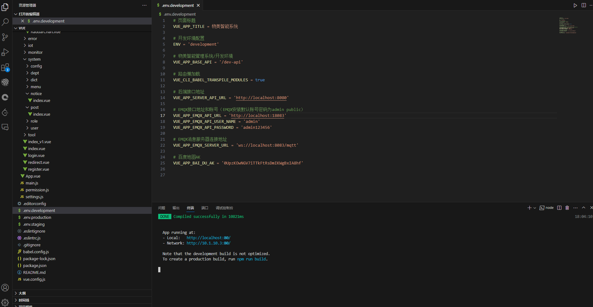
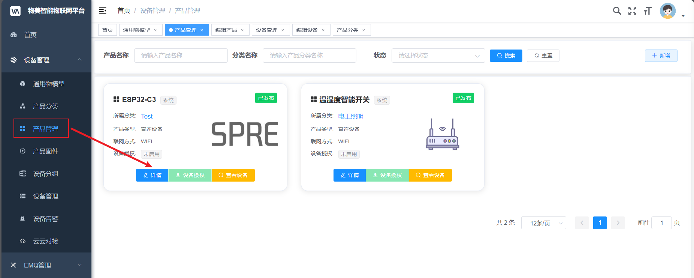

# IOT平台搭建说明

## Win10搭建

### 后端环境搭建

官方文档：[系统运行 | FastBee文档 (wumei.live)](https://wumei.live/doc/pages/system/#一、系统运行环境)

依次安装如下环境：

```xml
JDK = 1.8
Mysql = 5.7.0 
EMQX = 4.0
Redis >= 3.0
Maven >= 3.3
Node >= 12
TDengine = 2.6 (可选)
```

1，JDK1.8 安装教程：[JDK 1.8 详细安装及环境变量配置图文教程(基于windows系统)_jdk1.8-CSDN博客](https://blog.csdn.net/weixin_43252521/article/details/119119646)

链接：https://pan.baidu.com/s/1_ZSEX62qBZhWVGPo5JZm1A 
提取码：kpy7 
--来自百度网盘超级会员V1的分享

2，MySql5.7安装教程：[MySQL 5.7 安装教程（全步骤图解教程）_mysql5.7的安装教程-CSDN博客](https://blog.csdn.net/m0_49284219/article/details/121972531)

链接：https://pan.baidu.com/s/1r_-e1Ipf-HP8Pn4xD-N9JQ 
提取码：9ckx 
--来自百度网盘超级会员V1的分享

3，EMQX安装教程：https://www.emqx.io/docs/zh/v4/getting-started/install.html


链接：https://pan.baidu.com/s/1gGcvvbzxKn9O5-SedSdt_g 
提取码：uwjy 
--来自百度网盘超级会员V1的分享

4，Redis安装教程：

- [Window下Redis的安装和部署详细图文教程（Redis的安装和可视化工具的使用）_redis windows-CSDN博客](https://blog.csdn.net/weixin_44893902/article/details/123087435)

- [Windows下安装redis并且设置密码_windows redis 设置密码-CSDN博客](https://blog.csdn.net/m0_37190495/article/details/80360804)
- [Redis设置密码以及设置后不生效的解决方法_redis配置文件中密码删了后怎么还能连-CSDN博客](https://blog.csdn.net/qq649954944/article/details/115171541)

链接：https://pan.baidu.com/s/1jg-udc3dPl2ddUtHmZaAJA 
提取码：mv06 
--来自百度网盘超级会员V1的分享

5，Node安装教程：[node安装和配置(node-v12.20.2-x64 ) 以及node版本切换介绍-CSDN博客](https://blog.csdn.net/qq_30306717/article/details/121170387)

链接：https://pan.baidu.com/s/15UgFa7xFAkDRJ1xRvZ4wyw 
提取码：zv5o 
--来自百度网盘超级会员V1的分享

6，Maven安装教程：[Maven安装与配置——详细教程 - Winton-H - 博客园 (cnblogs.com)](https://www.cnblogs.com/winton-nfs/p/15998904.html)

链接：https://pan.baidu.com/s/1toKFThImEPgRK55AnJgFNw 
提取码：j0j6 
--来自百度网盘超级会员V1的分享


后端注意事项：按照下面的文档更改对应的配置！！！

[系统运行 | FastBee文档 (wumei.live)](https://wumei.live/doc/pages/system/#二、后端运行)

注：先启动redis，再启动后端项目。


后端搭建成功展示：


---

### 前端环境搭建

Vue安装教程：[Vue安装环境最全教程，傻瓜式安装_安装最新版vue-CSDN博客](https://blog.csdn.net/Mq_sir/article/details/118368900)


需要执行以下命令：[系统运行 | FastBee文档 (wumei.live)](https://wumei.live/doc/pages/system/#三、前端运行)

```typescript
# 安装依赖
npm install
npm install --registry=https://registry.npm.taobao.org

# 本地开发 启动项目
npm run dev
```

前端运行成功：


### 运行成功


---

# 服务器搭建

## Ubuntu安装及配置

### 开启ssh连接

> [ubuntu20.04开启SSH远程登录_ubuntu开启ssh远程登录-CSDN博客](https://blog.csdn.net/qq_45164331/article/details/122533327)

### 修改source.list

> [ubuntu镜像_ubuntu下载地址_ubuntu安装教程-阿里巴巴开源镜像站 (aliyun.com)](https://developer.aliyun.com/mirror/ubuntu?spm=a2c6h.13651102.0.0.3e221b110oomxG)

### apt 等价于 yum

> [【Linux】Ubuntu 可以不用安装 yum_ubuntu没有yum命令-CSDN博客](https://blog.csdn.net/qq_51870334/article/details/129021999)


### 安装docker

> [Install Docker Engine on Ubuntu | Docker Docs](https://docs.docker.com/engine/install/ubuntu/)
>
> - 22.04: [Index of linux/ubuntu/dists/jammy/pool/stable/amd64/ (docker.com)](https://download.docker.com/linux/ubuntu/dists/jammy/pool/stable/amd64/)
> - 23.04: [Index of linux/ubuntu/dists/mantic/pool/stable/amd64/ (docker.com)](https://download.docker.com/linux/ubuntu/dists/mantic/pool/stable/amd64/)

下载docker deb文件到指定目录进行安装

#### 22.04 版本

> 链接：https://pan.baidu.com/s/1_TMiI1Ix1pLPhdYhl6UMTw 
> 提取码：a2s0 
> --来自百度网盘超级会员V2的分享

```sh
sudo dpkg -i ./containerd.io_1.6.9-1_amd64.deb \
  ./docker-ce_24.0.7-1~ubuntu.22.04~jammy_amd64.deb \
  ./docker-ce-cli_24.0.7-1~ubuntu.22.04~jammy_amd64.deb \
  ./docker-buildx-plugin_0.11.2-1~ubuntu.22.04~jammy_amd64.deb \
  ./docker-compose-plugin_2.6.0~ubuntu-jammy_amd64.deb
```

#### 23.04 版本

> 链接：https://pan.baidu.com/s/1e6GZFZRuvvPRPN0-y1caTw 
> 提取码：ftv0 
> --来自百度网盘超级会员V2的分享

```sh
sudo dpkg -i ./containerd.io_1.6.25-1_amd64.deb \
  ./docker-ce_24.0.7-1~ubuntu.23.10~mantic_amd64.deb \
  ./docker-ce-cli_24.0.7-1~ubuntu.23.10~mantic_amd64.deb \
  ./docker-buildx-plugin_0.11.2-1~ubuntu.23.10~mantic_amd64.deb \
  ./docker-compose-plugin_2.21.0-1~ubuntu.23.10~mantic_amd64.deb

```

最后确认一下：

```sh
sudo service docker start
sudo docker run hello-world
```


## CentOS7安装


### 安装 docker Engine

> [centos7.6安装docker_centos docker安装部署-腾讯云开发者社区-腾讯云 (tencent.com)](https://cloud.tencent.com/developer/article/2110505)
>
> [Install Docker Engine on CentOS | Docker Docs](https://docs.docker.com/engine/install/centos/)

```linux
sudo yum install -y yum-utils device-mapper-persistent-data lvm2

sudo yum-config-manager --add-repo http://mirrors.aliyun.com/docker-ce/linux/centos/docker-ce.repo

sudo yum makecache fast

yum list docker-ce --showduplicates | sort -r

# 安装最新版
sudo yum install -y docker-ce 

sudo systemctl start docker
sudo systemctl enable docker
docker version

sudo docker run hello-world
```

**运行`hello-world`容器进行测试，以下代表安装成功!**


---

## docker部署

> [Docker部署 | FastBee文档 (wumei.live)](https://wumei.live/doc/pages/docker/#docker-compose常用命令)

### 安装 docker Compose

> docker-compose:
>
> - [Install Compose standalone | Docker Docs](https://docs.docker.com/compose/install/standalone/) 
>
> - https://www.cnblogs.com/mihutao/p/17296999.html
>- 汉化版：[「Docker」docker-compose安装（linux） - ColdJk - 博客园 (cnblogs.com)](https://www.cnblogs.com/ColdJk/p/14302613.html#:~:text=在Linux系统上安装 1 运行以下命令以下载Docker Compose的当前稳定版本： sudo curl -L "https%3A%2F%2Fgithub.com%2Fdocker%2Fcompose%2Freleases%2Fdownload%2F1.27.4%2Fdocker-compose-%24,备用安装选项” 标签。 2 将可执行权限应用于二进制文件： sudo chmod %2Bx %2Fusr%2Flocal%2Fbin%2Fdocker-compose)


```linux
sudo yum -y -update
docker compose version

sudo curl -SL https://github.com/docker/compose/releases/download/v2.23.3/docker-compose-linux-x86_64 -o /usr/local/bin/docker-compose
# 若上面的命令一直失败，先下载bin文件再上传到 /usr/local/bin 目录下
# 上传文件前，注意授权：sudo chmod 777 /usr/local/bin
# 最后重新命名
mv docker-compose-linux-x86_64 docker-compose
sudo chmod +x /usr/local/bin/docker-compose

# 可能需要的工具
yum -y install lrzsz
yum install -y unzip zip

# 可先拉取服务中镜像，时间取决于网络情况，可配置docker采用国内镜像源
docker-compose pull
# 构建并启动服务中容器
docker-compose up -d  
```

**docker-compose：**


### docker-compose常见命令

```linux
docker-compose -v        # 查看docker-compose版本，检查是否安装成功
docker-compose up -d     # 构建并启动服务中容器
docker-compose down      # 停止并删除服务中容器
docker-compose ps        # 列出服务中所有容器
docker-compose start     # 启动服务中的容器
docker-compose stop      # 停止服务中正在运行的容器
docker-compose restart   # 重启服务中的容器
docker-compose logs      # 查看服务中容器的输出
docker-compose pull      # 拉取服务中依赖的镜像
docker-compose config    # 验证并查看compose文件配置
```


### 运行IOT平台

打开阿里云防火墙：


### 容器可视化

```linux
sudo docker run -d -p 9000:9000 --restart=always -v /var/run/docker.sock:/var/run/docker.sock --privileged=true --name portainer portainer/portainer
```


### 远程数据库

> 查看用户名和密码：


---

## 遇到的问题

### 认证问题

解决访问认证问题：不论怎么输入自己设置的密码依然不行。


最终怎么解决：

> 在前端系统，认证的url一定要指向后端系统。



了解MQTT的简单使用：

[MQTT 协议入门：基础知识和快速教程 | EMQ (emqx.com)](https://www.emqx.com/zh/blog/the-easiest-guide-to-getting-started-with-mqtt#开始使用-mqtt-快速教程)

### Vim文件修改问题

> 文件权限不够

```linux
sudo chmod 777 文件名
```

### 验证码加载不出来

#### 问题分析

> 问题复现：本地部署一个测试服务器，发现还是会出现相同的问题。


> 解决思路：
>
> - 首先是查找有没有和我一样的人：[线上部署自己部署了一个环境，显示prod-api 访问404 · Issue #I3BXFV · 若依/RuoYi-Vue - Gitee.com](https://gitee.com/y_project/RuoYi-Vue/issues/I3BXFV)
> - 重启容器，发现java容器不运行也会出现相同的问题，结合404，推断出：前端没有访问到后端服务。
>   - 问题排除：
>     - java -jar /server.jar 没有运行？
>     - 编译的 server.jar 的ip地址没有和docker中的对应起来，导致访问不到 【最终确定是这个问题。】

修改对应文件中的ip地址为docker-compose.yml文件中的地址：


#### application.yml

```xml
# 项目相关配置
ruoyi:
  # 文件路径，以uploadPath结尾 示例（ Windows配置 D:/uploadPath，Linux配置 /var/data/java/uploadPath）
  #  profile: D:/uploadPath
  profile: /var/data/java/uploadPath
# Spring配置
  # redis 配置
  redis:
    # 地址
#    host: localhost
    host: 177.7.0.10
  # mqtt 配置
#    host-url: tcp://localhost:1883             # mqtt连接tcp地址
    host-url: tcp://177.7.0.12:1883             # mqtt连接tcp地址
# Swagger配置
swagger:
  # 是否开启swagger
  enabled: true
  # 请求前缀
  pathMapping: /prod-api
```

application-durid.yml

```xml
# 数据源配置
spring:
  datasource:
    type: com.alibaba.druid.pool.DruidDataSource
    driverClassName: com.mysql.cj.jdbc.Driver
    druid:
      # 主库数据源
      master:
#        url: jdbc:mysql://localhost/fastbee?useUnicode=true&characterEncoding=utf8&zeroDateTimeBehavior=convertToNull&useSSL=true&serverTimezone=GMT%2B8
        url: jdbc:mysql://177.7.0.11/fastbee?useUnicode=true&characterEncoding=utf8&zeroDateTimeBehavior=convertToNull&useSSL=true&serverTimezone=GMT%2B8
```


---

# ESP32设备接入

> 参考：[Mqtt设备接入 | FastBee文档 (wumei.live)](https://wumei.live/doc/pages/device/#_1-加密认证)


## 1，先添加设备 

> [快速入门 | FastBee文档 (wumei.live)](https://wumei.live/doc/pages/begin/#一、创建产品分类)
>
> 认证方式：简单认证 S


## 2， IOT平台查询相关信息

> ```ts
> # 客户端Id等于 认证类型 + 设备编号 + 产品编号 + 用户ID
> clientId = S & deviceNumber & productId & userId
> ```

查看 设备编号：D6A5XJ90P54Q


```python
MQTTClient("S&D6A5XJ90P54Q&42&6", "10.1.10.3", 1883, "wumei-smart", "P24XPK46K84WR9ZH")  # 建立一个MQTT客户端
```

>  查看 产品编号、用户ID、MQTT账号及密码。
>
> - D6A5XJ90P54Q
> - 6
> - wumei-smart
> - P24XPK46K84WR9ZH




## 3，设备联网

**教程**：[5. MQTT快速上手1 (itprojects.cn)](https://doc.itprojects.cn/0006.zhishi.esp32/02.doc/index.html#/c05.mqtt)

> ESP32-MicroPython联网代码：

```python
import time
import network
from umqttsimple import MQTTClient


def do_connect():
    wlan = network.WLAN(network.STA_IF)
    wlan.active(True)
    if not wlan.isconnected():
        print('connecting to network...')
        # MQTT服务器部署在本地主机，联网到同一WIFI下测试
        wlan.connect('SSID', 'PassWord')
        i = 1
        while not wlan.isconnected():
            print("正在链接...{}".format(i))
            i += 1
            time.sleep(1)
    print('network config:', wlan.ifconfig())


def sub_cb(topic, msg): # 回调函数，收到服务器消息后会调用这个函数
    print(topic, msg)


# 1. 联网
do_connect()
# 2. 创建mqt
c = MQTTClient("S&D6A5XJ90P54Q&42&6", "10.1.10.3", 1883, "wumei-smart", "P24XPK46K84WR9ZH")  # 建立一个MQTT客户端
c.set_callback(sub_cb)  # 设置回调函数
c.connect()  # 建立连接
c.subscribe(b"ledctl")  # 监控ledctl这个通道，接收控制命令
while True:
    c.check_msg()
    time.sleep(1)
```

umqttsimple.py

```py
import usocket as socket
import ustruct as struct
from ubinascii import hexlify


class MQTTException(Exception):
    pass


class MQTTClient:
    def __init__(
        # 初始化函数
        self,
        # 客户端ID
        client_id,
        # 服务器地址
        server,
        # 端口号，默认为0
        port=0,
        # 用户名，默认为None
        user=None,
        # 密码，默认为None
        password=None,
        # 长连接保持活跃时间，默认为0
        keepalive=0,
        # 是否使用SSL加密，默认为False
        ssl=False,
        # SSL参数，默认为空字典
        ssl_params={},
    ):
        # 如果端口号为0，则根据是否使用SSL加密设置默认端口号
        if port == 0:
            port = 8883 if ssl else 1883
        # 保存客户端ID
        self.client_id = client_id
        # 初始化socket为None
        self.sock = None
        # 保存服务器地址
        self.server = server
        # 保存端口号
        self.port = port
        # 保存是否使用SSL加密的标志
        self.ssl = ssl
        # 保存SSL参数
        self.ssl_params = ssl_params
        # 初始化进程ID为0
        self.pid = 0
        # 初始化回调函数为None
        self.cb = None
        # 保存用户名
        self.user = user
        # 保存密码
        self.pswd = password
        # 保存长连接保持活跃时间
        self.keepalive = keepalive
        # 初始化lw_topic为None
        self.lw_topic = None
        # 初始化lw_msg为None
        self.lw_msg = None
        # 初始化lw_qos为0
        self.lw_qos = 0
        # 初始化lw_retain为False
        self.lw_retain = False

    def _send_str(self, s):
        # 将字符串长度打包成二进制数据
        self.sock.write(struct.pack("!H", len(s)))
        # 写入字符串
        self.sock.write(s)

    def _recv_len(self):
        # 初始化变量n和sh
        n = 0
        sh = 0
        # 进入循环，直到条件满足时结束循环
        while 1:
            # 从套接字中读取一个字节
            b = self.sock.read(1)[0]
            # 将读取的字节与0x7F进行按位与操作，然后将结果左移sh位，再将结果赋值给n
            n |= (b & 0x7F) << sh
            # 如果读取的字节的最高位为0，说明接收的数据包已经结束，返回n的值
            if not b & 0x80:
                return n
            # 否则，将sh增加7，继续循环读取下一个字节
            sh += 7
    
    def set_callback(self, f):
        self.cb = f

    def set_last_will(self, topic, msg, retain=False, qos=0):
        assert 0 <= qos <= 2
        assert topic
        self.lw_topic = topic
        self.lw_msg = msg
        self.lw_qos = qos
        self.lw_retain = retain

    def connect(self, clean_session=True):
        # 创建socket对象
        self.sock = socket.socket()
        # 获取服务器地址和端口信息
        addr = socket.getaddrinfo(self.server, self.port)[0][-1]
        # 连接服务器
        self.sock.connect(addr)
        # 如果使用SSL，则导入ussl模块并使用wrap_socket方法进行SSL封装
        if self.ssl:
            import ussl

            self.sock = ussl.wrap_socket(self.sock, **self.ssl_params)

        # 创建前导消息
        premsg = bytearray(b"\x10\0\0\0\0\0")
        # 创建消息
        msg = bytearray(b"\x04MQTT\x04\x02\0\0")

        # 计算消息长度
        sz = 10 + 2 + len(self.client_id)
        # 设置消息的clean_session标志位
        msg[6] = clean_session << 1
        # 如果设置了用户名，则计算消息长度并设置消息的标志位
        if self.user is not None:
            sz += 2 + len(self.user) + 2 + len(self.pswd)
            msg[6] |= 0xC0
        # 如果设置了keepalive，则设置消息的keepalive值
        if self.keepalive:
            assert self.keepalive < 65536
            msg[7] |= self.keepalive >> 8
            msg[8] |= self.keepalive & 0x00FF
        # 如果设置了lw_topic，则计算消息长度并设置消息的标志位和lw_retain值
        if self.lw_topic:
            sz += 2 + len(self.lw_topic) + 2 + len(self.lw_msg)
            msg[6] |= 0x4 | (self.lw_qos & 0x1) << 3 | (self.lw_qos & 0x2) << 3
            msg[6] |= self.lw_retain << 5

        i = 1
        # 如果消息长度大于127，则通过多个字节来表示消息长度
        while sz > 0x7F:
            premsg[i] = (sz & 0x7F) | 0x80
            sz >>= 7
            i += 1
        premsg[i] = sz

        # 将前导消息和消息写入socket连接中
        self.sock.write(premsg, i + 2)
        self.sock.write(msg)
        # print(hex(len(msg)), hexlify(msg, ":"))
        # 发送client_id参数值到服务器端
        self._send_str(self.client_id)
        # 如果设置了lw_topic，则发送lw_topic和lw_msg参数值到服务器端
        if self.lw_topic:
            self._send_str(self.lw_topic)
            self._send_str(self.lw_msg)
        # 如果设置了用户名，则发送用户名和密码参数值到服务器端
        if self.user is not None:
            self._send_str(self.user)
            self._send_str(self.pswd)
        # 从socket连接中读取响应数据的前4个字节，并判断响应数据的协议版本和连接状态标志位是否正确
        resp = self.sock.read(4)
        print(resp)
        assert resp[0] == 0x20 and resp[1] == 0x02
        if resp[3] != 0:
            raise MQTTException(resp[3])
        return resp[2] & 1

    def disconnect(self):
        self.sock.write(b"\xe0\0")
        self.sock.close()

    def ping(self):
        self.sock.write(b"\xc0\0")

    def publish(self, topic, msg, retain=False, qos=0):
        pkt = bytearray(b"\x30\0\0\0")
        pkt[0] |= qos << 1 | retain
        sz = 2 + len(topic) + len(msg)
        if qos > 0:
            sz += 2
        assert sz < 2097152
        i = 1
        while sz > 0x7F:
            pkt[i] = (sz & 0x7F) | 0x80
            sz >>= 7
            i += 1
        pkt[i] = sz
        # print(hex(len(pkt)), hexlify(pkt, ":"))
        self.sock.write(pkt, i + 1)
        self._send_str(topic)
        if qos > 0:
            self.pid += 1
            pid = self.pid
            struct.pack_into("!H", pkt, 0, pid)
            self.sock.write(pkt, 2)
        self.sock.write(msg)
        if qos == 1:
            while 1:
                op = self.wait_msg()
                if op == 0x40:
                    sz = self.sock.read(1)
                    assert sz == b"\x02"
                    rcv_pid = self.sock.read(2)
                    rcv_pid = rcv_pid[0] << 8 | rcv_pid[1]
                    if pid == rcv_pid:
                        return
        elif qos == 2:
            assert 0

    def subscribe(self, topic, qos=0):
        assert self.cb is not None, "Subscribe callback is not set"
        pkt = bytearray(b"\x82\0\0\0")
        self.pid += 1
        struct.pack_into("!BH", pkt, 1, 2 + 2 + len(topic) + 1, self.pid)
        # print(hex(len(pkt)), hexlify(pkt, ":"))
        self.sock.write(pkt)
        self._send_str(topic)
        self.sock.write(qos.to_bytes(1, "little"))
        while 1:
            op = self.wait_msg()
            if op == 0x90:
                resp = self.sock.read(4)
                # print(resp)
                assert resp[1] == pkt[2] and resp[2] == pkt[3]
                if resp[3] == 0x80:
                    raise MQTTException(resp[3])
                return

    # Wait for a single incoming MQTT message and process it.
    # Subscribed messages are delivered to a callback previously
    # set by .set_callback() method. Other (internal) MQTT
    # messages processed internally.
    def wait_msg(self):
        res = self.sock.read(1)
        self.sock.setblocking(True)
        if res is None:
            return None
        if res == b"":
            raise OSError(-1)
        if res == b"\xd0":  # PINGRESP
            sz = self.sock.read(1)[0]
            assert sz == 0
            return None
        op = res[0]
        if op & 0xF0 != 0x30:
            return op
        sz = self._recv_len()
        topic_len = self.sock.read(2)
        topic_len = (topic_len[0] << 8) | topic_len[1]
        topic = self.sock.read(topic_len)
        sz -= topic_len + 2
        if op & 6:
            pid = self.sock.read(2)
            pid = pid[0] << 8 | pid[1]
            sz -= 2
        msg = self.sock.read(sz)
        self.cb(topic, msg)
        if op & 6 == 2:
            pkt = bytearray(b"\x40\x02\0\0")
            struct.pack_into("!H", pkt, 2, pid)
            self.sock.write(pkt)
        elif op & 6 == 4:
            assert 0

    # Checks whether a pending message from server is available.
    # If not, returns immediately with None. Otherwise, does
    # the same processing as wait_msg.
    def check_msg(self):
        self.sock.setblocking(False)
        return self.wait_msg()
```

## 4，实现效果

设备端：


服务器端：


IOT平台：


---

# MQTTX 客户端接入

## 接入信息

> 步骤同设备接入


## 实现逻辑

**MQTTX客户端接入后会向ESP32设备发送消息，点亮LED灯。**


## 更新esp32客户端代码

```python
import time
from machine import Pin  # ---- 添加 --------
import network
from umqttsimple import MQTTClient


def do_connect():
    wlan = network.WLAN(network.STA_IF)
    wlan.active(True)
    if not wlan.isconnected():
        print('connecting to network...')
        wlan.connect('MM智能', '88888888')
        i = 1
        while not wlan.isconnected():
            print("正在链接...{}".format(i))
            i += 1
            time.sleep(1)
    print('network config:', wlan.ifconfig())


def sub_cb(topic, msg): # 回调函数，收到服务器消息后会调用这个函数
    print(topic, msg)
    # ---- 添加 --------
    if topic.decode("utf-8") == "ledctl" and msg.decode("utf-8") == "on":
        led_pin.value(1)
    elif topic.decode("utf-8") == "ledctl" and msg.decode("utf-8") == "off":
        led_pin.value(0)
    # ---- 添加 --------


# 1. 联网
do_connect()

# 2. 创建mqt
c = MQTTClient("S&D6A5XJ90P54Q&42&6", "10.1.10.3", 1883, "wumei-smart", "P24XPK46K84WR9ZH")  # 建立一个MQTT客户端
c.set_callback(sub_cb)  # 设置回调函数
c.connect()  # 建立连接
c.subscribe(b"ledctl")  # 监控ledctl这个通道，接收控制命令

# ---- 添加 --------
# 3. 创建LED对应Pin对象
led_pin = Pin(2, Pin.OUT)
# ---- 添加 --------

while True:
    c.check_msg()
    time.sleep(1)


```

## MQTTX发送消息, ESP32接收消息指令控制LED灯

### 点灯 on


### 关灯 off


---


