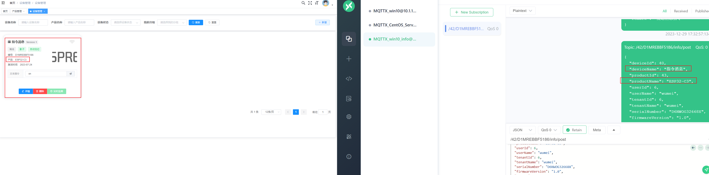
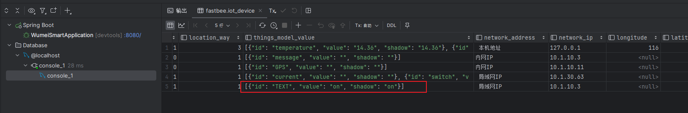
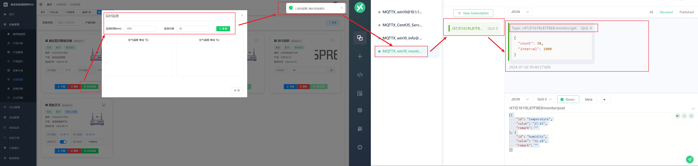

# 深入探索物美系统

## 理解物模型

> [快速入门 | FastBee文档 (wumei.live)](https://wumei.live/doc/pages/begin/#三、定义物模型)
>
> 首先需要新增产品【产品-物模型-设备】再定义物模型，物模型就是物联网的数据模型。

物模型：将实际产品抽象成由属性、功能、事件所组成的数据模型，便于物联网平台管理和数据交互。

- 路灯产品
  - 开关-**功能**-布尔【0-off；1-on】
  - 工作电流-**属性**-小数【取值范围0-9 | 单位-A | 步长-0.1 】

**注意**

> 1. 产品物模型的标识符必须唯一
> 2. 产品必须发布之后才能新建设备/接入设备。
> 3. 视频物模型正在开发中，暂时不支持视频回传业务定制。

## 设备接入

刚开始时，认证方式建议采用简单认证方式。只通过产品对应的mqtt账号和密码即可接入。

```py
MQTTClient("S&D1P1QKYDC8RV&46&1", "10.1.10.3", 1883, "wumei-smart", "P0Z40G37I80Z378O") 
```


## 认证逻辑

### 简单认证

标志：大写 `S`

设备简单认证，产品未启用授权码，密码格式为：`密码`

设备简单认证，产品启用授权码后，密码格式为：`密码 & 授权码`


## 数据交互

> 数据交互通过物模型传递。
>
> [物模型格式 | FastBee文档 (wumei.live)](https://wumei.live/doc/pages/tsl/)

对应表：iot_device

iot_things_model定义数据的格式，请参考**简洁物模型**。


---


## 发布与订阅

### 设备信息


> /{productId}/{deviceNum}/info/post 【发布设备信息】
>
> - /42/D1MREBBF5186/info/post
> - post一般是设备端到服务端推数据。
>
> /{productId}/{deviceNum}/info/get 【订阅设备信息（订阅到该主题就发布设备信息）】
>
> - get一般是服务端到设备端发送数据，**暂时还未掌握此方法**。
> - **暂时还未能进行get的Debug！**

#### 数据格式

> `com.ruoyi.iot.domain.Device`

```java
/** 产品分类ID */
private Long deviceId;

/** 产品分类名称 */
@Excel(name = "设备名称")
private String deviceName;

/** 产品ID */
@Excel(name = "产品ID")
private Long productId;

/** 产品名称 */
@Excel(name = "产品名称")
private String productName;

/** 用户ID */
@Excel(name = "用户ID")
private Long userId;

/** 用户昵称 */
@Excel(name = "用户昵称")
private String userName;

/** 租户ID */
@Excel(name = "租户ID")
private Long tenantId;

/** 租户名称 */
@Excel(name = "租户名称")
private String tenantName;

/** 设备编号 */
@Excel(name = "设备编号")
private String serialNumber;

/** 固件版本 */
@Excel(name = "固件版本")
private BigDecimal firmwareVersion;

/** 设备状态（1-未激活，2-禁用，3-在线，4-离线） */
@Excel(name = "设备状态")
private Integer status;

/** wifi信号强度（信号极好4格[-55— 0]，信号好3格[-70— -55]，信号一般2格[-85— -70]，信号差1格[-100— -85]） */
@Excel(name = "wifi信号强度")
private Integer rssi;

/** 设备影子 */
private Integer isShadow;

/** 设备所在地址 */
@Excel(name = "设备所在地址")
private String networkAddress;

/** 设备入网IP */
@Excel(name = "设备入网IP")
private String networkIp;

/** 设备经度 */
@Excel(name = "设备经度")
private BigDecimal longitude;

/** 设备纬度 */
@Excel(name = "设备纬度")
private BigDecimal latitude;

/** 激活时间 */
@JsonFormat(pattern = "yyyy-MM-dd")
@Excel(name = "激活时间", width = 30, dateFormat = "yyyy-MM-dd")
private Date activeTime;

@Excel(name = "物模型")
private String thingsModelValue;

/** 图片地址 */
private String imgUrl;

/** 是否自定义位置 **/
private Integer locationWay;

/** 设备摘要 **/
private String summary;

/** 分组ID，用于分组查询 **/
private Long groupId;

/** 是否设备所有者，用于查询 **/
private Integer isOwner;
```

#### 发布设备信息

> 执行方法 -> 上报设备数据 -> 更新数据库信息

```json
{
  "deviceId": 40,
  "deviceName": "MQTTX客户端",
  "productId": 43,
  "productName": "MQTTX",
  "userId": 6,
  "userName": "wumei",
  "tenantId": 6,
  "tenantName": "wumei",
  "serialNumber": "D6NWOG32668X",
  "firmwareVersion": "1.0",
  "status": 4,
  "rssi": 0,
  "networkAddress": "内网IP",
  "networkIp": "10.1.10.3",
  "longitude": "114.037167",
  "latitude": "22.72565",
  "activeTime": 1690158253000,
  "createBy": null,
  "createTime": 1690158123000,
  "updateBy": null,
  "updateTime": null,
  "remark": "发送消息给ESP32"
}
```


最终执行的SQL：

```sql
update iot_device SET device_name = 'MQTTX客户端', product_id = 42, product_name = 'MQTTX', user_id = 6, user_name = 'wumei', tenant_id = 6, tenant_name = 'wumei', serial_number = 'D1MREBBF5186', firmware_version = '1.0', status = 4, rssi = 0, network_address = '内网IP', network_ip = '10.1.10.3', active_time = '2023-07-24 08:24:13.0', create_time = '2023-07-24 08:22:03.0', update_time = '2023-12-29 17:19:23.749', remark = '发送消息给ESP32' where serial_number = 'D1MREBBF5186'
```

最终更新如下：

| device\_id | device\_name | product\_id | product\_name | user\_id | user\_name | tenant\_id | tenant\_name | serial\_number | firmware\_version | status | rssi | is\_shadow | location\_way | things\_model\_value                              | network\_address | network\_ip | longitude | latitude | active\_time        | summary | img\_url                            | del\_flag | create\_by | create\_time        | update\_by | update\_time        | remark          |
| :--------- | :----------- | :---------- | :------------ | :------- | :--------- | :--------- | :----------- | :------------- | :---------------- | :----- | :--- | :--------- | :------------ | :------------------------------------------------ | :--------------- | :---------- | :-------- | :------- | :------------------ | :------ | :---------------------------------- | :-------- | :--------- | :------------------ | :--------- | :------------------ | :-------------- |
| 46         | MQTTX客户端  | 42          | MQTTX         | 6        | wumei      | 6          | wumei        | D1MREBBF5186   | 1                 | 4      | 0    | 1          | 1             | \[{"id": "TEXT", "value": "on", "shadow": "on"}\] | 内网IP           | 10.1.10.3   | null      | null     | 2023-07-24 08:24:13 | null    | /profile/iot/6/2023-1212-180115.jpg | 0         |            | 2023-07-24 08:22:03 |            | 2023-12-29 17:19:24 | 发送消息给ESP32 |

**实时更新设备信息：** 备注信息，设备名称，产品类别等...





---


### 平台指令


参考：[设备端主题 | FastBee文档 (wumei.live)](https://wumei.live/doc/pages/topic/#二、设备端主题)

> 【/{productId}/{deviceNum}/function/post        发布功能】- 【设备端主题】
>
> - /42/D1MREBBF5186/function/post
> - 设备端发布消息，服务端接收消息并保存到数据库中，见消息接收测试。
>
> 【/{productId}/{deviceNum}/function-online/get  订阅功能，在线模式】- 【服务端主题】
>
> - /42/D1MREBBF5186/function-online/get
> - 若要接收服务端发布的消息指令，需要订阅该主题。

数据格式：

```json
[{
    "id": "TEXT",
    "value": "on",
    "remark": "ok"
 }]
```

#### 消息接收测试

`MQTTX_win10` ---> `emqx服务器` ---> `平台` ---> `数据库`


Debug到后端程序, 依次进入如下关键点:


此处数据格式主要根据它来的：

> 注意是List：
>
> [{
>     "id": "TEXT",
>     "value": "on",
>     "remark": "ok"
>  }]
>
> ```java
> List<ThingsModelValueRemarkItem> thingsModelValueRemarkItems = JSON.parseArray(message, ThingsModelValueRemarkItem.class);
> ```


先拿出旧数据，再替换，最后再塞回去。【remak似乎没啥用！】


最终存放在数据库的iot_device中的thing_model_value值的Value下。



---

#### 指令接收测试

`MQTTX_win10` <--- `emqx服务器` <--- `平台`


接收消息如下：


#### 平台控制LED

> 上面是用MQTTX客户端模拟ESP32开发版接收消息指令，现在做如下改动，以实现平台下发指令控制LED

```python
import time
from machine import Pin  
import network
from umqttsimple import MQTTClient
import json


def do_connect():
    wlan = network.WLAN(network.STA_IF)
    wlan.active(True)
    if not wlan.isconnected():
        print('connecting to network...')
        wlan.connect('MM智能', '88888888')
        i = 1
        while not wlan.isconnected():
            print("正在链接...{}".format(i))
            i += 1
            time.sleep(1)
    print('network config:', wlan.ifconfig())


def sub_cb(topic, msg): # 回调函数，收到服务器消息后会调用这个函数
    print(topic, msg)
    data = json.loads(msg)
    print(data)
    value = data[0]['value']
    print(value)
    # ---- 添加 --------
    if topic.decode("utf-8") == "/42/D1MREBBF5186/function-online/get" and value == "on":
        led_pin.value(1)
    elif topic.decode("utf-8") == "/42/D1MREBBF5186/function-online/get" and value == "off":
        led_pin.value(0)
    # ---- 添加 --------


# 1. 联网
do_connect()

# 2. 创建mqt端
c = MQTTClient("S&D1MREBBF5186&42&1", "10.1.10.3", 1883, "wumei-smart", "P24XPK46K84WR9ZH") 
# c = MQTTClient("S&D10894J2ZYK9&97&1", "120.79.92.83", 1883, "FastBee", "PCKN71M2E76G8G2R")  # 连接远程服务器
c.set_callback(sub_cb)  # 设置回调函数
c.connect()  # 建立连接
c.subscribe(b"/42/D1MREBBF5186/function-online/get")  # 监控/42/D1MREBBF5186/function-online/get这个通道，接收控制命令

# ---- 添加 --------
# 3. 创建LED对应Pin对象
led_pin = Pin(2, Pin.OUT)
# ---- 添加 --------

while True:
    c.check_msg()
    time.sleep(1)


```

**输出：**

```sh
>>> %Run -c $EDITOR_CONTENT
network config: ('10.1.30.63', '255.255.255.0', '10.1.30.1', '223.5.5.5')
server: ('10.1.10.3', 1883)
b' \x02\x00\x00'
b'/42/D1MREBBF5186/function-online/get' b'[{"id":"TEXT","value":"on"}]'
[{'id': 'TEXT', 'value': 'on'}]
on
b'/42/D1MREBBF5186/function-online/get' b'[{"id":"TEXT","value":"off"}]'
[{'id': 'TEXT', 'value': 'off'}]
off
b'/42/D1MREBBF5186/function-online/get' b'[{"id":"TEXT","value":"on"}]'
[{'id': 'TEXT', 'value': 'on'}]
on
b'/42/D1MREBBF5186/function-online/get' b'[{"id":"TEXT","value":"off"}]'
[{'id': 'TEXT', 'value': 'off'}]
off


```

**注意：设备必须要连上网指令才能发送成功，否则会发送失败。**【测试过程中发现的。】


---

### 实时监测


> /{productId}/{deviceNum}/monitor/post 【发布实时监测数据（仅用于实时监测图表显示，不会存储）】
>
> /{productId}/{deviceNum}/monitor/get 【订阅实时监测信号（根据监测次数和间隔，然后发布监测数据）】

#### post

设备端发送数据，服务端接收数据并根据每次发送的数据绘制对应的图表。


发送数据的格式：

```json
[{
    "id": "temperature",
    "value": "27.43",
    "remark": ""
}, {
    "id": "humidity",
    "value": "32.18",
    "remark": ""
}]
```

设备端发送数据：


#### get

> 服务端点击【实时检测】按钮，在设备端订阅【/47/D161RL87F8E8/monitor/get】主题的前提下，设备端接收数据
>
> ```json
> {
>   "count": 30,
>   "interval": 1000
> }
> ```
>
> 





---

### 数据和事件


#### post-数据

> /46/D1P1QKYDC8RV/property/post 【数据】
>
> 设置产品对应的设备属性信息


可以看到，IOT平台接收属性信息后，工作电流和开关也有相应的变化。

再次设置属性信息：

```json
[{
    "id": "current",
    "value": "8",
    "remark": "电流"
}, {
    "id": "switch",
    "value": "0",
    "remark": "开关已关闭"
}]
```


代码定位：`com.ruoyi.iot.mqtt.EmqxService#subscribeCallback`


数据库对应数据：`iot_device`


#### post-事件

> /46/D1P1QKYDC8RV/event/post
>
> 上传信息到日志

```json
[{
    "id": "current",
    "value": "8",
    "remark": "电流"
}, {
    "id": "switch",
    "value": "1",
    "remark": "开关"
}]
```


数据库日志记录：`iot_device_log`


#### function-online/get

> /46/D1P1QKYDC8RV/function-online/get


设备端接收数据：

```json
[
  {
    "id": "switch",
    "value": "1"
  }
]
```

IOT记录了属性信息的变化过程：


此处也可以发送指令：


