# 设备接入说明

> 综述：依次新建 产品分类-产品-设备，然后根据 
>
> - 认证方式
> - 设备编号 
> - 产品编号
> - 用户编号
> - 平台接入IP
> - 平台接入端口
> - mqtt账号
> - mqtt密码
>
> 进行IOT平台接入。

依次接入ESP32和MQTTX客户段设备到IOT平台，然后订阅-发布主题：`ledctl`，通过MQTTX客户端发送指令，ESP32接收指令，控制LED灯的亮和灭，作为平台接入示例展示。

## ESP32接入

新增产品分类

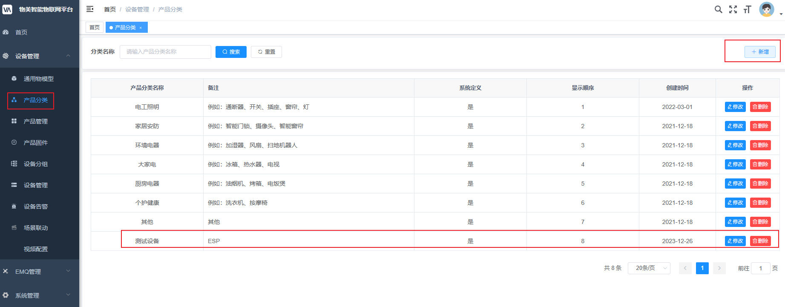

新增产品

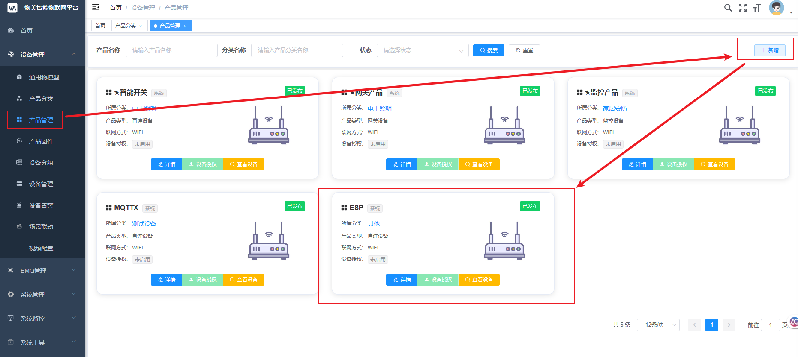

> MQTTClient("S&D14XQ244Y2L9&97&1", "你自己的服务器IP", 1883, "wumei-smart", "密码") 
>
> - 认证方式：S 简单认证
> - 设备编号 ：D14XQ244Y2L9
> - 产品编号：97
> - 用户编号：1
> - 平台接入IP：你自己的服务器IP
> - 平台接入端口：1883
> - mqtt账号：wumei-smart
> - mqtt密码：密码

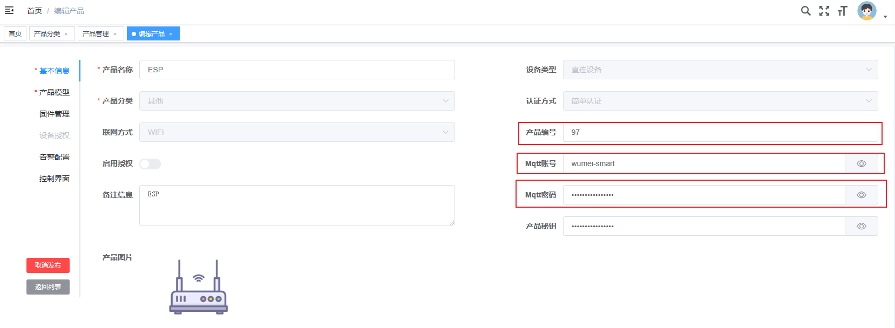

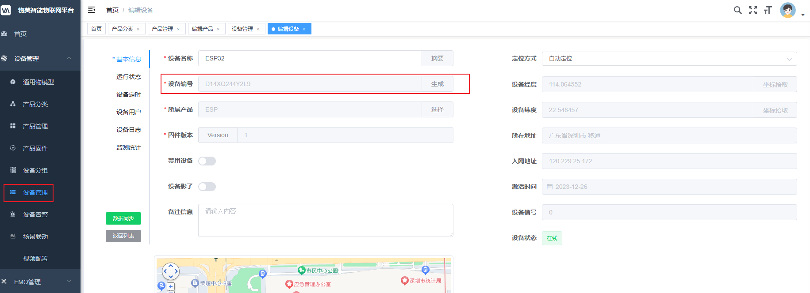

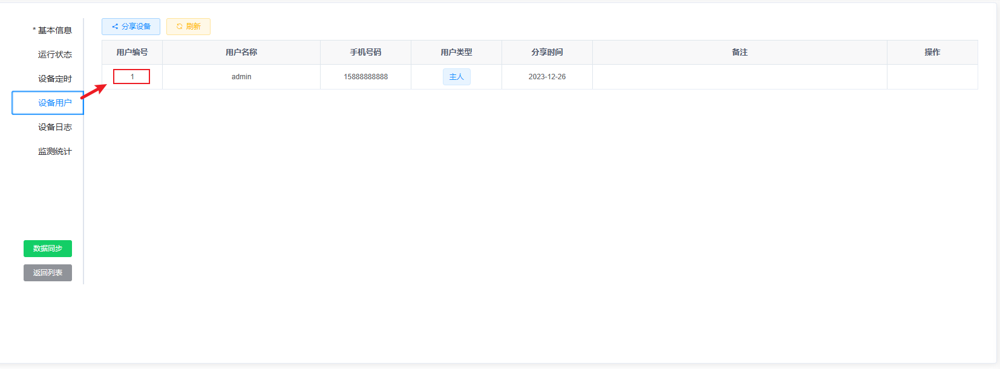

## MQTTX接入

> 操作同上

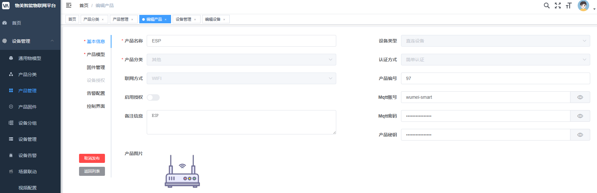

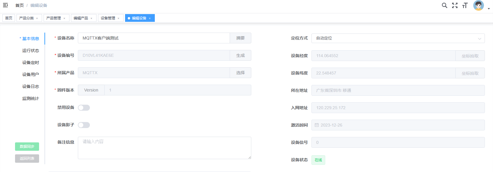

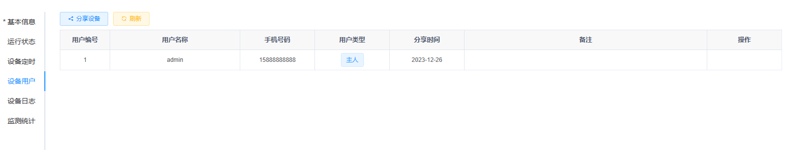

> Client ID 填入 `S&D10VL41KAE6E&98&1`

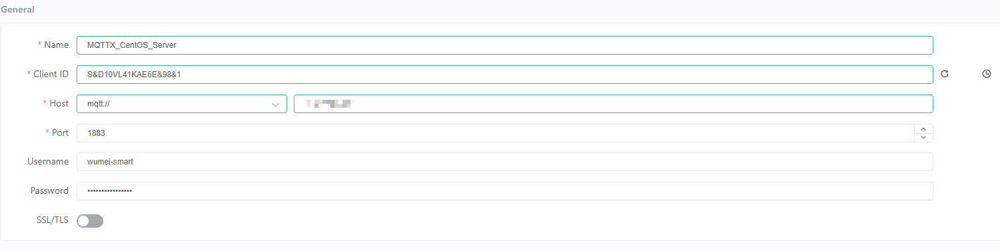

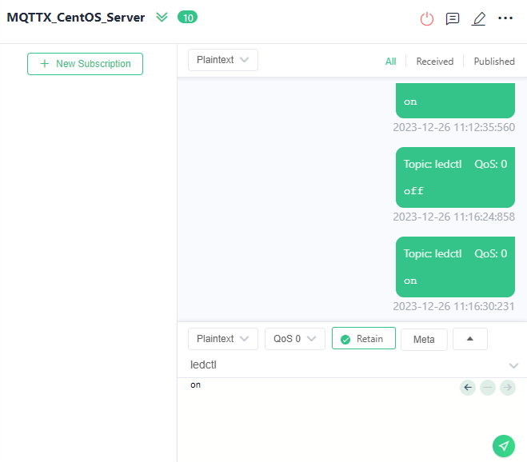

## 控制LED

> 注意事项：MQTTX客户端断开后，可能 ESP32 需要重新接入。

### 亮 on

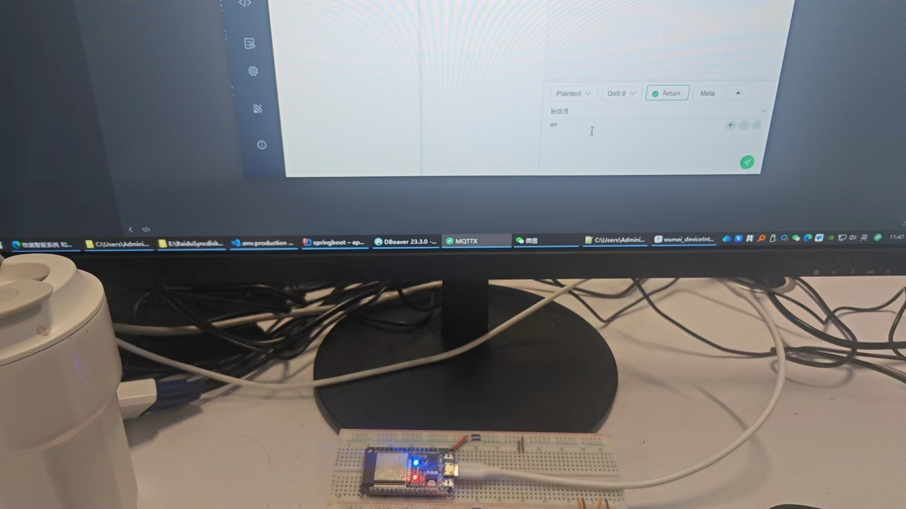

### 灭 off

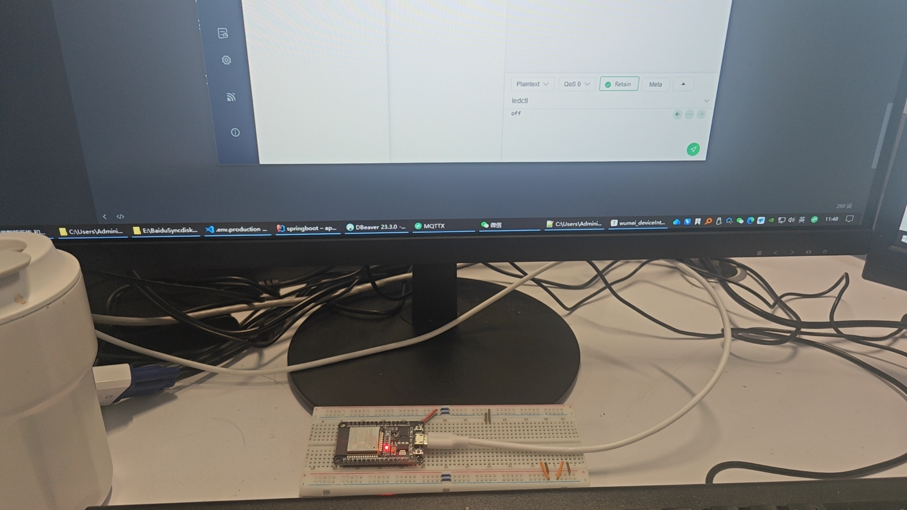

